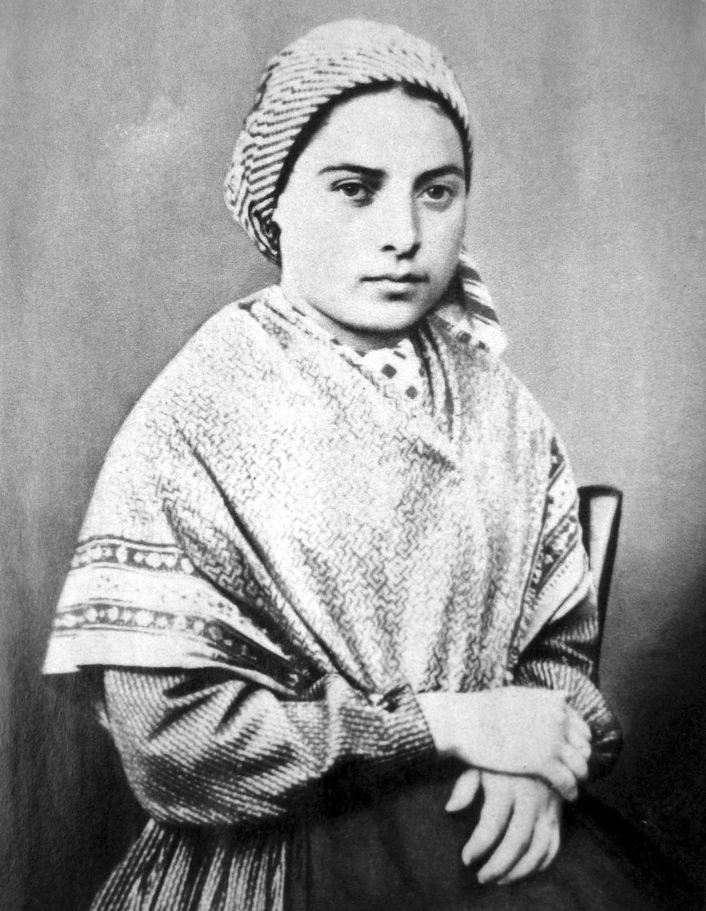

# Santa Bernadete Soubirous

**"Eu não te prometo a felicidade neste mundo, mas no outro."**

**Nascimento:** 7 de janeiro de 1844, Lourdes, França
**Morte:** 16 de abril de 1879, Nevers, França
**Festa Litúrgica:** 16 de abril (18 de fevereiro na França)
**Canonização:** 8 de dezembro de 1933, pelo Papa Pio XI

<TextToSpeech />

---

## Biografia

Marie-Bernarde Soubirous, conhecida como Bernadete, nasceu em Lourdes, França, filha mais velha de François e Louise, uma família de moleiros muito pobre. Desde criança, sofreu com a saúde frágil (asma e cólera) e viveu em condições miseráveis, morando inclusive em uma antiga prisão abandonada, o "Cachot". Era analfabeta e falava apenas o dialeto local (bigordan).

Em 11 de fevereiro de 1858, aos 14 anos, enquanto colhia lenha com a irmã e uma amiga perto da Gruta de Massabielle, Bernadete teve a primeira de 18 aparições de uma "Senhora" vestida de branco. A Senhora pediu penitência e oração pelos pecadores e instruiu Bernadete a cavar o chão, de onde brotou uma fonte de água que se tornaria local de inúmeras curas. Em 25 de março, a Senhora revelou sua identidade: "Eu sou a Imaculada Conceição", dogma que havia sido proclamado pelo Papa Pio IX apenas quatro anos antes, e que a menina ignorante desconhecia.

Após as aparições, Bernadete fugiu da curiosidade pública e ingressou na Congregação das Irmãs da Caridade de Nevers, onde viveu com humildade, servindo na enfermaria e na sacristia, e suportando grandes sofrimentos físicos e morais ("Fui moída como um grão de trigo").

## Vida Pessoal e Espiritualidade

A vida de Bernadete foi marcada pela simplicidade, obediência e sofrimento aceito com amor. Ela nunca buscou glória para si mesma, dizendo: "A Virgem me usou como uma vassoura; quando o trabalho acabou, fui colocada atrás da porta". Sua espiritualidade era centrada na oração do Rosário e na aceitação da vontade de Deus.

## Milagres

Durante sua vida, a fonte de Lourdes já operava milagres, embora Bernadete sempre atribuísse tudo à Virgem Maria e à fé das pessoas. O maior milagre, no entanto, foi sua própria vida de santidade em meio à dor. Seu corpo permanece incorrupto até hoje, exposto na capela do convento em Nevers, parecendo dormir serenamente.

## Curiosidades

1.  **O Círio:** Durante uma das aparições, a chama da vela que Bernadete segurava tocou sua mão por vários minutos sem queimá-la, fato testemunhado por um médico cético.
2.  **Incorrupção:** Seu corpo foi exumado três vezes (1909, 1919 e 1925) e encontrado intacto.
3.  **Cinema:** Sua história foi imortalizada no filme "A Canção de Bernadette" (1943), que ganhou vários Oscars.

## Cidades por onde passou

Bernadete viveu toda sua vida na França, dividindo-se entre sua cidade natal e o convento onde faleceu.

<MiracleMap :items='[
  { lat: 43.0915, lng: -0.0521, title: "Lourdes, França", description: "Local de nascimento e das 18 aparições de Nossa Senhora na Gruta de Massabielle." },
  { lat: 46.9906, lng: 3.1628, title: "Nevers, França", description: "Cidade onde viveu como religiosa no Convento Saint-Gildard e onde seu corpo incorrupto repousa." }
]' />

## Impacto Hoje

O Santuário de Nossa Senhora de Lourdes é um dos maiores centros de peregrinação do mundo, recebendo milhões de visitantes anualmente, especialmente doentes em busca de cura física e espiritual. Santa Bernadete é padroeira dos doentes, dos pobres e dos pastores, ensinando que Deus escolhe os pequenos e humildes para confundir os sábios do mundo.
