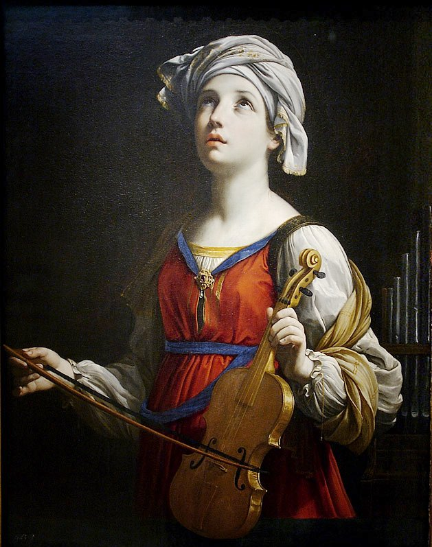

# Santa Cecília

    
    
"Senhor, guardai sem mancha meu corpo e minha alma, para que não seja confundida."

**Nascimento:** Século III, em Roma, Itália 
**Morte:** Século III, em Roma, Itália 
**Canonização:** Pré-congregacional (Culto Imemorial) 
**Festa Litúrgica:** 22 de Novembro

---

<TextToSpeech />

## Biografia

Santa Cecília é uma das mártires mais veneradas da antiguidade cristã e padroeira dos músicos e da música sacra. Nascida em uma nobre família romana, os Metelos, Cecília consagrou sua virgindade a Deus desde a infância. No entanto, seus pais a prometeram em casamento a um jovem nobre chamado Valeriano.

No dia do casamento, enquanto os músicos tocavam e os convidados se divertiam, Cecília cantava em seu coração para Deus, pedindo que sua pureza fosse preservada. Ao retirarem-se para os aposentos nupciais, Cecília revelou a Valeriano seu segredo: "Tenho um anjo de Deus que guarda meu corpo com extremo ciúme. Se ele perceber que me tocas com amor impuro, sua ira se acenderá contra ti; mas se me amares com pureza, ele te amará como a mim".

Impressionado e movido pela graça, Valeriano pediu para ver o anjo. Cecília instruiu-o a procurar o Papa Urbano I, que estava escondido nas catacumbas devido à perseguição. Valeriano foi batizado e, ao retornar, encontrou Cecília rezando com um anjo ao seu lado, que segurava duas coroas de rosas e lírios. O irmão de Valeriano, Tibúrcio, também se converteu e foi batizado.

### O Martírio

Valeriano e Tibúrcio dedicaram-se a enterrar os corpos dos mártires cristãos, o que era proibido. Foram descobertos, presos e decapitados por se recusarem a adorar os deuses pagãos. Cecília foi detida logo depois. O prefeito Almáquio tentou persuadi-la a renunciar à fé, mas ela permaneceu firme.

Condenada à morte, tentaram sufocá-la no caldarium (sala de banho quente) de sua própria casa, aquecendo o forno sete vezes mais que o normal. Cecília permaneceu lá por um dia e uma noite, cantando louvores a Deus, sem sofrer nenhum dano. Furioso, Almáquio ordenou que fosse decapitada. O carrasco golpeou seu pescoço três vezes (o máximo permitido pela lei romana), mas não conseguiu separar a cabeça do tronco. Cecília sobreviveu por três dias, durante os quais distribuiu seus bens aos pobres e pediu ao Papa que transformasse sua casa em uma igreja.

## Milagres e Curiosidades

### O Corpo Incorrupto
Em 1599, durante restaurações na Basílica de Santa Cecília no Trastevere, o túmulo da santa foi aberto. Para espanto de todos, seu corpo foi encontrado incorrupto, na mesma posição em que havia morrido séculos antes: deitada sobre o lado direito, com as marcas dos golpes no pescoço e os dedos das mãos fazendo um sinal de fé (três dedos estendidos em uma mão simbolizando a Trindade, e um na outra, simbolizando a Unidade de Deus).

O escultor Stefano Maderno presenciou a exumação e esculpiu a famosa estátua em mármore que hoje se encontra sob o altar da basílica, reproduzindo fielmente a posição do corpo.

### Padroeira dos Músicos
A tradição conta que, durante seu casamento, enquanto a música profana ressoava, Cecília "cantava em seu coração ao Senhor". Por isso, ela é invocada como padroeira dos músicos, compositores e luthiers.

### Cidades por onde passou

<MiracleMap :places="[
  { name: 'Basílica de Santa Cecília (Roma)', lat: 41.8879, lng: 12.4764, description: 'Local de seu martírio e onde seu corpo repousa sob o altar-mor.' },
  { name: 'Catacumba de São Calisto', lat: 41.8608, lng: 12.5086, description: 'Local onde foi originalmente sepultada antes de ser transladada para a basílica.' }
]" />

## O Impacto Hoje

Santa Cecília continua a inspirar músicos em todo o mundo. Academias de música, corais e conservatórios levam seu nome. Sua vida nos ensina sobre a integridade da fé, a pureza de coração e a alegria de louvar a Deus em todas as circunstâncias.

## Galeria de Imagens e Restaurações

| Imagem Original | Descrição |
| --- | --- |
|  | *Santa Cecília* (Guido Reni), retratando a santa com seu violino, olhando para o céu. |
|  | A célebre escultura de Stefano Maderno, que reproduz a posição do corpo incorrupto encontrado em 1599. |
