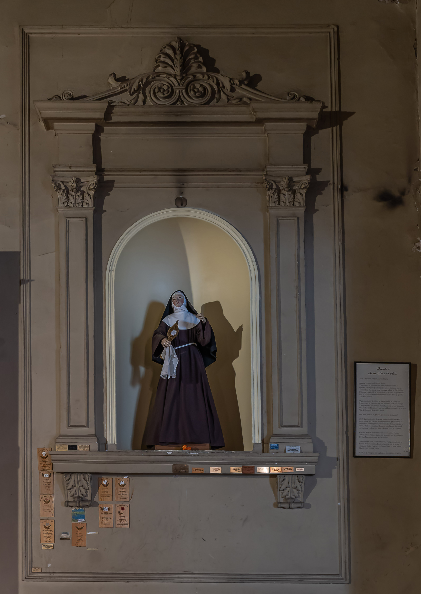

# Santa Clara de Assis

**"Ama totalmente Aquele que totalmente se entregou por teu amor."**

**Nascimento:** 16 de julho de 1194, Assis, Itália
**Morte:** 11 de agosto de 1253, Assis, Itália
**Festa Litúrgica:** 11 de agosto
**Canonização:** 26 de setembro de 1255, pelo Papa Alexandre IV

<TextToSpeech />

---

## Biografia

Clara de Assis (Chiara d'Offreduccio) nasceu em uma família nobre e rica de Assis. Desde jovem, destacou-se pela piedade e pela recusa em casar-se, apesar da insistência de sua família. Tocada pelas pregações de São Francisco de Assis, decidiu seguir radicalmente o Evangelho.

Na noite de Domingo de Ramos de 1212, fugiu de casa e foi até a pequena igreja da Porciúncula, onde Francisco e seus frades a esperavam. Lá, teve seus cabelos cortados e vestiu um hábito simples, consagrando-se a Deus. Estabeleceu-se no convento de São Damião, onde fundou a Ordem das Damas Pobres (hoje conhecidas como Clarissas).

## Vida Pessoal e Espiritualidade

Clara lutou bravamente pelo "Privilégio da Pobreza", o direito de não possuir bens materiais, nem individualmente nem como comunidade, confiando inteiramente na Providência Divina. Foi a primeira mulher na história da Igreja a escrever uma Regra para sua ordem religiosa, que foi aprovada pelo Papa pouco antes de sua morte.

Sua espiritualidade era eucarística e centrada na contemplação da humanidade de Cristo. Manteve uma profunda amizade espiritual com São Francisco, sendo sua fiel discípula e "plantinha", como ela mesma se chamava.

## Milagres

1.  **O Milagre da Eucaristia:** Em 1240, mercenários sarracenos a serviço do imperador Frederico II atacaram Assis e invadiram o claustro de São Damião. Clara, embora doente, pediu que lhe trouxessem o Santíssimo Sacramento. Erguendo o ostensório diante dos invasores, rezou fervorosamente. Os atacantes foram tomados por um terror súbito e fugiram sem ferir ninguém.
2.  **A Multiplicação dos Pães:** Em uma ocasião em que o convento tinha apenas um pão para alimentar cinquenta irmãs, Clara abençoou o pão e pediu que o partissem. O pão multiplicou-se de tal forma que todas puderam comer e se saciar.

## Curiosidades

1.  **Padroeira da Televisão:** No Natal de 1252, um ano antes de sua morte, Clara estava muito doente e não podia sair de sua cela para a Missa na Basílica de São Francisco. Milagrosamente, Deus concedeu-lhe a visão e a audição da cerimônia projetadas na parede de seu quarto, como se estivesse presente no local. Por esse motivo, o Papa Pio XII a declarou Padroeira da Televisão em 1958.
2.  **Nome:** Seu nome, Clara, foi inspirado em uma premonição que sua mãe teve antes do parto, de que a criança seria uma luz a iluminar o mundo.

## Cidades por onde passou

Clara viveu toda a sua vida religiosa em Assis, especificamente no Mosteiro de São Damião, fora dos muros da cidade.

<MiracleMap :items='[
  { lat: 43.0707, lng: 12.6196, title: "Assis, Itália", description: "Cidade natal de Santa Clara." },
  { lat: 43.0645, lng: 12.6133, title: "San Damiano", description: "Convento onde viveu a maior parte de sua vida e onde faleceu." },
  { lat: 43.0583, lng: 12.5804, title: "Porciúncula (Santa Maria dos Anjos)", description: "Local onde recebeu o hábito das mãos de São Francisco." }
]' />

## Impacto Hoje

A Ordem das Clarissas espalhou-se rapidamente por todo o mundo e continua a ser uma das maiores ordens contemplativas da Igreja. O testemunho de Santa Clara sobre a pobreza evangélica e a confiança absoluta em Deus permanece um desafio e uma inspiração para a sociedade consumista atual. Sua coragem em defender seus ideais diante de Papas e Cardeais a torna um exemplo de força feminina na Igreja.
