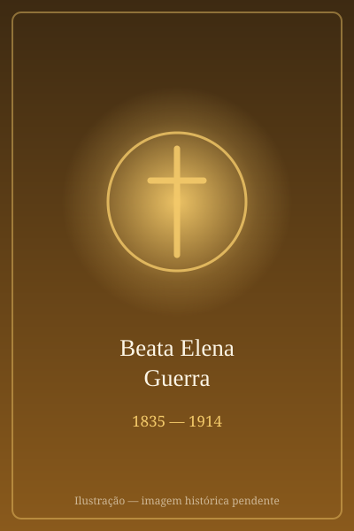

# Beata Elena Guerra

> "Apóstola do Espírito Santo."

- **Nascimento:** 23 de junho de 1835, Lucca, Itália
- **Morte:** 11 de abril de 1914, Lucca, Itália
- **Beatificação:** 1959, pelo Papa João XXIII
- **Festa Litúrgica:** 11 de abril

<TextToSpeech />

---

## Biografia

Elena Guerra nasceu em 23 de junho de 1835, em Lucca, na Toscana, numa família abastada. Adoeceu gravemente na adolescência e passou anos praticamente reclusa — período em que se dedicou à leitura dos Padres da Igreja e da Sagrada Escritura, formação incomum para uma mulher leiga de sua época.

Recuperada, dedicou-se à instrução religiosa das jovens de Lucca, reunindo-as em grupos de estudo e oração. Em 1872 abriu uma escola e, em 1882, fundou a congregação das Oblatas do Espírito Santo, também chamadas Irmãs de Santa Zita, voltada à educação das meninas pobres. Entre suas alunas esteve Gemma Galgani, futura santa.

A partir de 1895, escreveu doze cartas confidenciais ao Papa Leão XIII, insistindo em um único pedido: que a Igreja voltasse a pregar e a invocar o Espírito Santo. Não era um gesto trivial — uma religiosa de província escrevendo diretamente ao Pontífice. Leão XIII acolheu o apelo: em 1895 pediu uma novena ao Espírito Santo em toda a Igreja antes de Pentecostes, e em 1897 publicou a encíclica *Divinum illud munus*, inteiramente dedicada ao tema. Na passagem para o século XX, o Papa entoou o *Veni Creator Spiritus* em nome de toda a Igreja.

Os últimos anos foram duros: em 1906 foi afastada do governo da própria congregação, em meio a incompreensões internas, e aceitou a decisão em silêncio. Morreu em Lucca no Sábado Santo de 11 de abril de 1914, aos 78 anos.

## Vida Pessoal e Obra

Elena escreveu diversas obras de espiritualidade e catequese, sempre em torno da ação do Espírito Santo na vida comum dos fiéis. Sua insistência não era devocional apenas: defendia que o Espírito fosse apresentado como pessoa viva e atuante, e não como assunto abstrato de manuais. João XXIII, ao beatificá-la em 1959, chamou-a de "apóstola do Espírito Santo" — e, poucos meses depois, convocou o Concílio Vaticano II pedindo "um novo Pentecostes" para a Igreja.

## Milagres

O milagre reconhecido para a canonização ocorreu no Brasil, em Uberlândia (MG): a cura inexplicável de uma pessoa em estado grave, após orações à sua intercessão. O decreto foi promulgado pelo Papa Francisco em 13 de abril de 2024, e a canonização realizou-se na Praça de São Pedro em 20 de outubro de 2024.

## Curiosidades

1. **Doze cartas a um Papa:** as cartas a Leão XIII, hoje publicadas, são um caso raro de influência direta de uma religiosa sobre o magistério pontifício.
2. **Professora de Santa Gemma:** ensinou catecismo a Gemma Galgani, canonizada em 1940 — muito antes dela, portanto.
3. **Precursora da Renovação Carismática:** movimentos de renovação no Espírito a reconhecem como precursora, embora tenha morrido meio século antes do surgimento deles.
4. **Afastada da própria obra:** viveu os últimos oito anos removida do governo da congregação que fundara, sem jamais protestar publicamente.

## Cidades por onde passou

Nasceu, ensinou, fundou sua congregação e morreu em Lucca, na Toscana, cidade a que esteve ligada a vida inteira.

<MiracleMap :items='[
  { lat: 43.8429, lng: 10.5027, type: "nascimento", title: "Lucca", description: "Cidade onde viveu e fundou sua congregação. Local de nascimento (23 de junho de 1835)." },
  { lat: 41.9029, lng: 12.4534, type: "vida", title: "Cidade do Vaticano", description: "Destino das doze cartas que enviou a Leão XIII pedindo a pregação sobre o Espírito Santo." },
  { lat: -18.9186, lng: -48.2772, type: "milagre", title: "Uberlândia (MG), Brasil", description: "Cura reconhecida como o milagre que levou à sua canonização, em 2024." },
  { lat: 43.8429, lng: 10.5027, type: "morte", title: "Lucca", description: "Local da morte (11 de abril de 1914)." }
]' />

## Impacto Hoje

As Oblatas do Espírito Santo mantêm escolas e obras educativas em vários países. Sua canonização, em 2024, foi recebida com particular entusiasmo pelos movimentos de espiritualidade pneumatológica, que veem nela uma antecipação do que o Concílio Vaticano II e a Renovação Carismática desenvolveriam. A ligação entre suas cartas, a encíclica de Leão XIII e o pedido de João XXIII por "um novo Pentecostes" é hoje um dos episódios mais citados na história recente da teologia do Espírito Santo.
