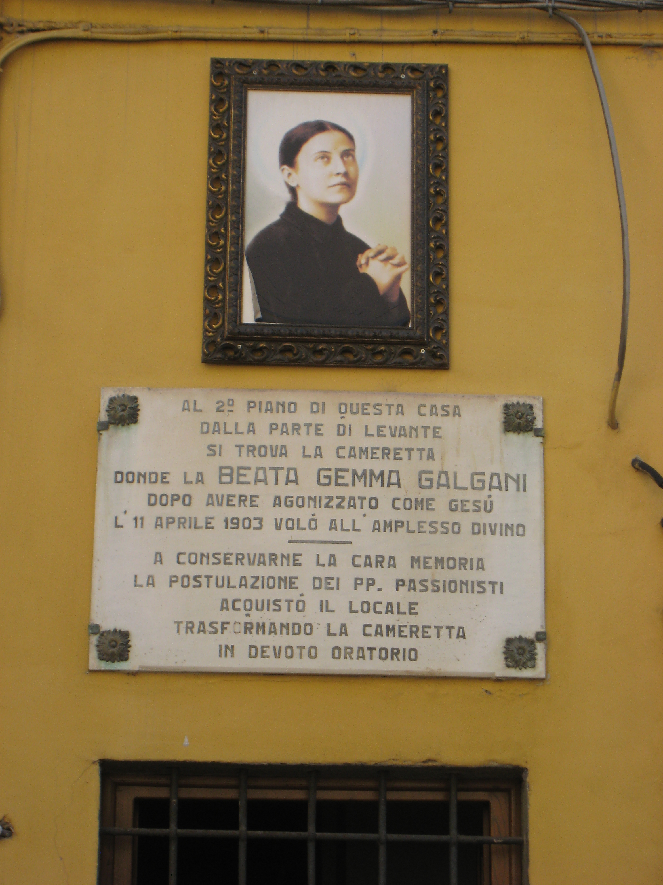

# Santa Gemma Galgani

<TextToSpeech />

## Biografia

Santa Gemma Galgani, conhecida como a "Filha da Paixão", foi uma mística italiana que viveu uma vida de profundo sofrimento e união com Cristo. Nascida em Camigliano, uma pequena aldeia perto de Lucca, na região da Toscana, em 12 de março de 1878, ela era a quinta de oito filhos de Enrico Galgani, um farmacêutico próspero, e Aurelia Landi.

Desde tenra idade, Gemma demonstrou uma piedade extraordinária. Aos sete anos, durante a preparação para a Crisma, sentiu um chamado interior para entregar sua mãe a Deus, aceitando a morte dela com resignação cristã. Sua mãe faleceu de tuberculose em 1886, deixando uma marca profunda na jovem Gemma.

A vida de Gemma foi marcada por perdas familiares e dificuldades financeiras. Seu pai faleceu quando ela tinha 19 anos, deixando a família na miséria. Gemma assumiu a responsabilidade de cuidar de seus irmãos mais novos, demonstrando grande maturidade e força de caráter.

Gemma desejava ardentemente tornar-se freira Passionista, mas sua saúde frágil e a oposição de alguns a impediram. Em vez disso, ela viveu como leiga consagrada, acolhida pela família Giannini em Lucca, onde passou seus últimos anos em oração, penitência e serviço aos outros.

Ela faleceu em um Sábado Santo, 11 de abril de 1903, aos 25 anos, vítima de tuberculose. Foi canonizada pelo Papa Pio XII em 1940, que a chamou de "a estrela do meu pontificado".

<MiracleMap :places="[
  { lat: 43.8500, lng: 10.5667, name: 'Camigliano (Capannori)', description: 'Local de nascimento de Santa Gemma Galgani.' },
  { lat: 43.8417, lng: 10.5028, name: 'Lucca', description: 'Cidade onde viveu a maior parte de sua vida, recebeu os estigmas e faleceu.' },
  { lat: 43.9333, lng: 10.3000, name: 'Camaiore', description: 'Local onde residiu temporariamente e sua saúde piorou.' }
]" />

## Vida Pessoal

A vida pessoal de Gemma foi caracterizada por uma simplicidade angelical e uma união mística com Deus. Ela tinha uma devoção especial à Paixão de Cristo e à Virgem Maria. Seus escritos, incluindo sua autobiografia e cartas, revelam uma alma em constante diálogo com o divino.

Ela experimentou fenômenos místicos extraordinários, incluindo visões de Jesus, Maria e seu Anjo da Guarda, com quem conversava familiarmente e a quem confiava recados. Gemma lutou contra tentações demoníacas e sofreu ataques físicos do maligno, que ela suportava com paciência e oração.

Apesar de seus sofrimentos físicos e espirituais, Gemma era conhecida por seu sorriso radiante e sua gentileza para com todos. Ela escondia suas dores e estigmas sob luvas e roupas de mangas compridas, buscando viver sua santidade de forma oculta.

## Milagres

Um dos aspectos mais marcantes da vida de Santa Gemma foi o recebimento dos estigmas. A partir de 8 de junho de 1899, ela começou a manifestar as chagas da Paixão de Cristo em suas mãos, pés e lado. Os estigmas apareciam periodicamente, geralmente nas noites de quinta-feira para sexta-feira, acompanhados de êxtases dolorosos.

Além dos estigmas, muitos milagres de cura e conversão foram atribuídos à sua intercessão, tanto durante sua vida quanto após sua morte. Um milagre notável reconhecido para sua beatificação envolveu a cura instantânea de uma mulher com úlceras estomacais graves e incuráveis.

## Curiosidades

1.  **Conversas com o Anjo**: Gemma tinha uma relação tão próxima com seu Anjo da Guarda que às vezes pedia que ele entregasse cartas ao seu diretor espiritual em Roma, e as cartas chegavam misteriosamente ao destino.
2.  **Reprovação na Escola**: Apesar de sua inteligência, Gemma teve dificuldades na escola devido à saúde, mas era amada por suas professoras, incluindo a Beata Elena Guerra, fundadora das Irmãs Oblatas do Espírito Santo.
3.  **Coluna Vertebral**: Gemma sofria de uma doença na coluna (tuberculose óssea ou Mal de Pott) que a obrigou a usar um colete de ferro doloroso por um tempo, mas foi milagrosamente curada após uma novena a Santa Margarida Maria Alacoque.

## Cidades que passou

*   **Camigliano (Capannori)**: Onde nasceu e foi batizada.
*   **Lucca**: O cenário principal de sua vida, onde frequentou a escola, viveu com a família Giannini e recebeu as graças místicas.
*   **Camaiore**: Onde passou um período com uma tia após a morte do pai, antes de retornar a Lucca.

## O Impacto Hoje

Santa Gemma Galgani continua a ser uma fonte de inspiração para jovens e sofredores em todo o mundo. Sua aceitação amorosa do sofrimento como meio de união com Cristo oferece conforto àqueles que enfrentam doenças e provações.

Ela é a padroeira dos estudantes (junto com São Gabriel de Nossa Senhora das Dores), dos farmacêuticos e daqueles que sofrem de dores nas costas e dores de cabeça. Seu santuário em Lucca atrai milhares de peregrinos anualmente. A Congregação das Irmãs Missionárias de Santa Gemma foi fundada em sua honra para propagar sua espiritualidade.

## Galeria de Imagens

| Casa em Lucca |
| --- |
|  |
