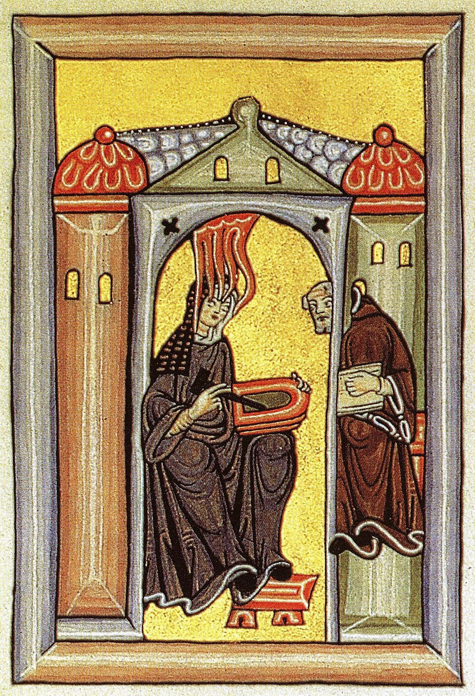

> "Sibila do Reno e Profetisa da Alemanha"

**Nascimento**: 1098, Bermersheim vor der Höhe, Sacro Império Romano-Germânico 
**Morte**: 17 de setembro de 1179, Mosteiro de Rupertsberg, Bingen am Rhein 
**Canonização**: Equivalente formalizada pelo Papa Bento XVI (2012) 
**Festa Litúrgica**: 17 de setembro 

<TextToSpeech />

## Biografia
Hildegarda nasceu em 1098, a décima filha de uma família nobre e livre, a serviço dos condes de Sponheim. Por ser uma criança doente, desde seus primeiros anos experimentou visões místicas. Aos oito anos, seus pais a confiaram aos cuidados de Jutta de Sponheim, uma reclusa que vivia anexa a um mosteiro beneditino em Disibodenberg.

Ali, Hildegarda aprendeu a ler, cantar salmos, e gradualmente formou-se em latim básico. Após a morte de Jutta em 1136, Hildegarda, já monja, foi eleita magistra (mestra) de forma unânime por sua comunidade. Com o crescimento da comunidade de freiras, ela sentiu um chamado divino para fundar um novo mosteiro. Superando a forte resistência do abade de Disibodenberg, ela mudou a comunidade em 1150 para Rupertsberg, em Bingen, e, mais tarde, em 1165, fundou um segundo mosteiro em Eibingen, na margem oposta do rio Reno.

Em 1141, ela recebeu uma visão que lhe dizia "Escreve o que vês e ouves". Hesitante por conta de sua humildade e insegurança no latim, ela finalmente revelou o fato ao monge Volmar, que se tornou seu secretário, e obteve a autorização do abade. Seus escritos foram apresentados pelo Papa Eugênio III em 1147 no Sínodo de Trier, o qual a autorizou e incentivou a continuar escrevendo. Ela tornou-se uma das vozes femininas mais poderosas da Idade Média, correspondendo-se com papas, imperadores (como Frederico Barba Ruiva), reis e bispos.

Hildegarda também se destacou por realizar extensas viagens de pregação – algo raríssimo para uma mulher na época – pelo sul e centro da Alemanha e pela França, conclamando o clero à reforma espiritual e combatendo heresias como o catarismo.

## Milagres
Muitos prodígios foram atribuídos a ela ainda em vida.
* A história relata curas extraordinárias, como quando ela, utilizando a água do rio Reno combinada com suas preces e o sinal da cruz, curou cegos e outros enfermos graves.
* Ela obteve diversas libertações de possessão demoníaca.
* O milagre de sua "visão" contínua das verdades teológicas sem estudos formais aprofundados, descritas no seu monumental trabalho *Scivias* ("Conhece os Caminhos"), era considerado por si só um sinal de intervenção direta do Espírito Santo.

## Curiosidades
1. **Doutora da Igreja:** Em 7 de outubro de 2012, o Papa Bento XVI declarou formalmente Santa Hildegarda como Doutora da Igreja Universal, um título restrito aos maiores mestres da fé cristã, pela profundidade de sua teologia, que antecipava várias questões ecológicas e místicas.
2. **Compositora prolífica:** Hildegarda é uma das primeiras compositoras cuja biografia é bem conhecida. Ela compôs a melodia para 69 composições musicais, cada uma com seu próprio texto poético original, e a primeira "ópera" ou drama litúrgico moral do mundo ocidental, o *Ordo Virtutum* ("Ordem das Virtudes").
3. **Pioneira na medicina:** Ela foi autora de textos sobre medicina holística e ciências naturais (*Physica* e *Causae et Curae*). Ela documentou as propriedades curativas de ervas e minerais, considerando a saúde humana estritamente conectada com o equilíbrio e a ordem na natureza.
4. **Língua própria:** Hildegarda inventou uma linguagem construída, conhecida como *Lingua Ignota* ("Língua Desconhecida"), criando um vocabulário novo e até um alfabeto próprio com 23 letras.

## Cidades por onde passou
<MiracleMap :markers="[
  { lat: 49.7214, lng: 8.0844, title: 'Bermersheim, Alemanha', description: 'Local provável de seu nascimento em 1098.' },
  { lat: 49.7758, lng: 7.7011, title: 'Disibodenberg, Alemanha', description: 'Onde cresceu reclusa, aprendeu com Jutta e mais tarde foi eleita magistra.' },
  { lat: 49.967, lng: 7.8933, title: 'Bingen am Rhein (Rupertsberg), Alemanha', description: 'Fundou o mosteiro de Rupertsberg para onde se mudou com suas freiras em 1150.' },
  { lat: 49.9886, lng: 7.9250, title: 'Eibingen, Alemanha', description: 'Fundou seu segundo mosteiro em 1165, que hoje preserva suas relíquias.' }
]" />

## Impacto Hoje
O legado de Santa Hildegarda é colossal, transversal e incrivelmente atual. Ela é reverenciada não apenas pelos católicos, mas por muitos ao redor do mundo.
Na teologia, sua visão profética da harmonia entre a criação, o cosmo e a redenção continua a inspirar o pensamento cristão ecológico e espiritual.
Sua música gregoriana tem experimentado um renascimento enorme desde o final do século XX, sendo amplamente gravada e ouvida por seu profundo senso de contemplação e beleza etérea.
No campo da medicina natural e fitoterapia, seus princípios sobre alimentação saudável e o poder curativo das plantas formam a base para o que hoje é conhecido como "Medicina de Hildegarda", popular especialmente na Alemanha e Europa Central. Em 2012, após séculos de veneração "equivalente" a santos, Bento XVI oficializou o reconhecimento de sua imensa estatura.
