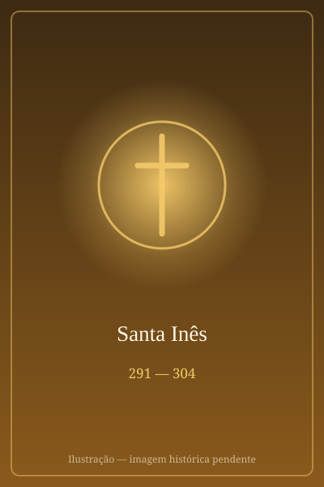

# Santa Inês

> "Cristo é meu único esposo."

- **Nascimento:** c. 291 d.C., Roma
- **Morte:** c. 304 d.C., Roma
- **Canonização:** Pré-congregação
- **Festa Litúrgica:** 21 de janeiro

<TextToSpeech />

---

## Biografia

Inês nasceu por volta de 291, em Roma, numa família nobre e cristã. Segundo a tradição transmitida por Santo Ambrósio, por Prudêncio e pelo Papa Dâmaso — testemunhos do século IV, portanto muito próximos dos fatos —, era uma menina de doze ou treze anos, notável pela beleza e pela riqueza da família, o que atraiu numerosos pretendentes.

Inês recusou todos, declarando-se consagrada a Cristo. Um dos rejeitados, filho do prefeito de Roma, denunciou-a como cristã durante a perseguição de Diocleciano. Levada ao tribunal, manteve-se firme diante das ameaças e das promessas. Como a lei romana proibia executar virgens, foi enviada a um lupanar para ser desonrada — e a tradição narra que ninguém conseguiu tocá-la.

Condenada por fim à morte, foi degolada por volta de 304. Santo Ambrósio, escrevendo poucas décadas depois, comenta que os algozes tremiam mais do que ela e que "havia lugar para a ferida num corpo tão pequeno".

## Vida Pessoal e Obra

O nome Inês (*Agnes*) evoca ao mesmo tempo o grego *hagné*, "pura", e o latim *agnus*, "cordeiro" — dupla ressonância que explicou desde cedo a iconografia. Seu culto é dos mais antigos de Roma: a imperatriz Constantina, filha de Constantino, mandou erguer uma basílica sobre seu túmulo na via Nomentana já no século IV, e seu nome entrou no Cânon Romano da Missa.

## Milagres

- **A cabeleira:** a tradição narra que, exposta no lupanar, seus cabelos cresceram milagrosamente até cobri-la por inteiro.
- **O pretendente fulminado:** o filho do prefeito, que tentou aproximar-se dela, teria caído sem sentidos e sido devolvido à vida pela oração da própria Inês.
- **As chamas que se afastaram:** segundo Prudêncio, uma primeira tentativa de queimá-la falhou porque o fogo se dividiu sem tocá-la, restando a espada.
- **A aparição a Constantina:** a tradição atribui à sua intercessão a cura da filha de Constantino, motivo pelo qual a basílica foi construída.

## Curiosidades

1. **O cordeiro e os pálios:** é representada com um cordeiro nos braços. Todo 21 de janeiro, dois cordeiros são bentos na basílica de Santa Inês; sua lã tece os pálios que o Papa entrega aos arcebispos metropolitanos em 29 de junho.
2. **Duas igrejas em Roma:** Sant'Agnese fuori le Mura guarda seu túmulo; Sant'Agnese in Agone, na Piazza Navona, marca o local tradicional do martírio, sobre as ruínas do estádio de Domiciano.
3. **Um crânio de criança:** o crânio venerado como sua relíquia, conservado na Piazza Navona, foi examinado no século XX e é compatível com o de uma menina de cerca de treze anos.
4. **Padroeira:** das jovens, dos noivos, dos jardineiros e das vítimas de abuso.

## Cidades por onde passou

Nasceu, viveu e morreu em Roma, onde é venerada desde os primeiros séculos.

<MiracleMap :items='[
  { lat: 41.9028, lng: 12.4964, type: "nascimento", title: "Basílica de Santa Inês Fora de Muros", description: "Local de nascimento (c. 291 d.C.)." },
  { lat: 41.8988, lng: 12.4731, type: "morte", title: "Sant&#39;Agnese in Agone", description: "Local do martírio (Estádio de Domiciano)." },
  { lat: 41.9213, lng: 12.5074, type: "tumulo", title: "Basílica de Santa Inês Fora de Muros", description: "Local onde foi sepultada." }
]' />

## Impacto Hoje

Santa Inês é uma das sete mulheres nomeadas no Cânon Romano e uma das figuras mais antigas do calendário cristão. O rito dos cordeiros e dos pálios liga sua festa, em janeiro, à de São Pedro e São Paulo, em junho, num dos gestos litúrgicos mais visíveis do papado. Nos últimos anos, sua história tem sido lembrada em contextos de defesa de meninas e adolescentes contra a violência e o casamento forçado.
