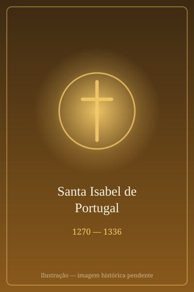

# Santa Isabel de Portugal

> "Rainha Santa e Pacificadora"

- **Nascimento:** 11 de fevereiro de 1270 (Saragoça, Aragão, atual Espanha)
- **Morte:** 4 de julho de 1336 (Estremoz, Portugal)
- **Canonização:** 25 de maio de 1625, pelo Papa Urbano VIII
- **Festa Litúrgica:** 4 de julho

<TextToSpeech />

---

## Biografia

Santa Isabel de Portugal, muitas vezes chamada de Rainha Santa Isabel, nasceu em Saragoça, Reino de Aragão, filha do rei Pedro III de Aragão e da rainha Constança de Sicília. Recebeu o nome de Isabel em homenagem à sua tia-avó paterna, Santa Isabel da Hungria. Desde jovem, demonstrou uma profunda inclinação para a piedade, a caridade e a oração.

Aos 12 anos, em 1282, casou-se com o rei D. Dinis de Portugal e tornou-se rainha consorte. Ao chegar a Portugal, enfrentou os desafios da corte e os inúmeros conflitos familiares, incluindo a vida extraconjugal do marido. Com notável paciência, perdoou D. Dinis e até cuidou dos filhos ilegítimos dele, proporcionando-lhes educação.

O seu papel mais notável na política foi o de pacificadora. Interveio ativamente para evitar a guerra civil entre o rei D. Dinis e o seu filho, o infante D. Afonso (futuro rei Afonso IV), conseguindo reconciliar pai e filho e evitar o derramamento de sangue.

Após a morte de D. Dinis em 1325, Isabel retirou-se para o Mosteiro de Santa Clara-a-Velha, em Coimbra, o qual ela própria fundara e ajudara a financiar, vestindo o hábito das clarissas, embora não tenha professado os votos solenes para poder continuar administrando os seus bens a favor dos pobres.

## Milagres

*   **O Milagre das Rosas:** O milagre mais conhecido ocorreu num dia de Inverno em que Isabel saíra furtivamente do castelo para distribuir pão aos pobres. D. Dinis interceptou-a e exigiu saber o que levava no regaço. Ao abrir o manto e exclamar "São rosas, Senhor!", o pão transformou-se em lindas e frescas rosas, apesar de ser Inverno.
*   **Curar os Doentes:** Relata-se que a rainha possuía o dom de curar enfermidades através das suas orações e cuidando ela própria de leprosos e doentes que a corte evitava.
*   **A Paz Mágica:** Muitas vezes montava o seu cavalo no meio de campos de batalha iminentes, interpondo-se entre os exércitos oponentes, cujas armas milagrosamente depunham em obediência.

## Curiosidades

1.  **Fundadora de Mosteiros:** Além do Mosteiro de Santa Clara-a-Velha, financiou a construção de hospitais, albergues e orfanatos pelo país.
2.  **Rainha Peregrina:** Realizou a pé o Caminho de Santiago até Santiago de Compostela para agradecer o fim de conflitos.
3.  **Mecenas:** É tradicionalmente considerada a financiadora e a grande difusora das Festas do Divino Espírito Santo em Portugal e nos Açores.
4.  **Tia-avó e Sobrinha:** Tinha o nome e seguia muitas das mesmas tradições de caridade da sua tia-avó paterna, Santa Isabel da Hungria, que partilha um Milagre das Rosas idêntico nas histórias populares.

## Cidades por onde passou

Em Espanha, viveu a sua juventude. Em Portugal, residiu em Leiria, Coimbra e Alenquer, mas viajou por todo o reino para intervir em disputas e supervisionar as suas obras de caridade. O seu último grande acto foi a viagem até Estremoz, já doente, para evitar um conflito entre o seu filho, o rei Afonso IV, e o seu neto, Afonso XI de Castela.

<MiracleMap :items='[
  { lat: 41.6488, lng: -0.8891, type: "nascimento", title: "Saragoça, Espanha", description: "Local de nascimento (11 de fevereiro de 1270)." },
  { lat: 40.2091, lng: -8.4298, type: "vida", title: "Coimbra, Portugal", description: "Fundou e retirou-se para o Mosteiro de Santa Clara-a-Velha." },
  { lat: 38.8437, lng: -7.5873, type: "morte", title: "Estremoz, Portugal", description: "Faleceu a 4 de julho de 1336 após tentar impedir uma guerra." }
]' />

## Impacto Hoje

Santa Isabel é recordada como a Rainha da Paz, um exemplo duradouro de diplomacia cristã, compaixão e serviço incondicional. O seu santuário em Coimbra (no Mosteiro de Santa Clara-a-Nova) atrai milhares de peregrinos anualmente. As Festas do Divino Espírito Santo, promovidas por ela, ainda hoje são a celebração central da cultura dos Açores e da diáspora portuguesa, caracterizada pelas sopas e distribuição de pão e carne, espelhando a sua caridade original.
