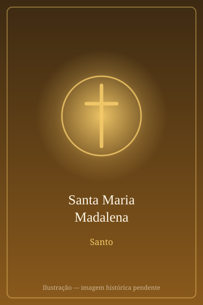

# Santa Maria Madalena

> "Vi o Senhor!"

- **Nascimento:** Século I, Magdala
- **Morte:** Século I, Éfeso ou França (tradição)
- **Canonização:** Pré-congregação
- **Festa Litúrgica:** 22 de julho

<TextToSpeech />

---

## Biografia

Maria de Magdala recebe o nome da aldeia de pescadores às margens do lago da Galileia onde nasceu. Os Evangelhos a apresentam entre as mulheres que seguiam Jesus e sustentavam o grupo com seus bens, e registram que dela haviam saído sete demônios — expressão que, na linguagem do tempo, indica um mal profundo, físico ou espiritual, e não necessariamente pecado sexual.

Está presente nas cenas decisivas da Paixão. Permaneceu ao pé da cruz com Maria, mãe de Jesus, e com o discípulo amado, enquanto quase todos os apóstolos haviam fugido. Acompanhou o sepultamento e voltou ao túmulo na madrugada do primeiro dia da semana, "quando ainda estava escuro".

Foi a primeira testemunha da Ressurreição. Encontrando o sepulcro aberto, chorou; e quando alguém a quem tomou pelo jardineiro a chamou pelo nome — "Maria!" —, reconheceu Jesus e respondeu "Rabbuni!". Dele recebeu o encargo de anunciar aos discípulos que ele subia ao Pai (Jo 20,11-18). Por isso a tradição, desde Santo Hipólito no século III, a chama *Apostola Apostolorum*, a apóstola dos apóstolos.

## Vida Pessoal e Tradições

Sobre o resto de sua vida, as tradições divergem. A oriental afirma que acompanhou a Virgem Maria e São João a Éfeso, onde teria morrido e sido sepultada. A tradição provençal, difundida na Idade Média, conta que chegou às costas da Gália e passou os últimos trinta anos em penitência numa gruta da Sainte-Baume, sendo sepultada em Saint-Maximin.

Durante séculos, a liturgia ocidental fundiu numa só figura três mulheres distintas dos Evangelhos: Maria de Magdala, a pecadora que ungiu os pés de Jesus e Maria de Betânia, irmã de Marta e Lázaro. Essa identificação, popularizada por uma homilia do Papa Gregório Magno em 591, nunca foi adotada pelo Oriente e foi abandonada pela reforma litúrgica de 1969, que a celebra apenas como discípula e testemunha da Ressurreição.

## Milagres

Os relatos medievais da Provença atribuem-lhe a conversão do governador de Marselha e de sua esposa, a quem teria obtido a graça de um filho, além de curas junto à gruta da Sainte-Baume. A tradição oriental associa a ela o costume do ovo tingido de vermelho da Páscoa: teria apresentado um ovo ao imperador Tibério anunciando a Ressurreição, e o ovo se tornou vermelho diante dele.

## Curiosidades

1. **Festa elevada:** em 2016, o Papa Francisco elevou sua memória litúrgica a festa, o mesmo grau dos apóstolos, com prefácio próprio que a chama "apóstola dos apóstolos".
2. **Sainte-Baume:** a gruta da Provença é local de peregrinação contínua desde o século XIII e é cuidada pelos dominicanos.
3. **Não era prostituta:** nenhum texto bíblico faz essa associação; ela nasce da homilia de Gregório Magno e foi corrigida pela liturgia contemporânea.
4. **Padroeira:** dos penitentes, dos perfumistas, cabeleireiros, jardineiros e das mulheres em situação de violência.

## Cidades por onde passou

Nasceu em Magdala, na Galileia, seguiu Jesus por toda a Palestina e esteve em Jerusalém na Paixão e na Ressurreição. As tradições posteriores a levam a Éfeso ou à Provença francesa.

<MiracleMap :items='[
  { lat: 32.8364, lng: 35.5186, type: "nascimento", title: "Magdala", description: "Cidade natal." },
  { lat: 37.9126, lng: 27.3323, type: "morte", title: "Éfeso", description: "Local da morte (Século I)." },
  { lat: 43.3323, lng: 5.845, type: "tumulo", title: "Saint-Maximin-la-Sainte-Baume", description: "Basílica onde estariam suas relíquias, na França." }
]' />

## Impacto Hoje

A elevação de sua memória a festa, em 2016, deu novo relevo ao papel das mulheres no anúncio pascal, e sua figura é hoje central nos debates sobre a participação feminina na Igreja. A correção da identificação com "a pecadora" também mudou sua representação na catequese e na arte contemporânea. Em Magdala, escavações recentes revelaram uma sinagoga do século I, tornando o sítio um dos pontos mais visitados da Terra Santa.
