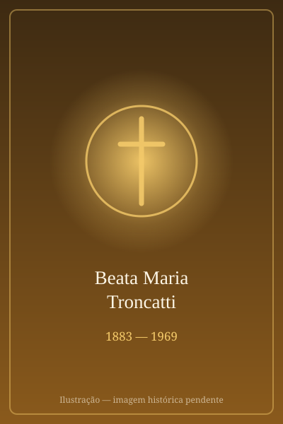

# Santa Maria Troncatti

> "A médica da selva."

- **Nascimento:** 16 de fevereiro de 1883, Corteno Golgi, Itália
- **Morte:** 25 de agosto de 1969, Sucúa, Equador
- **Beatificação:** 24 de novembro de 2012, pelo Papa Bento XVI
- **Canonização:** 19 de outubro de 2025, pelo Papa Leão XIV
- **Festa Litúrgica:** 25 de agosto

<TextToSpeech />

---

## Biografia

Maria Troncatti nasceu em 16 de fevereiro de 1883, em Corteno Golgi, nas montanhas da Lombardia, numa família numerosa de camponeses. Trabalhou no campo desde criança e entrou para as Filhas de Maria Auxiliadora — as salesianas — em 1905, contra a resistência inicial do pai.

Durante a Primeira Guerra Mundial serviu como enfermeira da Cruz Vermelha num hospital militar de Varese, onde aprendeu a tratar feridas graves, amputações e infecções — formação prática que mudaria sua vida. Em 1922 partiu como missionária para o Equador.

Foi enviada à Amazônia equatoriana, ao território dos Shuar, povo indígena então conhecido como jívaro e famoso pela hostilidade aos estrangeiros. Chegou a Macas depois de uma travessia a pé de vários dias pela cordilheira. Ali permaneceu 47 anos, trabalhando como enfermeira, dentista, parteira, cirurgeira improvisada e catequista, aprendendo a língua e ganhando, aos poucos, a confiança do povo.

Sua atuação foi decisiva na pacificação de conflitos entre clãs shuar e entre indígenas e colonos, e no fim de práticas de vingança e da acusação de bruxaria contra mulheres. Formou gerações de moças shuar e defendeu que escolhessem livremente com quem se casar — mudança profunda naquele contexto. Morreu em 25 de agosto de 1969, em Sucúa, num acidente aéreo, quando viajava para fazer os exercícios espirituais.

## Vida Pessoal e Obra

Chamavam-na *madrecita buena*. Não tinha formação médica formal, mas realizou milhares de atendimentos e algumas cirurgias de emergência em condições precárias, com o que havia à mão. Escreveu poucas cartas, quase sempre pedindo remédios e instrumentos. Sua espiritualidade era salesiana e prática: confiança em Maria Auxiliadora e trabalho contínuo.

## Milagres

O milagre reconhecido para a beatificação foi a cura de uma jovem equatoriana com um quadro clínico grave, atribuída à sua intercessão. Bento XVI autorizou o decreto, e a beatificação ocorreu em Macas, no Equador, em 24 de novembro de 2012 — a primeira beatificação celebrada naquele país. O milagre para a canonização, também ocorrido no Equador, foi aprovado pelo Papa Leão XIV, que a canonizou na Praça de São Pedro em 19 de outubro de 2025.

## Curiosidades

1. **A primeira cirurgia:** a tradição missionária conta que sua entrada definitiva na confiança dos Shuar veio depois de salvar, com meios improvisados, a filha de um líder local ferida por um tiro.
2. **Enfermeira de guerra:** a experiência no hospital militar durante a Primeira Guerra foi o que lhe permitiu enfrentar a medicina de emergência na selva.
3. **Beatificada na Amazônia:** sua beatificação foi a primeira realizada em território equatoriano e reuniu multidões de comunidades shuar.
4. **Canonizada em 2025:** foi elevada aos altares na mesma celebração de José Gregório Hernández e Bartolo Longo.

## Cidades por onde passou

Nasceu em Corteno Golgi, na Lombardia, formou-se em Nizza Monferrato, serviu como enfermeira em Varese e passou 47 anos na Amazônia equatoriana, entre Macas e Sucúa, onde morreu.

<MiracleMap :items='[
  { lat: 46.1667, lng: 10.25, type: "nascimento", title: "Corteno Golgi, Itália", description: "Local de nascimento (16 de fevereiro de 1883)." },
  { lat: -2.4566, lng: -78.1738, type: "morte", title: "Sucúa", description: "Local da morte (25 de agosto de 1969)." },
  { lat: -2.4566, lng: -78.1738, type: "tumulo", title: "Sucúa", description: "Local onde trabalhou e está sepultada." }
]' />

## Impacto Hoje

Maria Troncatti é uma figura central da memória do povo Shuar e da missão salesiana na Amazônia — referência frequente nos debates sobre inculturação e sobre o papel das mulheres na evangelização de territórios indígenas. Sua canonização, em 2025, deu ao Equador uma de suas santas mais populares, e o santuário de Macas é hoje ponto de romaria da região amazônica.
