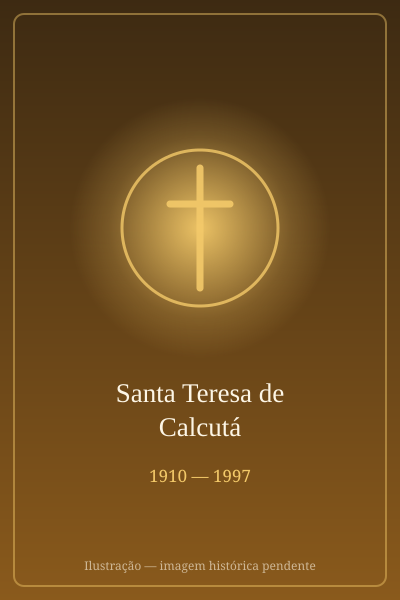

# Santa Teresa de Calcutá

> "Não podemos fazer grandes coisas, mas podemos fazer pequenas coisas com grande amor."

- **Nascimento:** 26 de agosto de 1910, Skopje (atual Macedônia do Norte)
- **Morte:** 5 de setembro de 1997, Calcutá, Índia
- **Canonização:** 4 de setembro de 2016 (Papa Francisco)
- **Festa Litúrgica:** 5 de setembro

<TextToSpeech />

---

## Biografia

**Santa Teresa de Calcutá**, nascida **Agnes Gonxha Bojaxhiu**, é mundialmente conhecida como a "Santa das Sarjetas" e fundadora das Missionárias da Caridade. Nascida em uma família albanesa católica em Skopje, sentiu o chamado à vida religiosa desde cedo. Aos 18 anos, deixou sua casa para ingressar nas Irmãs de Nossa Senhora de Loreto, na Irlanda, com o desejo de se tornar missionária na Índia.

Chegou à Índia em 1929 e ensinou geografia por quase 20 anos no Colégio Santa Maria, em Calcutá. No entanto, em 10 de setembro de 1946, durante uma viagem de trem para um retiro em Darjeeling, recebeu o que descreveu como um "chamado dentro do chamado": Jesus pedia que ela abandonasse o convento e O servisse nos "mais pobres dos pobres".

Em 1948, obteve permissão para deixar a ordem de Loreto e começou seu trabalho nas favelas de Calcutá, vestindo o sári branco com bordas azuis que se tornaria seu hábito. Em 1950, fundou a Congregação das Missionárias da Caridade, dedicada a cuidar dos "indesejados, não amados e não cuidados".

Seu trabalho se expandiu rapidamente, criando lares para moribundos (Nirmal Hriday), leprosários e orfanatos. Em 1979, recebeu o Prêmio Nobel da Paz. Faleceu em 1997, deixando um legado de amor e serviço que continua a inspirar o mundo.

## Milagres

Para sua canonização, a Igreja reconheceu dois milagres atribuídos à sua intercessão:

1.  **Cura de Monica Besra (2002):** Uma mulher indiana que sofria de um grande tumor abdominal. Ela foi curada inexplicavelmente após as irmãs colocarem uma medalha de Madre Teresa sobre seu estômago e rezarem. Este milagre levou à sua beatificação em 2003.
2.  **Cura de Marcilio Haddad Andrino (2008):** O milagre que permitiu a canonização ocorreu no Brasil. Marcilio, um engenheiro de Santos (SP), sofria de múltiplos abscessos cerebrais e hidrocefalia. Estava em coma e prestes a passar por uma cirurgia de emergência quando acordou sem dor e sem sintomas. Exames posteriores mostraram o desaparecimento completo das lesões. Sua esposa havia rezado fervorosamente a Madre Teresa.

## Curiosidades

*   **Noite Escura da Alma:** Após sua morte, cartas revelaram que Madre Teresa viveu uma profunda "escuridão espiritual" por quase 50 anos, sentindo-se abandonada por Deus, mas permanecendo fiel em sua fé e missão.
*   **Banquete do Nobel:** Ao receber o Prêmio Nobel da Paz, ela recusou o tradicional banquete cerimonial e pediu que o dinheiro (cerca de 192.000 dólares) fosse doado aos pobres da Índia.
*   **Cidadanias:** Recebeu a cidadania indiana em 1948 e foi feita Cidadã Honorária dos Estados Unidos em 1996.
*   **Estatura:** Era fisicamente pequena, medindo cerca de 1,50m, mas possuía uma energia e determinação gigantescas.

## Cidades por onde passou

<MiracleMap :items='[
  { lat: 41.9981, lng: 21.4254, type: "nascimento", title: "Skopje, Macedônia do Norte", description: "Cidade natal de Agnes Gonxha Bojaxhiu." },
  { lat: 53.3498, lng: -6.2603, type: "vida", title: "Dublin, Irlanda", description: "Onde ingressou nas Irmãs de Loreto para aprender inglês." },
  { lat: 27.041, lng: 88.2663, type: "vida", title: "Darjeeling, Índia", description: "Destino da viagem de trem onde recebeu o &#39;chamado dentro do chamado&#39;." },
  { lat: 59.9139, lng: 10.7522, type: "vida", title: "Oslo, Noruega", description: "Onde recebeu o Prêmio Nobel da Paz em 1979." },
  { lat: 41.9028, lng: 12.4964, type: "vida", title: "Roma, Vaticano", description: "Onde foi canonizada pelo Papa Francisco na Praça de São Pedro." },
  { lat: 23.4, lng: 88.5, type: "milagre", title: "Bengala Ocidental, Índia", description: "Cura de Monica Besra, de tumor abdominal (2002) — milagre da beatificação." },
  { lat: -23.9608, lng: -46.3336, type: "milagre", title: "Santos (SP), Brasil", description: "Cura de Marcilio Haddad Andrino, de abscessos cerebrais (2008) — milagre da canonização." },
  { lat: 22.5726, lng: 88.3639, type: "morte", title: "Calcutá, Índia", description: "Onde fundou as Missionárias da Caridade e serviu aos pobres até sua morte." }
]' />

## Galeria

| | |
|---|---|
|  |  |
| **Servindo aos Pobres** | **Retrato Oficial** |

---
*Santa Teresa de Calcutá, rogai por nós!*

## Impacto Hoje

As Missionárias da Caridade estão presentes em mais de 130 países, com casas de acolhimento para moribundos, pessoas com HIV, hansenianos, dependentes químicos e crianças abandonadas — a maior rede desse tipo fundada no século XX. Madre Teresa continua a ser uma das figuras religiosas mais reconhecidas do mundo, dentro e fora do catolicismo, e sua imagem é usada em campanhas de solidariedade e em currículos escolares de muitos países.

A publicação póstuma de suas cartas, em *Venha, Seja Minha Luz*, revelou que viveu décadas de aridez espiritual profunda enquanto sustentava a obra — um dado que mudou a leitura de sua santidade e a tornou próxima de quem atravessa crises de fé. Sua canonização, em 4 de setembro de 2016, encerrou o Jubileu da Misericórdia, e o Papa Francisco a propôs como o rosto daquele ano santo.
