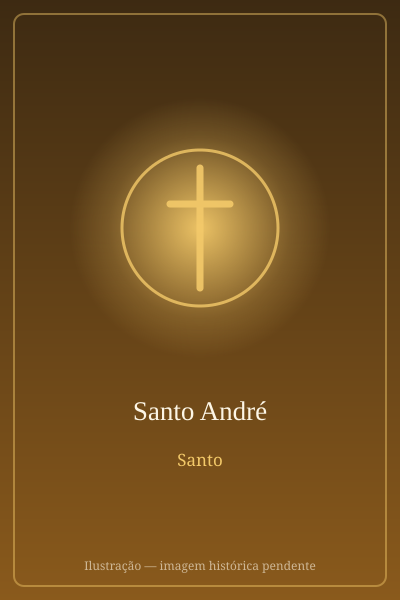

# Santo André

> "Achamos o Messias."

- **Nascimento:** Século I a.C., Betsaida, Galileia
- **Morte:** c. 60 d.C., Patras, Grécia
- **Canonização:** Pré-congregação
- **Festa Litúrgica:** 30 de novembro

<TextToSpeech />

---

## Biografia

André nasceu em Betsaida, na Galileia, e trabalhava como pescador em Cafarnaum junto com seu irmão Simão Pedro. Era discípulo de João Batista quando ouviu o mestre apontar Jesus e dizer "eis o Cordeiro de Deus"; seguiu-o naquele mesmo dia e, logo depois, levou o irmão ao encontro dele — por isso a tradição grega o chama de *Protocletos*, "o primeiro chamado".

Aparece em cenas marcantes do Evangelho: foi ele quem apresentou a Jesus o menino com cinco pães e dois peixes antes da multiplicação, e quem levou até o Mestre os gregos que pediam para vê-lo. Depois de Pentecostes, a tradição situa sua pregação na Ásia Menor, na Trácia, junto ao Mar Negro e na Grécia.

Foi martirizado em Patras, na Acaia, condenado pelo procônsul Egeias. Segundo a tradição, foi amarrado — e não pregado — a uma cruz em forma de X, para prolongar o suplício, e pregou ao povo reunido durante dois dias antes de morrer.

## Vida Pessoal e Missão

Pescador de origem humilde, André aparece nos Evangelhos sempre no papel de quem conduz outros a Jesus: o irmão, o menino dos pães, os gregos. É essa a nota que a tradição espiritual mais destaca nele — a de apresentador discreto, que não busca o primeiro lugar.

## Milagres

Os relatos apócrifos dos *Atos de André*, difundidos desde o século II, atribuem-lhe curas, exorcismos e a ressurreição de vítimas de um naufrágio na costa da Acaia. Depois de sua morte, o túmulo em Patras tornou-se centro de peregrinação, e a tradição registra a exsudação de um óleo perfumado, chamado *mana de Santo André*, associado a curas.

## Curiosidades

1. **A cruz em X:** a *crux decussata* que leva seu nome aparece nas bandeiras da Escócia, da Jamaica, de Tenerife e — combinada à cruz de São Jorge — na Union Jack britânica.
2. **Padroeiro de nações:** é patrono da Escócia, da Grécia, da Rússia, da Ucrânia e da Romênia, além de padroeiro dos pescadores.
3. **Relíquias divididas:** a cabeça foi levada a Roma e devolvida a Patras pelo Papa Paulo VI em 1964, como gesto de aproximação com a Igreja Ortodoxa.
4. **Ecumenismo:** a Igreja de Constantinopla o venera como fundador, e a cada 30 de novembro uma delegação do Vaticano participa da festa no Fanar, enquanto uma delegação ortodoxa vai a Roma na festa de São Pedro.

## Cidades por onde passou

De Betsaida e Cafarnaum, na Galileia, seguiu Jesus pela Palestina; a tradição o leva depois à Ásia Menor, à Trácia, a Bizâncio e por fim à Acaia, na Grécia, onde morreu em Patras.

<MiracleMap :items='[
  { lat: 32.909, lng: 35.63, type: "nascimento", title: "Betsaida", description: "Cidade natal." },
  { lat: 38.2466, lng: 21.7346, type: "morte", title: "Patras", description: "Local do martírio de Santo André." }
]' />

## Impacto Hoje

Santo André é o elo mais forte entre o Oriente e o Ocidente cristãos: como patrono do Patriarcado Ecumênico de Constantinopla, sua festa se tornou o principal encontro anual entre católicos e ortodoxos. Em Patras, a imensa basílica que guarda suas relíquias recebe peregrinos o ano inteiro, e na Escócia a data de 30 de novembro é feriado nacional.
