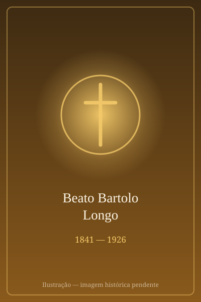

# São Bartolo Longo

> "O Apóstolo do Rosário"

- **Nascimento:** 10 de Fevereiro de 1841, Latiano, Itália
- **Morte:** 5 de Outubro de 1926, Pompeia, Itália
- **Beatificação:** 26 de outubro de 1980, pelo Papa João Paulo II
- **Canonização:** 19 de outubro de 2025, pelo Papa Leão XIV
- **Festa Litúrgica:** 5 de Outubro

<TextToSpeech />

---

## Biografia

**Bartolo Longo** é uma das figuras mais fascinantes da história recente da Igreja, demonstrando que a misericórdia de Deus não tem limites. Nasceu em Latiano, no sul da Itália, em 1841, em uma família devota.

Durante seus estudos universitários em Nápoles, num período de forte anticlericalismo e influência positivista, Bartolo afastou-se da fé católica. Envolveu-se profundamente com o espiritismo e o ocultismo, chegando a ser ordenado "sacerdote" em uma seita satânica. Essa vida o levou a uma profunda depressão, paranoia e à beira do suicídio.

A virada em sua vida ocorreu quando ouviu a voz de seu falecido pai implorando: "Volte a Deus!". Com a ajuda de um amigo, o Professor Vicente Pepe, e do padre dominicano Alberto Radente, Bartolo iniciou um caminho de conversão radical. Renunciou às práticas ocultas e dedicou-se às obras de caridade.

Um dia, ao caminhar pelo vale de Pompeia, atormentado por dúvidas sobre sua salvação devido ao seu passado, ouviu uma inspiração interior que dizia: **"Se procuras a salvação, propaga o Rosário. É promessa de Maria: quem propaga o Rosário será salvo."**

A partir desse momento, Bartolo Longo dedicou sua vida a promover a devoção a Nossa Senhora do Rosário. Transformou o vale de Pompeia, então uma região pobre, perigosa e insalubre, em um centro de fé e caridade. Construiu o magnífico **Santuário de Nossa Senhora do Rosário de Pompeia** e fundou diversas obras sociais para órfãos e filhos de prisioneiros, provando que a fé pode regenerar a sociedade.

## Milagres e Graças

O maior milagre de Bartolo Longo foi, sem dúvida, sua própria conversão e a transformação social e espiritual que operou em Pompeia.

*   **A Conversão de Pompeia:** A região era conhecida pelo banditismo e pobreza extrema. Através da oração do Rosário e da catequese, Bartolo transformou a moral e a vida social dos habitantes.
*   **A Imagem Milagrosa:** A imagem de Nossa Senhora do Rosário que ele trouxe para Pompeia (uma pintura antiga e desgastada que chegou numa carroça de esterco) tornou-se fonte de inúmeros milagres de cura física e espiritual relatados por peregrinos de todo o mundo.
*   **Curas:** Existem milhares de ex-votos no Santuário de Pompeia atestando graças alcançadas, desde curas de doenças incuráveis até reconciliações familiares, atribuídas à intercessão da Virgem do Rosário invocada por Bartolo.

## Curiosidades e Impacto

*   **De satanista a santo:** foi o único canonizado conhecido que havia atuado como "sacerdote de Satanás" antes da conversão. Sua história é um poderoso testemunho contra o ocultismo.
*   **A Súplica:** Escreveu a famosa "Súplica a Nossa Senhora de Pompeia", oração rezada solenemente em todo o mundo duas vezes por ano (8 de maio e no primeiro domingo de outubro).
*   **Obras Sociais:** Foi um pioneiro na reintegração social, criando escolas e oficinas para os filhos de presidiários, dando-lhes dignidade e futuro, algo revolucionário para a época.
*   **Influência Papal:** O Papa João Paulo II era muito devoto de Nossa Senhora de Pompeia e citou Bartolo Longo em sua Carta Apostólica *Rosarium Virginis Mariae*, chamando-o de "Apóstolo do Rosário".

## Cidades por onde passou

<MiracleMap :items='[
  { lat: 40.5557, lng: 17.7161, type: "nascimento", title: "Latiano", description: "Cidade natal de Bartolo Longo." },
  { lat: 40.8518, lng: 14.2681, type: "vida", title: "Nápoles", description: "Onde estudou Direito, perdeu a fé e envolveu-se com o ocultismo, e depois se converteu." },
  { lat: 40.7506, lng: 14.5028, type: "morte", title: "Pompeia", description: "Local de sua grande obra, onde construiu o Santuário e fundou a Nova Pompeia. Local da morte (5 de Outubro de 1926)." }
]' />

## Galeria

| | |
|---|---|
|  |  |
| **Santuário de Pompeia** | **Ícone de N. Sra. do Rosário** |

---
*São Bartolo Longo, apóstolo do Rosário, rogai por nós.*

## Impacto Hoje

O Santuário de Nossa Senhora do Rosário de Pompeia, que Bartolo Longo ergueu a partir de uma capela em ruínas, é hoje um dos maiores centros marianos da Europa, com milhões de peregrinos por ano, e a cidade que nasceu ao seu redor tem quase 25 mil habitantes. As obras sociais que fundou para filhos de presos e órfãos continuam ativas.

Sua *Súplica à Virgem de Pompeia*, escrita em 1883, é rezada em maio e outubro por comunidades de todo o mundo, e o Papa João Paulo II o chamou de "apóstolo do Rosário" ao dedicar-lhe passagens da carta *Rosarium Virginis Mariae*. Sua canonização, em 19 de outubro de 2025, deu novo relevo a uma trajetória incomum — a de um ex-sacerdote de cultos espíritas que se tornou o maior propagador moderno do Rosário — e é frequentemente citada em pastorais dedicadas a quem retorna à fé depois de rupturas radicais.
