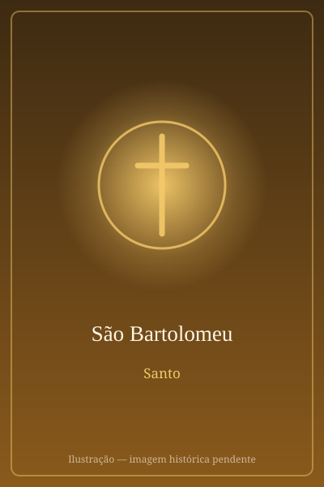

# São Bartolomeu

> "Eis um verdadeiro israelita, em quem não há dolo!"

- **Nascimento:** Caná, Galileia
- **Morte:** Século I, Armênia (Albana)
- **Canonização:** Pré-congregação
- **Festa Litúrgica:** 24 de agosto

<TextToSpeech />

---

## Biografia

Bartolomeu é o nome patronímico — *bar-Tolmai*, "filho de Tolmai" — pelo qual os três primeiros Evangelhos designam o apóstolo que João chama de Natanael. Era natural de Caná da Galileia e foi levado a Jesus por Filipe. Sua reação inicial ficou célebre pelo ceticismo: "De Nazaré pode vir coisa boa?". Ao ser recebido por Jesus com as palavras "eis um verdadeiro israelita, no qual não há falsidade", e ao ouvir que fora visto debaixo da figueira antes mesmo do encontro, respondeu: "Rabi, tu és o Filho de Deus, tu és o rei de Israel" (Jo 1,45-49).

Esteve entre os discípulos a quem Jesus ressuscitado apareceu junto ao mar de Tiberíades. Depois de Pentecostes, as tradições antigas situam sua pregação na Índia — provavelmente a Arábia Feliz ou o noroeste indiano — e sobretudo na Grande Armênia, onde teria convertido o rei Polimio.

Foi martirizado em Albanópolis, na Armênia, por volta do ano 68. A tradição afirma que foi esfolado vivo e depois decapitado — martírio de crueldade excepcional que marcou toda a sua iconografia.

## Vida Pessoal e Missão

A cena do encontro com Jesus define seu perfil: um homem franco, capaz de expressar sem rodeios a própria desconfiança e de mudar de opinião diante da evidência. Eusébio de Cesareia conta que, no século II, o missionário Panteno encontrou na Índia comunidades cristãs que guardavam uma cópia do Evangelho de Mateus em hebraico, deixada, diziam, por Bartolomeu.

## Milagres

Os relatos antigos atribuem-lhe a expulsão do demônio que habitava o ídolo Astarote, cultuado na corte armênia, e a cura da filha do rei Polimio — episódios que teriam levado à conversão da família real e desencadeado a reação dos sacerdotes pagãos, provocando seu martírio.

## Curiosidades

1. **A própria pele:** é representado segurando uma faca e, muitas vezes, a própria pele. No *Juízo Final* de Michelangelo, na Capela Sistina, o rosto desenhado na pele que o santo segura é geralmente interpretado como um autorretrato do pintor.
2. **Ilha Tiberina:** suas relíquias são veneradas na Basílica de São Bartolomeu, na Ilha Tiberina, em Roma, hoje também memorial dos mártires cristãos do século XX.
3. **Armênia:** é considerado, com São Judas Tadeu, o evangelizador da Armênia — o primeiro país a adotar oficialmente o cristianismo, em 301.
4. **Padroeiro:** dos curtidores, encadernadores, açougueiros e alfaiates.

## Cidades por onde passou

De Caná da Galileia acompanhou Jesus pela Palestina; a tradição o leva à Arábia e à Índia e, por fim, à Grande Armênia, onde pregou e morreu mártir.

<MiracleMap :items='[
  { lat: 32.7467, lng: 35.3389, type: "nascimento", title: "Caná da Galileia", description: "Local de nascimento (Caná)." },
  { lat: 38.05, lng: 44.01, type: "morte", title: "Albanópolis", description: "Local da morte (Século I)." },
  { lat: 41.8906, lng: 12.4783, type: "tumulo", title: "Ilha Tiberina (Roma)", description: "Local onde repousam suas relíquias na Basílica de São Bartolomeu." }
]' />

## Impacto Hoje

A Igreja Apostólica Armênia o reconhece, ao lado de São Judas Tadeu, como seu fundador — o que lhe dá lugar central na identidade de um dos povos cristãos mais antigos do mundo. Em Roma, a basílica da Ilha Tiberina abriga desde 2000 o memorial dos "novos mártires", reunindo objetos de cristãos mortos por sua fé em todos os continentes no século XX, o que ligou seu nome à memória da perseguição contemporânea.
