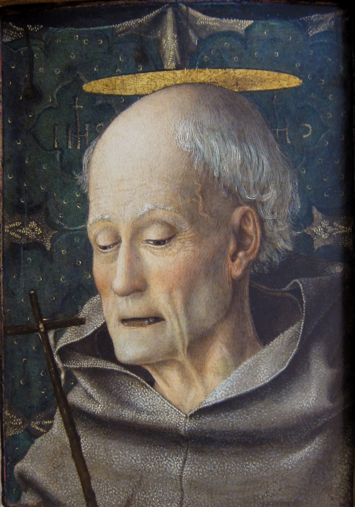

# São Bernardino de Sena

> "O Apóstolo da Itália e Propagador do Santíssimo Nome de Jesus"

- **Nascimento:** 8 de setembro de 1380, Massa Marittima, República de Siena (atual Itália)
- **Morte:** 20 de maio de 1444, Áquila, Reino de Nápoles (atual Itália)
- **Canonização:** 24 de maio de 1450 pelo Papa Nicolau V
- **Festa Litúrgica:** 20 de maio

<TextToSpeech />

---

## Biografia

São Bernardino nasceu em 8 de setembro de 1380 na cidade de Massa Marittima, na Toscana, filho do governador local, que pertencia à nobre família Albizzeschi de Siena. Ele ficou órfão muito cedo, perdendo a mãe aos três anos e o pai aos seis. Bernardino foi então criado por tias devotas em Siena, onde recebeu uma educação excepcional e começou seus estudos em leis e teologia.

Em 1400, quando uma terrível praga (Peste Negra) atingiu Siena, vitimando milhares de pessoas, Bernardino, aos 20 anos, assumiu a administração do hospital de Santa Maria della Scala, junto com vários companheiros que ele inspirou. Eles cuidaram dos doentes dia e noite por quatro meses, durante os quais o próprio Bernardino contraiu uma febre e adoeceu, embora tenha sobrevivido. Após distribuir sua herança aos pobres, ele ingressou na Ordem dos Frades Menores (Franciscanos) e foi ordenado sacerdote em 1404.

Por mais de uma década, ele viveu uma vida de reclusão e oração em um mosteiro perto de Siena. No entanto, sua verdadeira vocação era a pregação. Em 1417, iniciou suas viagens por todo o norte e centro da Itália como pregador itinerante. Suas pregações atraíam multidões imensas — às vezes mais de 30.000 pessoas —, forçando-o a falar em praças públicas porque as igrejas não comportavam os fiéis.

Ele denunciava a feitiçaria, o jogo, a usura (empréstimo a juros abusivos), o infanticídio e as rixas políticas entre as facções rivais (como os guelfos e gibelinos) que devastavam a Itália na época. Promoveu incansavelmente a devoção ao Santíssimo Nome de Jesus, desenhando um monograma "IHS" rodeado de raios dourados, um símbolo que as pessoas passaram a exibir em suas casas e cidades. Devido à sua influência na revitalização da fé na Itália do século XV, é chamado de "Apóstolo da Itália". Faleceu durante uma missão de pregação em L'Aquila, no dia 20 de maio de 1444.

## Milagres

Em vida, diversos milagres foram atribuídos a Bernardino. Em uma ocasião, ao pregar perto de um rio em Mântua e sendo impedido de atravessar por um barqueiro porque não tinha dinheiro, ele estendeu seu manto sobre as águas e navegou sobre ele até a outra margem. Há também relatos de exorcismos, curas milagrosas e até mesmo, através de suas pregações fervorosas contra vícios, fogueiras onde as pessoas espontaneamente queimavam seus dados de apostas, baralhos e símbolos de feitiçaria (conhecidas como "Fogueiras das Vaidades").

Após sua morte, seus restos mortais no convento de São Francisco em Áquila tornaram-se um centro de intensas peregrinações, onde diversas curas de cegos, coxos e enfermos foram atestadas. Devido ao grande volume de milagres póstumos comprovados, ele foi canonizado apenas seis anos após sua morte pelo Papa Nicolau V.

## Curiosidades

- **Monograma IHS:** Bernardino popularizou amplamente o monograma IHS (as três primeiras letras do nome de Jesus em grego). Até hoje, este símbolo é visível nas fachadas de igrejas, prefeituras e edifícios históricos em toda a Itália devido à sua influência.
- **Padroeiro:** Devido ao seu modo enfático de pregar e às suas extensas viagens, ele é o padroeiro dos publicitários, das relações públicas e da comunicação.
- **Acusações de Heresia:** Por promover a devoção ao nome de Jesus através da placa visual (o monograma "IHS"), ele foi denunciado três vezes por heresia perante diferentes papas, mas foi totalmente inocentado em todas as ocasiões, com os papas inclusive incentivando sua prática.
- **Recusa de Bispados:** Para manter-se livre para viajar e pregar aos pobres e às massas, ele recusou o cargo de bispo nas cidades de Siena, Ferrara e Urbino.

## Cidades por onde passou

São Bernardino pregou por quase toda a Itália, atraindo vastas multidões e operando profunda renovação moral e espiritual.

<MiracleMap :items='[
  { lat: 43.0487, lng: 10.8906, type: "nascimento", title: "Massa Marittima, Itália", description: "Local de nascimento de São Bernardino em 1380." },
  { lat: 43.3188, lng: 11.3308, type: "vida", title: "Siena, Itália", description: "Onde ele cresceu, estudou, e trabalhou no hospital durante a peste cuidando dos enfermos." },
  { lat: 45.4642, lng: 9.1900, type: "milagre", title: "Milão, Itália", description: "Local de uma de suas pregações mais famosas em 1417, que deu início às suas grandes missões públicas." },
  { lat: 42.3498, lng: 13.3995, type: "morte", title: "Áquila, Itália", description: "Local onde faleceu em 1444 e onde seus restos mortais repousam." }
]' />

## Impacto Hoje

O legado de São Bernardino de Sena está presente de forma visível na devoção contínua ao Santíssimo Nome de Jesus, que influenciou profundamente o catolicismo moderno. A imagem do sol flamejante com as letras IHS é hoje um emblema amplamente reconhecido da Igreja, tendo sido adotado posteriormente por várias ordens, incluindo a Companhia de Jesus (Jesuítas).

Além disso, seu estilo de pregação incisiva que enfrentava os problemas reais da sociedade - a economia (ele escreveu tratados importantes sobre ética econômica, denunciando a usura excessiva), a pobreza, as facções políticas - torna-o uma referência histórica de como a fé católica engaja e critica estruturas sociais injustas, inspirando comunicadores cristãos até hoje.
