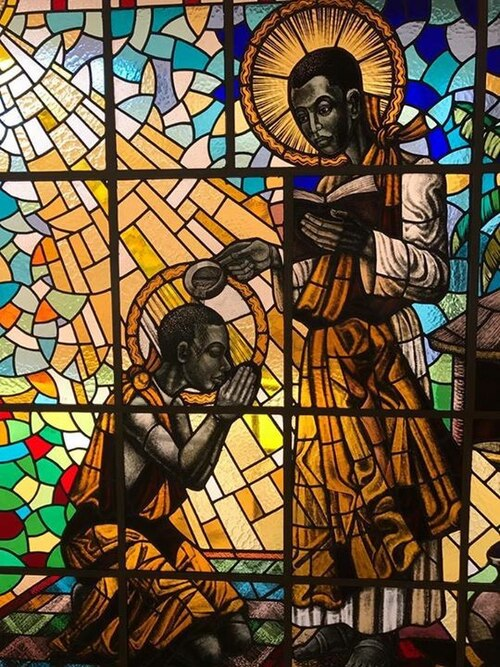
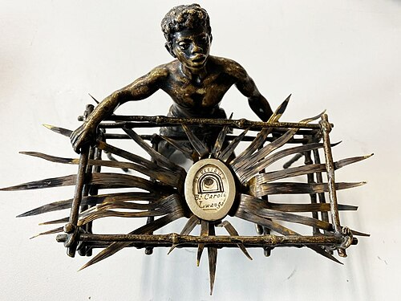

# São Carlos Lwanga

> "Podes me queimar, mas o fogo não me fará renunciar a Jesus Cristo!"

- **Nascimento:** 1860, Bulimu (Uganda)
- **Morte:** 3 de junho de 1886, Namugongo (Uganda)
- **Canonização:** 18 de outubro de 1964, pelo Papa Paulo VI
- **Festa Litúrgica:** 3 de junho

<TextToSpeech />

---

## Biografia

São Carlos Lwanga (ou Lwanga Charles) nasceu no Reino de Buganda, atual Uganda. Ele pertencia ao clã Ngabi e, devido à sua forte liderança e virtudes, foi nomeado pajem chefe e mestre de audiências na corte do Rei Mwanga II.

A fé católica havia chegado à região recentemente, por meio dos Padres Brancos (Missionários da África). O Rei Mwanga, que a princípio os aceitava, começou a persegui-los quando percebeu que os ensinamentos cristãos se opunham às suas práticas, que incluíam abusos morais e sexuais, além do tráfico de escravos.

Quando José Mukasa, líder dos pajens cristãos, foi martirizado, Carlos Lwanga assumiu sua posição. Na mesma noite do martírio de Mukasa, Lwanga levou os pajens cristãos catecúmenos para serem batizados em segredo. Ele dedicou-se a proteger os jovens da corte contra as exigências imorais do rei e a fortalecê-los na fé.

O Rei Mwanga exigiu que todos os seus pajens renunciassem ao cristianismo. Carlos Lwanga e outros 21 companheiros recusaram-se firmemente, afirmando sua fidelidade a Cristo.

## Martírio

Diante da recusa, o rei ordenou que fossem executados na colina de Namugongo, um tradicional local de execuções, a cerca de 16 milhas de distância. Durante a longa caminhada, eles cantavam hinos e rezavam, demonstrando uma coragem que impressionou até mesmo seus algozes.

Em 3 de junho de 1886, Carlos Lwanga foi enrolado em esteiras de junco e queimado vivo. Relata-se que, enquanto as chamas o consumiam, ele rezava calmamente. Suas últimas palavras registradas foram "Katonda!" (Meu Deus!). Seu testemunho de fé inspirou profundamente a Igreja na África e ao redor do mundo.

## Curiosidades

1.  **Padroeiro:** Carlos Lwanga é o padroeiro da juventude católica africana, da Ação Católica, dos convertidos e das vítimas de tortura.
2.  **Mártires de Uganda:** Ele e seus companheiros foram canonizados em 1964 por Paulo VI, e a Basílica dos Mártires de Uganda, em Namugongo, atrai anualmente milhões de peregrinos no dia de sua festa.
3.  **Primeiros frutos:** Os Mártires de Uganda são considerados os primeiros mártires da África Subsaariana e "sementes do cristianismo" moderno no continente africano.

## Cidades por onde passou

A vida de São Carlos Lwanga concentrou-se na região que hoje é Uganda, especificamente na área próxima ao Lago Vitória.

<MiracleMap :items='[
  { lat: 0.2833, lng: 32.5500, type: "nascimento", title: "Bulimu, Buganda (Uganda)", description: "Local de nascimento por volta de 1860 (coordenadas aproximadas na região de Buganda)." },
  { lat: 0.3833, lng: 32.6500, type: "morte", title: "Namugongo (Uganda)", description: "Local onde foi queimado vivo em 3 de junho de 1886." }
]' />

## Impacto Hoje

O sacrifício de Carlos Lwanga e seus companheiros causou um efeito contrário ao desejado pelo rei Mwanga: em vez de erradicar o cristianismo, o sangue dos mártires fez a fé florescer em Uganda e em toda a África. Hoje, o continente possui uma das populações católicas que mais crescem no mundo. O Santuário de Namugongo é um local de peregrinação vibrante, lembrando aos cristãos modernos a importância da coragem e da fidelidade diante das pressões do mundo secular.

> *"O sangue dos mártires é a semente dos cristãos."* - Tertuliano (aplicável à história de Uganda)

## Galeria de Imagens

*Relicário de São Carlos Lwanga*
