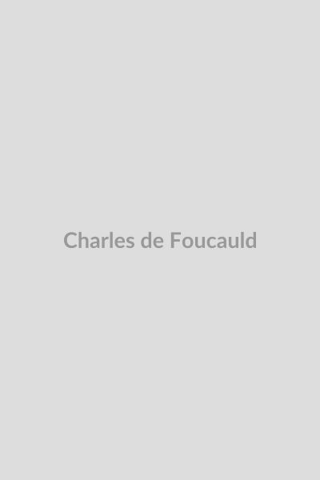

# São Charles de Foucauld

**"Pai, em Tuas mãos me entrego"**

**Nascimento:** 15 de setembro de 1858, Estrasburgo, França 
**Morte:** 1 de dezembro de 1916, Tamanrasset, Argélia 
**Canonização:** 15 de maio de 2022, pelo Papa Francisco 
**Festa Litúrgica:** 1 de dezembro 

<TextToSpeech />

---

## Biografia

Charles Eugène de Foucauld nasceu em uma família aristocrática francesa em Estrasburgo. Na juventude, perdeu a fé e levou uma vida desregrada, gastando sua herança em prazeres. Ele se tornou militar e foi enviado para a Argélia, onde a cultura local e a devoção muçulmana começaram a despertar nele uma busca espiritual. Ele deixou o exército e realizou uma exploração perigosa e bem-sucedida no Marrocos, o que lhe rendeu reconhecimento geográfico.

Retornando à França, aprofundou sua busca espiritual sob a orientação do Padre Henri Huvelin e reconverteu-se ao catolicismo em 1886. Ele ingressou na Ordem Trapista na França e na Síria, buscando a vida oculta de Jesus em Nazaré. No entanto, sentindo o chamado para uma vida ainda mais pobre e solitária, deixou os trapistas.

Após ser ordenado sacerdote, Charles foi viver como eremita no Saara argelino, primeiro em Beni Abbès e depois em Tamanrasset, entre os tuaregues. Ele aprendeu a língua, os costumes e a cultura tuaregue, criando o primeiro dicionário francês-tuaregue e traduzindo poemas. Ele desejava ser o "irmão universal", acolhendo a todos, independentemente de religião ou etnia. Em 1916, foi assassinado por um grupo de salteadores armados em sua ermida.

## Milagres

A canonização de Charles de Foucauld foi impulsionada pela aprovação de dois milagres:

1. **A cura de Giovanna Cazzaniga (Beatificação):** Uma mulher italiana foi curada de um câncer ósseo em estágio terminal em 1984 após sua comunidade paroquial orar pela intercessão de Charles de Foucauld.
2. **A sobrevivência de Charle (Canonização):** Um jovem carpinteiro chamado Charle, não batizado na época, caiu de uma altura de 15,5 metros na capela de uma escola francesa em Saumur em 2016. Seu abdômen foi perfurado por um banco de madeira. De forma inexplicável, ele sobreviveu sem sequelas físicas e mentais a longo prazo.

## Curiosidades

- **Explorador:** Antes de sua conversão, Charles escreveu "Reconnaissance au Maroc" (Reconhecimento no Marrocos), uma obra que foi amplamente aclamada pela comunidade científica e lhe rendeu uma medalha de ouro da Sociedade Geográfica Francesa.
- **Irmão Universal:** Ele queria fundar uma nova ordem religiosa focada no acolhimento de todas as pessoas, mas não conseguiu atrair seguidores durante sua vida. Sua família espiritual só foi fundada após sua morte.
- **Estudos Tuaregues:** Ele dedicou muitos anos a estudar e documentar a língua e a poesia tuaregues. Suas contribuições linguísticas ainda são valiosas até os dias de hoje.
- **A Oração de Abandono:** Ele escreveu uma famosa oração de entrega total a Deus, que começa com "Meu Pai, eu me abandono a Vós, fazei de mim o que quiserdes".

## Cidades por onde passou

- **Estrasburgo, França:** Local de seu nascimento.
- **Paris, França:** Onde teve sua vida desregrada na juventude e sua conversão na Igreja de Santo Agostinho.
- **Marrocos:** Realizou sua exploração que lhe deu reconhecimento geográfico.
- **Nazaré e Jerusalém:** Onde viveu como criado das Clarissas e buscou a "vida oculta".
- **Beni Abbès e Tamanrasset, Argélia:** Onde viveu as últimas décadas de sua vida como eremita e sacerdote entre os povos do deserto.

## Impacto Hoje

Embora Charles de Foucauld não tenha tido seguidores durante sua vida, seu impacto póstumo foi imenso. Ele inspirou a fundação de dezenas de congregações religiosas e institutos seculares, mais notavelmente os Irmãozinhos de Jesus e as Irmãzinhas de Jesus. Seu conceito de ser o "irmão universal" é uma luz guia para o diálogo inter-religioso e a fraternidade humana hoje. Sua vida oculta, de silencioso testemunho cristão sem a tentativa de proselitismo agressivo, continua a ser uma espiritualidade profunda que ressoa na modernidade.

<MiracleMap :miracles="[
  { lat: 48.5839, lng: 7.7455, title: 'Estrasburgo, França', description: 'Nascimento de Charles de Foucauld.' },
  { lat: 48.8753, lng: 2.3190, title: 'Igreja de Santo Agostinho, Paris', description: 'Local da conversão de Charles de Foucauld.' },
  { lat: 22.7850, lng: 5.5228, title: 'Tamanrasset, Argélia', description: 'Onde viveu como eremita entre os tuaregues e foi assassinado.' }
]" />