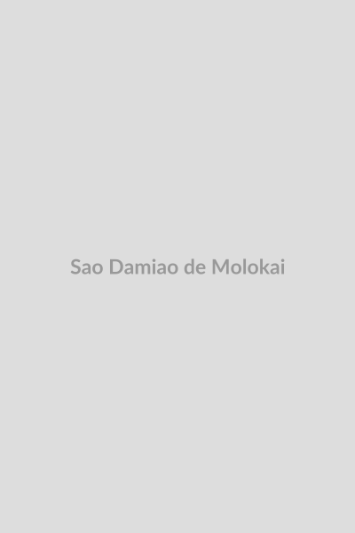

# São Damião de Molokai

**"O Apóstolo dos Leprosos"**

**Nascimento:** 3 de janeiro de 1840, Tremelo, Bélgica 
**Morte:** 15 de abril de 1889, Molokai, Reino do Havaí 
**Festa Litúrgica:** 10 de maio 
**Canonização:** 11 de outubro de 2009, pelo Papa Bento XVI 

<TextToSpeech />

---

## Biografia

Damião de Molokai, nascido Jozef De Veuster, foi um sacerdote católico belga da Congregação dos Sagrados Corações de Jesus e Maria. Ele é mundialmente conhecido por seu trabalho missionário entre os leprosos (pacientes com hanseníase) na ilha de Molokai, no Havaí.

Em 1873, Damião ofereceu-se voluntariamente para ir a Molokai, onde o governo havaiano havia estabelecido uma colônia de quarentena para leprosos. Ao chegar, encontrou uma comunidade desorganizada, sem lei e em total desespero. Damião não apenas ministrou os sacramentos, mas também tornou-se médico, enfermeiro, carpinteiro, coveiro e líder da comunidade. Ele construiu casas, igrejas, hospitais e organizou a vida social, devolvendo a dignidade àquelas pessoas esquecidas.

Após anos de serviço, Damião contraiu a própria doença que combatia. Em vez de se desesperar, ele continuou seu trabalho com ainda mais ardor, identificando-se plenamente com seu rebanho, passando a iniciar seus sermões com a frase "Nós, leprosos". Ele faleceu aos 49 anos, vítima da doença, mas seu legado de amor e sacrifício ecoou por todo o mundo.

## Vida Pessoal e Espiritualidade

Damião era um homem de fé robusta e prática. Sua espiritualidade era centrada na Eucaristia e na Adoração ao Santíssimo Sacramento, de onde tirava forças para enfrentar o isolamento e o sofrimento ao seu redor. Ele escreveu em seu diário: "Sem a presença constante de nosso Divino Mestre em meu pobre tabernáculo, eu jamais teria perseverado em compartilhar a sorte dos leprosos de Molokai".

## Milagres

O milagre que levou à sua canonização foi a cura inexplicável de Audrey Toguchi, uma mulher havaiana que sofria de um câncer agressivo no pulmão. Após rezar pedindo a intercessão do Padre Damião no túmulo original dele em Molokai, o câncer desapareceu completamente, o que foi confirmado por médicos e teólogos.

## Curiosidades

1.  **Estátua no Capitólio:** Uma estátua de São Damião representa o estado do Havaí no Salão das Estátuas do Capitólio dos Estados Unidos, em Washington D.C.
2.  **Mahatma Gandhi:** O líder indiano citou o Padre Damião como uma de suas inspirações para o trabalho social na Índia.
3.  **Robert Louis Stevenson:** O famoso escritor defendeu publicamente a memória de Damião contra críticas injustas em uma famosa carta aberta.

## Cidades por onde passou

<MiracleMap :items='[
  { lat: 50.9914, lng: 4.7536, title: "Tremelo, Bélgica", description: "Cidade natal de Jozef De Veuster (Padre Damião)." },
  { lat: 21.3069, lng: -157.8583, title: "Honolulu, Havaí", description: "Onde foi ordenado sacerdote na Catedral de Nossa Senhora da Paz." },
  { lat: 21.1912, lng: -156.9808, title: "Kalaupapa, Molokai", description: "A colônia de leprosos onde viveu, trabalhou e morreu." }
]' />

## Impacto Hoje

São Damião de Molokai é o padroeiro dos que sofrem de hanseníase e do HIV/AIDS. Seu exemplo continua a inspirar médicos, enfermeiros e voluntários em todo o mundo a cuidar dos marginalizados e estigmatizados pela sociedade. Ele nos ensina que nenhuma vida é descartável e que o amor cristão deve ir até as últimas consequências.
