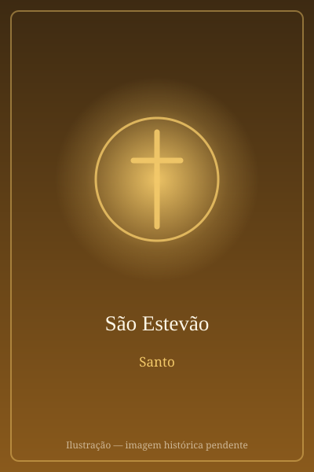

# São Estevão

> "Senhor Jesus, recebe o meu espírito."

- **Nascimento:** Século I, Jerusalém
- **Morte:** c. 34 d.C., Jerusalém
- **Canonização:** Pré-congregação
- **Festa Litúrgica:** 26 de dezembro

<TextToSpeech />

---

## Biografia

Estêvão era um judeu helenista — de língua e cultura gregas — da comunidade cristã de Jerusalém. Quando surgiram queixas de que as viúvas helenistas estavam sendo esquecidas na distribuição diária, os apóstolos escolheram sete homens "de boa reputação, cheios do Espírito e de sabedoria" para esse serviço; Estêvão foi o primeiro da lista, e o grupo ficou conhecido como os sete primeiros diáconos.

Os Atos dos Apóstolos dizem que ele, "cheio de graça e poder, realizava prodígios e grandes sinais entre o povo" (At 6,8). Sua pregação nas sinagogas dos helenistas provocou uma oposição que não conseguia "resistir à sabedoria e ao Espírito com que falava". Acusado de blasfêmia por testemunhas falsas, foi levado ao Sinédrio.

Sua defesa é o discurso mais longo dos Atos: uma releitura de toda a história de Israel que culmina na acusação de que o povo sempre resistiu ao Espírito Santo. Ao terminar, disse ver "os céus abertos e o Filho do Homem de pé à direita de Deus" — e foi arrastado para fora da cidade e apedrejado. Morreu rezando por seus algozes: "Senhor, não lhes leves em conta este pecado". As testemunhas depuseram as vestes aos pés de um jovem chamado Saulo, o futuro São Paulo.

## Vida Pessoal e Missão

Estêvão é o protomártir — o primeiro cristão a morrer pela fé. Sua morte, por volta do ano 34, desencadeou a primeira grande perseguição em Jerusalém e a dispersão dos discípulos, que acabou levando o Evangelho para fora da Judeia. Santo Agostinho resumiu o efeito de seu perdão numa frase célebre: "se Estêvão não tivesse rezado, a Igreja não teria Paulo".

## Milagres

- **Sinais e prodígios:** os Atos registram que realizava curas e sinais extraordinários entre o povo de Jerusalém, antes mesmo de sua prisão (At 6,8).
- **O rosto de anjo:** durante o julgamento, todos os que estavam no Sinédrio "viram o seu rosto como o rosto de um anjo" (At 6,15).
- **A visão da glória:** no momento da condenação, contemplou os céus abertos — a única aparição do Filho do Homem "de pé" registrada no Novo Testamento.
- **A invenção das relíquias:** em 415, o sacerdote Luciano afirmou ter sido guiado em sonho até o sepulcro em Cafargamala; o traslado dos restos a Jerusalém foi acompanhado, segundo Santo Agostinho, de numerosas curas, várias delas registradas por ele na *Cidade de Deus*.

## Curiosidades

1. **A festa no dia seguinte ao Natal:** é celebrado em 26 de dezembro, imediatamente após o nascimento de Cristo — a tradição liga o berço ao martírio, mostrando desde logo o preço do Evangelho.
2. **Boxing Day e Santo Estêvão:** em vários países europeus, o 26 de dezembro é feriado com o seu nome; a tradição de distribuir donativos nesse dia liga-se ao seu papel de diácono encarregado dos pobres.
3. **As pedras:** é representado em dalmática de diácono, com pedras sobre os ombros ou na cabeça e a palma do martírio.
4. **Padroeiro:** dos diáconos, dos pedreiros e canteiros, invocado contra dores de cabeça.

## Cidades por onde passou

Sua vida documentada transcorre em Jerusalém, onde serviu como diácono e onde foi martirizado, fora dos muros da cidade.

<MiracleMap :items='[
  { lat: 31.7806, lng: 35.2359, type: "nascimento", title: "Porta dos Leões (Santo Estevão)", description: "Local tradicional de seu apedrejamento em Jerusalém. Local de nascimento (Século I)." },
  { lat: 31.7683, lng: 35.2137, type: "morte", title: "Porta dos Leões (Santo Estevão)", description: "Local da morte (c. 34 d.C.)." }
]' />

## Impacto Hoje

Estêvão é a referência permanente do diaconato: o Concílio Vaticano II, ao restaurar o diaconato permanente, retomou o texto dos Atos que narra sua escolha. Sua morte perdoando os agressores tornou-se o modelo cristão do martírio, e a Porta dos Leões, em Jerusalém, é ainda hoje chamada Porta de Santo Estêvão. A conexão entre o seu perdão e a conversão de Paulo é um dos argumentos mais citados sobre a fecundidade do perdão.
