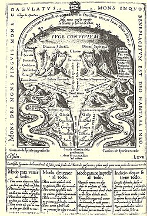
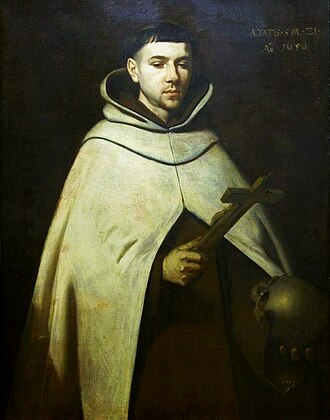

# São João da Cruz

**"No entardecer da vida, seremos julgados pelo amor."**

**Nascimento:** 24 de junho de 1542, Fontiveros, Espanha
**Morte:** 14 de dezembro de 1591, Úbeda, Espanha
**Festa Litúrgica:** 14 de dezembro
**Canonização:** 27 de dezembro de 1726, pelo Papa Bento XIII

---

## Biografia

Juan de Yepes y Álvarez, mundialmente conhecido como São João da Cruz, nasceu em uma família humilde de Fontiveros, na Espanha. Órfão de pai ainda criança, conheceu a pobreza extrema, o que o levou a trabalhar desde cedo como enfermeiro e tecelão para ajudar sua mãe. Aos 21 anos, entrou para a Ordem dos Carmelitas, adotando o nome de Frei João de São Matias.

Durante seus estudos em Salamanca, conheceu Santa Teresa de Ávila, que o convenceu a ajudá-la na reforma da Ordem Carmelita, buscando retornar à austeridade e contemplação originais. João aceitou o desafio e tornou-se o primeiro frade da reforma dos Carmelitas Descalços, mudando seu nome para João da Cruz.

A reforma enfrentou forte resistência. João foi preso por seus próprios irmãos de ordem no convento de Toledo, onde permaneceu encarcerado por nove meses em uma cela minúscula, escura e sem ventilação. Foi neste ambiente de sofrimento extremo que compôs alguns de seus mais belos poemas místicos. Ele conseguiu escapar miraculosamente e continuou sua missão de fundar conventos e guiar almas.

Morreu em Úbeda, aos 49 anos, após uma dolorosa doença, deixando um legado inestimável para a espiritualidade cristã.

## Vida Pessoal e Espiritualidade

São João da Cruz é considerado um dos maiores poetas e místicos da história. Sua espiritualidade centra-se na união da alma com Deus através da purificação e do desapego. Ele descreve a jornada espiritual como uma "subida do Monte Carmelo" e uma "noite escura", onde a alma deve se esvaziar de tudo o que não é Deus para ser preenchida pelo Seu amor.

Suas obras principais, *Subida do Monte Carmelo*, *Noite Escura*, *Cântico Espiritual* e *Chama Viva de Amor*, são faróis que iluminam o caminho da oração contemplativa. Ele ensinava que o sofrimento e a aridez espiritual não são sinais de abandono divino, mas oportunidades de purificação profunda.

## Milagres

Embora sua vida tenha sido marcada mais pelo martírio interior e pela sabedoria do que por milagres espetaculares em vida, muitos relatos de curas e graças alcançadas por sua intercessão foram registrados após sua morte. Um dos milagres mais conhecidos é a incorruptibilidade de seu corpo por um longo período e o perfume suave que emanava de suas relíquias.

Também são atribuídos a ele milagres de conversão profunda de almas que, ao lerem seus escritos, encontraram o caminho de volta para Deus.

## Curiosidades

1.  **Padroeiro dos Poetas:** É o padroeiro dos poetas em língua espanhola e dos místicos.
2.  **Fuga Espetacular:** Para fugir da prisão em Toledo, ele desceu de uma janela alta usando uma corda feita de lençóis rasgados.
3.  **Desenho de Cristo:** Um dia, teve uma visão de Cristo crucificado visto de cima e fez um pequeno desenho. Séculos depois, este desenho inspirou o famoso quadro "Cristo de São João da Cruz" do pintor surrealista Salvador Dalí.
4.  **Doutor da Igreja:** Foi declarado Doutor da Igreja pelo Papa Pio XI em 1926, recebendo o título de "Doutor Místico".

## Impacto Hoje

A mensagem de São João da Cruz permanece vibrante e necessária. Em um mundo marcado pelo materialismo e pela dispersão, ele nos convida ao silêncio, à interioridade e à busca do essencial. Seus escritos continuam a ser estudados não apenas por teólogos, mas também por filósofos, psicólogos e amantes da literatura em todo o mundo.

Ele ensina ao homem moderno que a verdadeira felicidade não está na posse de coisas, mas na liberdade interior e no encontro amoroso com Deus. Como ele mesmo disse: "Para vir a possuir tudo, não queiras possuir algo em nada".

  

    <TextToSpeech />
  

  

    <MiracleMap :items="[
  { title: 'Fontiveros', lat: 40.9328, lng: -4.9567, description: 'Cidade natal' },
  { title: 'Salamanca', lat: 40.9701, lng: -5.6635, description: 'Onde estudou e conheceu Santa Teresa' },
  { title: 'Toledo', lat: 39.8628, lng: -4.0273, description: 'Onde foi encarcerado' },
  { title: 'Úbeda', lat: 38.0097, lng: -3.3719, description: 'Onde faleceu' }
]" />
  

<SaintOfTheDay />
