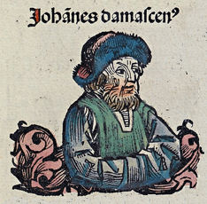

# São João Damasceno

  

    
  

  

    
"O que um livro é para os que sabem ler, uma imagem é para os que não sabem."

    
<strong>Nascimento:</strong> 675, Damasco, Síria 
    <strong>Morte:</strong> 4 de dezembro de 749, Mosteiro de São Sabas, Palestina 
    <strong>Canonização:</strong> Venerado desde os primeiros séculos 
    <strong>Festa Litúrgica:</strong> 4 de dezembro

  

<TextToSpeech />

## Biografia
João Mansur, mais conhecido como João Damasceno, nasceu em uma família cristã abastada em Damasco, cidade que à época estava sob o domínio muçulmano do califado omíada. Seu pai, Sérgio, ocupava o importante cargo de logóteta (uma espécie de ministro das finanças) no califado, demonstrando a tolerância e o prestígio que algumas famílias cristãs ainda mantinham. Desde jovem, João recebeu uma educação esmerada, abrangendo teologia, filosofia, matemática, astronomia e música, orientado por um monge siciliano chamado Cosme.
Após a morte de seu pai, João assumiu o cargo na administração do califado. No entanto, sentindo o chamado à vida monástica e devido às crescentes tensões políticas e religiosas, renunciou ao seu posto por volta de 726 e retirou-se para o Mosteiro de São Sabas (Mar Saba), próximo a Jerusalém. Lá, foi ordenado sacerdote e dedicou o resto de sua vida ao estudo, à oração, à composição de hinos e à escrita teológica, tornando-se uma das mentes mais brilhantes do seu tempo. João Damasceno foi um fervoroso defensor da ortodoxia, e seu talento literário o destacou como o último dos grandes Padres da Igreja Oriental.

## Obras e Defesa da Ortodoxia
São João Damasceno é amplamente reconhecido por sua vasta produção teológica. Sua obra mais célebre é "A Fonte do Conhecimento" (*Fons cognitionis*), uma síntese magistral da teologia cristã que influenciou profundamente o pensamento posterior, tanto no Oriente quanto no Ocidente (inclusive Santo Tomás de Aquino). Esta obra é dividida em três partes: a Dialética, a História das Heresias e a Exposição Exata da Fé Ortodoxa, sendo esta última a mais famosa.
O momento mais crítico de sua vida ocorreu durante a controvérsia iconoclasta, iniciada pelo imperador bizantino Leão III em 726, que ordenou a destruição de todas as imagens sagradas. De seu refúgio no território muçulmano, João escreveu três tratados brilhantes defendendo a veneração (dulia) das imagens, distinguindo-a cuidadosamente da adoração (latria), que é devida somente a Deus. Ele argumentou que, através da Encarnação, Deus se fez visível em Jesus Cristo, justificando assim a representação material das realidades celestiais.

## Milagres
- **O Milagre da Mão Cortada:** O milagre mais famoso associado a São João Damasceno ocorreu durante a controvérsia iconoclasta. Segundo a tradição, o imperador Leão III, furioso com os escritos de João, falsificou uma carta acusando-o de traição e a enviou ao califa de Damasco. O califa, acreditando na farsa, ordenou que a mão direita de João (a mão que escrevia os tratados) fosse cortada e exposta na praça pública. João implorou que lhe devolvessem a mão e, prostrado diante de um ícone da Virgem Maria, rezou fervorosamente para que ela fosse restaurada, para que ele pudesse continuar defendendo a fé. Milagrosamente, a mão foi reimplantada durante o sono, deixando apenas uma fina cicatriz vermelha como sinal do prodígio. Em gratidão, João fixou uma mão de prata no ícone, que se tornou conhecido como a "Virgem Tríquerousa" (Virgem de Três Mãos), um dos ícones mais reverenciados na ortodoxia.
- **Inspiração Divina:** Muitos atribuem a impressionante profundidade e clareza de seus escritos teológicos e hinos a uma contínua assistência e inspiração divina.

## Curiosidades
- **"São Tomás do Oriente":** Devido à sua capacidade de sistematizar a teologia e sua profunda influência, é frequentemente comparado a São Tomás de Aquino.
- **Hinos Litúrgicos:** Ele é considerado um dos maiores poetas e hinógrafos da Igreja Oriental. Seus hinos são cantados até hoje nas liturgias bizantinas, especialmente o Cânone da Páscoa ("O Dia da Ressurreição").
- **Doutor da Assunção:** João Damasceno escreveu algumas das homilias mais belas e profundas sobre a Dormição (Assunção) de Maria, que foram citadas pelo Papa Pio XII ao proclamar o dogma da Assunção em 1950.

## Cidades por onde passou
- **Damasco (Síria):** Cidade de seu nascimento, onde passou sua juventude e atuou na administração do califado.
- **Jerusalém e Mar Saba (Palestina):** Onde se tornou monge no Mosteiro de São Sabas, dedicando-se inteiramente à vida religiosa, à composição e à teologia, e onde faleceu.

## Impacto Hoje
São João Damasceno permanece como uma figura colossal na história cristã, reverenciado como "Doutor da Igreja" no Ocidente (proclamado em 1890 pelo Papa Leão XIII) e como um dos Padres fundamentais da Ortodoxia. Seu legado na defesa da teologia das imagens é o fundamento da arte sacra cristã; sem ele, o patrimônio artístico da Igreja poderia ter sido irremediavelmente perdido. Além disso, suas sínteses teológicas continuam a ser um ponto de referência essencial, e seus hinos continuam a inspirar e elevar as almas na liturgia oriental. Ele é o padroeiro dos estudantes de teologia e dos artistas sacros.

<MiracleMap
  :miracles="[
    {
      title: 'O Milagre da Mão Cortada',
      description: 'Segundo a tradição, a mão direita de João, cortada por ordem do califa devido a uma falsa acusação, foi milagrosamente reimplantada após suas preces diante de um ícone da Virgem Maria.',
      coordinates: [33.5138, 36.2765],
      location: 'Damasco, Síria'
    }
  ]"
/>
