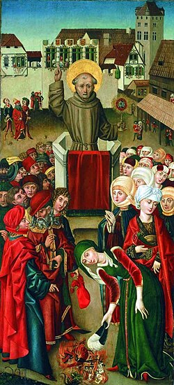

# São João de Capistrano

> "Aquele que trabalha com as próprias mãos é um trabalhador. Aquele que trabalha com as mãos e a cabeça é um artesão. Aquele que trabalha com as mãos, a cabeça e o coração é um artista."

- **Nascimento:** 24 de junho de 1386, Capestrano, Reino de Nápoles 
- **Morte:** 23 de outubro de 1456, Ilok, Reino da Hungria 
- **Canonização:** 16 de outubro de 1690, pelo Papa Alexandre VIII 
- **Festa Litúrgica:** 23 de outubro 

<TextToSpeech />

---

## Biografia

Giovanni da Capestrano nasceu no Reino de Nápoles em 1386. Inicialmente, seguiu carreira como jurista e chegou a ser nomeado governador de Perúgia. No entanto, durante uma guerra civil, foi feito prisioneiro. Na prisão, teve uma experiência espiritual profunda que o levou a abandonar a vida secular, sua noiva e sua fortuna, ingressando na Ordem dos Frades Menores (Franciscanos) em 1416.

Tornou-se um pregador itinerante extremamente popular e eficaz por toda a Europa, atraindo multidões imensas. Ao lado de São Bernardino de Sena, promoveu a reforma da Ordem Franciscana e a devoção ao Santíssimo Nome de Jesus. Em 1456, aos 70 anos de idade, liderou com fervor cruzado a defesa cristã no Cerco de Belgrado, animando as tropas contra o avanço do Império Otomano, o que lhe rendeu o título de "o Santo Soldado".

## Milagres

Sua vida foi cercada de curas extraordinárias e milagres que aconteciam durante suas pregações, o que aumentava ainda mais a multidão de fiéis que o seguiam. Ele era capaz de pacificar cidades inteiras em conflito com suas palavras e orações.

## Curiosidades

1. **O Santo Soldado:** Participou ativamente da Batalha de Belgrado aos 70 anos de idade, liderando as tropas cristãs na vitória contra os turcos.
2. **Padroeiro:** É o padroeiro dos juristas e dos capelães militares.
3. **Missões:** O seu nome inspirou as famosas missões espanholas nas Américas, como a Missão San Juan Capistrano, na Califórnia (famosa pelo retorno das andorinhas).

## Cidades por onde passou

O mapa abaixo reúne os lugares ligados a São João de Capistrano:

<MiracleMap :items='[
  { lat: 42.2681, lng: 13.7667, type: "nascimento", title: "Capestrano, Itália", description: "Local de nascimento em 1386." },
  { lat: 43.1121, lng: 12.3888, type: "milagre", title: "Perúgia, Itália", description: "Onde atuou como jurista e governador antes de se converter." },
  { lat: 45.2231, lng: 19.3769, type: "morte", title: "Ilok, Croácia", description: "Local da morte (23 de outubro de 1456)." },
  { lat: 44.8125, lng: 20.4612, type: "milagre", title: "Belgrado, Sérvia", description: "Local da famosa Batalha de Belgrado em 1456." }
]' />

## Impacto Hoje

São João de Capistrano é lembrado pelo seu ardor missionário e coragem inabalável em defender a fé e a Europa Cristã. Sua vida inspira os cristãos, especialmente os capelães militares, a confiarem plenamente em Deus mesmo diante das maiores adversidades.
