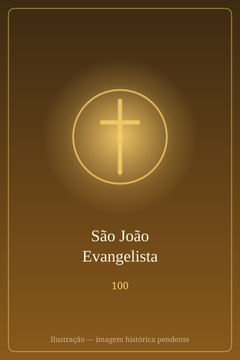

# São João Evangelista

> "Deus é amor."

- **Nascimento:** c. 6 d.C., Galileia
- **Morte:** c. 100 d.C., Éfeso, Turquia
- **Canonização:** Pré-congregação
- **Festa Litúrgica:** 27 de dezembro

<TextToSpeech />

---

## Biografia

João, filho de Zebedeu e irmão de Tiago Maior, era pescador na Galileia e, como o irmão, foi chamado por Jesus junto ao lago. Provavelmente o mais jovem dos Doze, é identificado pela tradição com o "discípulo a quem Jesus amava", que reclinou a cabeça sobre o peito do Mestre na Última Ceia.

Pertencia ao círculo mais íntimo, com Pedro e Tiago, e presenciou a Transfiguração e a agonia do Getsêmani. Foi o único apóstolo a permanecer ao pé da cruz, e ali recebeu de Jesus o encargo de acolher Maria: "eis aí a tua mãe" (Jo 19,27). Na manhã da Ressurreição, correu com Pedro ao sepulcro e, diz o Evangelho, "viu e creu".

Depois de Pentecostes, pregou em Jerusalém e Samaria e, segundo a tradição antiga, estabeleceu-se em Éfeso, onde cuidou das comunidades da Ásia Menor. Foi desterrado para a ilha de Patmos durante uma perseguição — ali situa-se a redação do Apocalipse. Voltou a Éfeso e morreu de causas naturais em idade muito avançada, o único dos Doze a não morrer mártir.

## Vida Pessoal e Obra

A tradição atribui a João cinco livros do Novo Testamento: o quarto Evangelho, três cartas e o Apocalipse. Seu Evangelho é o mais contemplativo dos quatro, aberto pelo prólogo sobre o Verbo que se fez carne, e suas cartas condensam a mensagem cristã numa frase: "Deus é amor". São Jerônimo conta que, já muito velho e sem forças para pregar, repetia à comunidade apenas "filhinhos, amai-vos uns aos outros" — e explicava que, se fizessem só isso, bastava.

## Milagres

- **O cálice envenenado:** a tradição narra que, desafiado a beber um cálice envenenado em Éfeso, João o abençoou e o veneno saiu em forma de serpente, deixando-o ileso — origem do cálice com a serpente que aparece em suas imagens.
- **O templo de Ártemis:** os relatos antigos contam que sua oração provocou a ruína de parte do grande templo de Éfeso, levando muitos à conversão.
- **A ressurreição de Drusiana:** os *Atos de João* narram que devolveu a vida a uma discípula de Éfeso durante seu funeral.
- **O poço de Patmos:** ainda hoje os peregrinos visitam, na ilha, a gruta onde a tradição situa as visões do Apocalipse.

## Curiosidades

1. **A águia:** é simbolizado por uma águia, entre os quatro viventes, porque seu Evangelho começa contemplando a divindade do Verbo "desde o alto".
2. **A casa de Maria:** perto de Éfeso, a Casa da Virgem Maria (Meryem Ana Evi) é visitada por cristãos e muçulmanos, ligada à tradição de que João levou Maria para lá.
3. **Vinho de São João:** em muitas regiões da Europa, a festa de 27 de dezembro guarda o costume da bênção do vinho, em memória do cálice envenenado.
4. **Padroeiro:** dos teólogos, escritores, editores e livreiros.

## Cidades por onde passou

Da Galileia acompanhou Jesus por toda a Palestina; viveu em Jerusalém, transferiu-se para Éfeso, foi desterrado em Patmos e voltou a Éfeso, onde morreu.

<MiracleMap :items='[
  { lat: 32.909, lng: 35.63, type: "nascimento", title: "Betsaida", description: "Local de nascimento (c. 6 d.C.)." },
  { lat: 37.3152, lng: 26.5456, type: "vida", title: "Patmos", description: "Ilha onde escreveu o Apocalipse." },
  { lat: 37.9126, lng: 27.3323, type: "morte", title: "Basílica de São João", description: "Local da morte (c. 100 d.C.)." },
  { lat: 37.9422, lng: 27.3619, type: "tumulo", title: "Basílica de São João", description: "Túmulo de São João em Éfeso." }
]' />

## Impacto Hoje

O Evangelho de João é o texto que mais alimentou a espiritualidade e a teologia cristãs sobre a identidade de Cristo e sobre o amor como centro da fé. Suas páginas estruturam a liturgia da Páscoa e do Natal, e frases como "eu sou o caminho, a verdade e a vida" ou "conhecereis a verdade e a verdade vos libertará" passaram para a cultura comum. Patmos e Éfeso continuam entre os destinos de peregrinação mais procurados do Mediterrâneo oriental.
