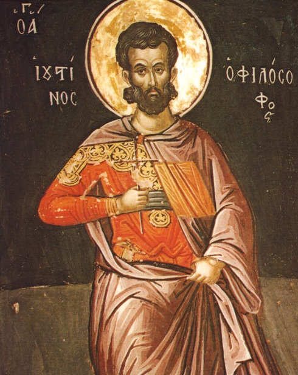

# São Justino Mártir

> "Nós podemos ser mortos, mas não podemos ser feridos."

- **Nascimento:** 100, Flávia Neápolis (atual Nablus, Palestina)
- **Morte:** 165, Roma, Itália
- **Canonização:** Reconhecimento pré-Congregação
- **Festa Litúrgica:** 1º de junho

<TextToSpeech />

---

## Biografia

São Justino, também conhecido como Justino Mártir ou Justino, o Filósofo, foi um dos primeiros apologistas cristãos e um dos mais importantes teólogos cristãos do século II. Nascido em Flávia Neápolis, na Samaria, de pais pagãos, ele buscou intensamente a verdade através de várias escolas filosóficas (estoicismo, aristotelismo, pitagorismo e platonismo) antes de encontrar no Cristianismo a "única filosofia segura e proveitosa".

Sua conversão ocorreu por volta do ano 130 d.C., após um encontro transformador com um ancião misterioso à beira-mar (provavelmente em Éfeso ou Cesareia), que lhe apontou os profetas hebraicos como os verdadeiros precursores de Cristo. A partir de então, Justino dedicou sua vida a defender a fé cristã usando argumentos filosóficos, buscando demonstrar aos pagãos, especialmente aos gregos e romanos, que o Cristianismo era o cumprimento das verdades parciais encontradas na filosofia antiga.

Ele viajou extensivamente, ensinando e debatendo, e fundou uma escola em Roma, onde ensinava o Cristianismo como a verdadeira filosofia. Justino escreveu várias obras apologéticas, sendo as mais famosas suas duas "Apologias" (endereçadas ao imperador Antonino Pio e ao Senado Romano) e o "Diálogo com Trifão" (uma defesa do Cristianismo diante do Judaísmo).

Durante o reinado do imperador Marco Aurélio, Justino e alguns de seus discípulos foram denunciados às autoridades romanas, possivelmente pelo filósofo cínico Crescente, que fora derrotado por Justino em debates públicos. Recusando-se a sacrificar aos deuses romanos, Justino foi flagelado e decapitado junto com seis companheiros no ano de 165 d.C.

## Vida Pessoal e Espiritualidade

A espiritualidade de São Justino era profundamente enraizada na busca intelectual pela verdade, que culminou no seu encontro com o *Logos* (A Palavra de Deus), que ele identificou como Jesus Cristo. Ele acreditava firmemente que as "sementes da Palavra" (*Logos spermatikos*) estavam presentes em todas as culturas e que tudo o que era bom e verdadeiro, mesmo no pensamento pagão, pertencia a Cristo.

Seu compromisso com a verdade o levou não apenas a escrever em defesa da fé, mas a vivê-la corajosamente, culminando no martírio, que ele aceitou serenamente como a confirmação definitiva de sua crença. As atas de seu martírio relatam sua resposta firme ao prefeito Rústico: "Minha única decisão é seguir os ensinamentos cristãos."

## Milagres

O maior "milagre" atribuído a São Justino é a clareza e a profundidade de seus escritos, que forneceram a base teológica para a defesa do Cristianismo nos primeiros séculos. As descrições litúrgicas em suas obras são considerados registros inestimáveis para a compreensão das primeiras práticas da Igreja (como a Eucaristia e o Batismo).
Muitas conversões ao longo dos séculos são atribuídas à leitura de suas obras e de seu testemunho de martírio.

## Curiosidades

1.  **O "Logos":** Justino desenvolveu o conceito de "Logos espermático", argumentando que a razão (Logos) ilumina cada pessoa e que Jesus é o Logos encarnado, harmonizando a fé com a razão filosófica.
2.  **Registro Litúrgico:** Sua "Primeira Apologia" contém a descrição mais antiga e detalhada que sobreviveu sobre a celebração da Eucaristia no domingo, oferecendo um vislumbre único da liturgia da Igreja Primitiva.
3.  **Patrono dos Filósofos:** Ele é frequentemente invocado como o padroeiro dos filósofos e apologistas cristãos.

## Cidades por onde passou

<MiracleMap :items='[
  { lat: 32.2211, lng: 35.2544, type: "nascimento", title: "Flávia Neápolis (Nablus)", description: "Local de nascimento de São Justino Mártir, antiga Siquém." },
  { lat: 37.9421, lng: 27.3456, type: "vida", title: "Éfeso, Turquia", description: "Local provável de seu encontro com o ancião e conversão ao Cristianismo." },
  { lat: 41.9028, lng: 12.4964, type: "morte", title: "Roma, Itália", description: "Onde ensinou e fundou sua escola, e onde sofreu o martírio." }
]' />

## Impacto Hoje

O legado de São Justino Mártir é fundamental para a teologia cristã contemporânea. Ele foi pioneiro no diálogo entre a fé cristã e a cultura secular/filosófica de sua época, uma necessidade que permanece até hoje. Suas descrições litúrgicas ainda servem como ponto de referência para teólogos e historiadores da Igreja para confirmar a continuidade das tradições cristãs ao longo de mais de dois milênios.
