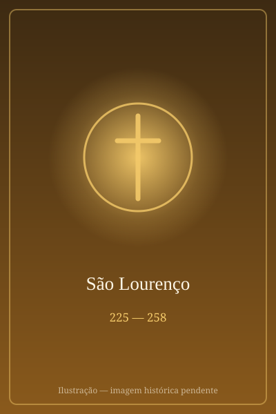

# São Lourenço

> "Vire-me do outro lado, este já está assado."

- **Nascimento:** c. 225 d.C., Huesca, Espanha
- **Morte:** 258 d.C., Roma, Itália
- **Canonização:** Pré-congregação
- **Festa Litúrgica:** 10 de agosto

<TextToSpeech />

---

## Biografia

Lourenço nasceu na Hispânia, provavelmente em Huesca, e foi para Roma ainda jovem. Ali tornou-se discípulo do arcediago Sisto, que, eleito Papa como Sisto II em 257, o ordenou diácono e o colocou como primeiro dos sete diáconos da cidade — cargo que incluía a administração dos bens da Igreja e o cuidado dos pobres.

Em 258, o imperador Valeriano publicou um edito que condenava à morte bispos, presbíteros e diáconos. Sisto II foi preso enquanto celebrava nas catacumbas e executado em 6 de agosto. A tradição narra que Lourenço, ao vê-lo ser levado, chorou por não poder acompanhá-lo, e ouviu do Papa a promessa de que o seguiria em três dias.

Nesse intervalo, o prefeito de Roma exigiu que entregasse os tesouros da Igreja. Lourenço pediu prazo, distribuiu tudo aos pobres e apresentou-se depois acompanhado de mendigos, doentes, cegos e coxos, dizendo: "Aqui estão os tesouros da Igreja". Foi condenado a morrer queimado sobre uma grelha, em 10 de agosto de 258.

## Vida Pessoal e Obra

Como diácono responsável pelas finanças, Lourenço encarnou o entendimento cristão de que o patrimônio eclesial pertence aos pobres. Seu culto é um dos mais antigos de Roma: já no século IV havia basílica sobre seu túmulo, seu nome entrou no Cânon Romano da Missa e Santo Ambrósio, Prudêncio e Santo Agostinho escreveram sobre ele.

## Milagres

- **A conversão de Hipólito:** a tradição conta que o carcereiro encarregado de guardá-lo, Hipólito, converteu-se ao vê-lo devolver a visão a um cego na prisão.
- **Curas na prisão:** os relatos antigos atribuem-lhe a cura de vários presos e do cego Crescêncio durante os dias que antecederam o martírio.
- **O tesouro dos pobres:** a apresentação dos pobres como "tesouro da Igreja" é lembrada menos como prodígio do que como o gesto que definiu a caridade cristã institucional.

## Curiosidades

1. **"Assa-me deste lado":** Santo Ambrósio e Prudêncio registram a frase que a tradição lhe atribui sobre a grelha — "está assado deste lado, vira-me" —, exemplo antigo do humor diante do martírio.
2. **As lágrimas de São Lourenço:** a chuva de meteoros das Perseidas, visível em agosto, recebeu esse nome popular na Europa por coincidir com sua festa.
3. **O Escorial:** Filipe II mandou construir o mosteiro-palácio de São Lourenço do Escorial em planta de grelha, em agradecimento por uma vitória obtida no dia do santo.
4. **Padroeiro:** dos cozinheiros, bombeiros, vidraceiros, bibliotecários e arquivistas — e da cidade do Rio de Janeiro, fundada em terreno que leva seu nome.

## Cidades por onde passou

Nasceu na Hispânia, na região de Huesca, e viveu sua vida adulta em Roma, onde serviu como diácono e onde foi martirizado.

<MiracleMap :items='[
  { lat: 42.1401, lng: -0.4089, type: "nascimento", title: "Huesca, Espanha", description: "Local de nascimento (c. 225 d.C.)." },
  { lat: 41.9028, lng: 12.4964, type: "morte", title: "Basílica de São Lourenço Fora de Muros", description: "Local da morte (258 d.C.)." },
  { lat: 41.9023, lng: 12.5193, type: "tumulo", title: "Basílica de São Lourenço Fora de Muros", description: "Local de seu túmulo em Roma." }
]' />

## Impacto Hoje

Lourenço é um dos poucos santos não bíblicos citados nominalmente no Cânon Romano, e sua basílica — San Lorenzo fuori le Mura — é uma das sete igrejas da peregrinação tradicional de Roma. A resposta que deu ao prefeito continua a ser o texto mais invocado quando a Igreja fala do destino de seus bens, e sua festa, em 10 de agosto, é dia de grandes celebrações populares na Itália, na Espanha e na América Latina.
