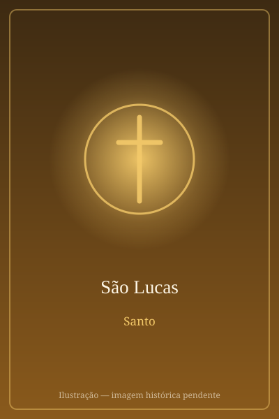

# São Lucas

> "O médico amado."

- **Nascimento:** Antioquia, Síria
- **Morte:** c. 84 d.C., Beócia, Grécia
- **Canonização:** Pré-congregação
- **Festa Litúrgica:** 18 de outubro

<TextToSpeech />

---

## Biografia

Lucas era natural de Antioquia da Síria, de origem grega, e exercia a medicina — São Paulo o chama de "o médico amado" (Cl 4,14). Não conheceu Jesus pessoalmente: converteu-se ao cristianismo já adulto e tornou-se companheiro de Paulo a partir da segunda viagem missionária, como mostram as passagens dos Atos dos Apóstolos narradas em primeira pessoa do plural, as chamadas "seções nós".

Acompanhou Paulo em Filipos, Trôade, Jerusalém e Cesareia, viajou com ele até Roma e permaneceu ao seu lado na prisão — na Segunda Carta a Timóteo, Paulo escreve que "só Lucas está comigo". Depois da morte do apóstolo, a tradição situa sua pregação na Grécia. Morreu em idade avançada, provavelmente em Tebas, na Beócia; algumas fontes o apresentam como mártir.

## Vida Pessoal e Obra

Escreveu dois livros do Novo Testamento — o terceiro Evangelho e os Atos dos Apóstolos —, que juntos formam a maior contribuição de um só autor ao Novo Testamento. Seu grego é o mais culto entre os evangelistas, e seu método está declarado no prólogo: investigar tudo cuidadosamente desde a origem, a partir do testemunho dos que viram.

O Evangelho de Lucas é chamado "o Evangelho da misericórdia" por guardar, sozinho, as parábolas do Bom Samaritano, do Filho Pródigo e do Fariseu e o Publicano. É também o "Evangelho da infância": só ele narra a Anunciação, a Visitação, o Magnificat, o nascimento em Belém e o Menino no Templo — o que sugere contato próximo com Maria ou com quem guardava suas memórias.

## Milagres

Sendo médico, Lucas é lembrado menos por prodígios pessoais do que por ter registrado com precisão as curas de Jesus e dos apóstolos. A tradição posterior atribui poderes taumatúrgicos aos ícones marianos que teria pintado, e o traslado de suas relíquias a Constantinopla, no século IV, foi acompanhado de relatos de curas — testemunhados por Santo Ambrósio e São Jerônimo.

## Curiosidades

1. **O touro alado:** entre os quatro viventes, seu símbolo é o touro, animal de sacrifício, porque o Evangelho começa no Templo com o sacerdote Zacarias.
2. **Pintor de Nossa Senhora:** uma tradição do século VI o apresenta como o primeiro iconógrafo, autor de retratos de Maria — daí ser padroeiro dos pintores e das academias de belas-artes.
3. **Túmulo em Pádua:** seus restos são venerados na Basílica de Santa Justina, em Pádua. Um exame científico realizado em 1998 confirmou que o corpo é de um homem idoso, de origem síria, morto por volta do século I ou II.
4. **Padroeiro:** dos médicos, cirurgiões, enfermeiros, pintores e açougueiros.

## Cidades por onde passou

De Antioquia da Síria seguiu com Paulo por Trôade, Filipos, Jerusalém, Cesareia e Roma; a tradição situa seus últimos anos na Grécia, onde morreu, em Tebas.

<MiracleMap :items='[
  { lat: 36.1963, lng: 36.16, type: "nascimento", title: "Antioquia", description: "Cidade natal." },
  { lat: 45.4087, lng: 11.8763, type: "vida", title: "Basílica de Santa Justina (Pádua)", description: "Onde se encontra seu corpo (exceto a cabeça)." },
  { lat: 38.32, lng: 23.32, type: "morte", title: "Tebas", description: "Local da morte (c. 84 d.C.)." }
]' />

## Impacto Hoje

O par Evangelho–Atos escrito por Lucas é a única narrativa contínua que vai do nascimento de Jesus à chegada do cristianismo a Roma, e por isso é a espinha dorsal de qualquer estudo sobre as origens da Igreja. Suas parábolas exclusivas — o Bom Samaritano e o Filho Pródigo — tornaram-se referências universais, muito além do público religioso, e o Magnificat que ele registrou é rezado diariamente nas Vésperas em todo o mundo. Em 18 de outubro, sua festa é também o dia dos médicos em vários países.
