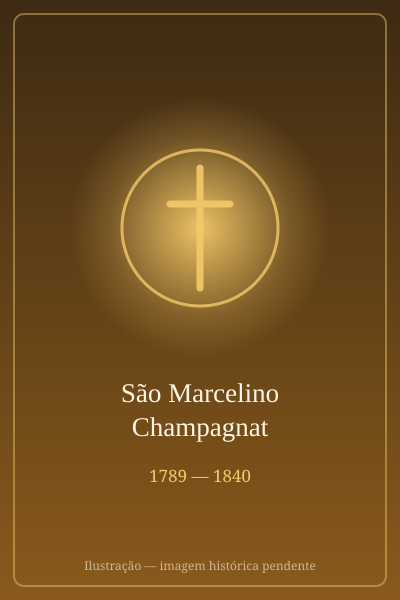

# São Marcelino Champagnat

> "Todas as dioceses do mundo entram em nossos planos." — São Marcelino Champagnat

- **Nascimento:** 20 de maio de 1789, em Le Rosey, Marlhes, França.
- **Morte:** 6 de junho de 1840, em Notre Dame de l'Hermitage, França.
- **Canonização:** 18 de abril de 1999, pelo Papa João Paulo II.
- **Festa Litúrgica:** 6 de junho.

<TextToSpeech />

## Biografia

Marcelino José Bento Champagnat nasceu em Marlhes, na França, no ano em que eclodiu a Revolução Francesa. Sua família era de camponeses modestos e profundamente religiosos. Em sua infância, Marcelino não frequentou muito a escola devido ao contexto político turbulento da época e também à sua dificuldade inicial nos estudos. A brutalidade de um professor fez com que ele desistisse de ir à escola por um longo período.

Anos mais tarde, com a ajuda e incentivo de um padre que percebeu sua vocação, Marcelino decidiu retomar os estudos e ingressar no seminário. Sua trajetória como seminarista não foi fácil devido à base educacional precária que possuía. Apesar dos grandes desafios acadêmicos, sua determinação e fé o levaram adiante. Durante seu tempo no seminário, ele conheceu e fez amizade com outros futuros santos, como São João Maria Vianney (o Cura d'Ars) e São Pedro Julião Eymard.

Junto com um grupo de seminaristas, ele idealizou a "Sociedade de Maria", focada em missões para espalhar a fé. Marcelino insistiu especialmente na necessidade de irmãos que pudessem ensinar e educar os jovens, em particular aqueles vindos de regiões rurais e mais pobres, que careciam de educação cristã e formação básica.

Após ser ordenado padre em 1816, ele foi designado para a paróquia de La Valla, uma área rural empobrecida. Lá, ele ficou profundamente tocado pelo estado de abandono espiritual e ignorância religiosa dos jovens. O encontro com um jovem doente chamado João Batista Montagne, de apenas 16 anos, que estava prestes a morrer sem conhecer absolutamente nada sobre a fé cristã, marcou Marcelino para sempre. Logo após esse evento, no dia 2 de janeiro de 1817, Marcelino fundou o Instituto dos Irmãos Maristas das Escolas (Pequenos Irmãos de Maria), acolhendo dois jovens para viver em comunidade e se formarem como professores.

Apesar de inúmeras dificuldades, como a falta de recursos, incompreensões e críticas do clero local, Marcelino perseverou na sua fundação, que logo começou a crescer. Ele construiu com as próprias mãos a casa de "Nossa Senhora de l'Hermitage", que se tornaria o coração da sua congregação.

Marcelino morreu em 6 de junho de 1840, aos 51 anos, esgotado de tanto trabalhar por seu instituto e pelo cuidado das vocações. Em seu testamento espiritual, recomendou aos irmãos que permanecessem unidos, praticassem a caridade e devotassem suas vidas à educação cristã, afirmando: "Para educar bem as crianças, é preciso antes amá-las, e amá-las todas por igual."

## Milagres

A canonização de São Marcelino Champagnat ocorreu em 18 de abril de 1999, em reconhecimento de dois milagres atribuídos à sua intercessão.

O milagre aceito para a sua canonização ocorreu em Montevidéu, Uruguai, em 1976. Um Ir. Marista, o Irmão Heriberto Weber, sofria de uma doença infecciosa pulmonar não identificada que havia degenerado e estava causando graves danos pulmonares, sem esperança de recuperação. O irmão estava à beira da morte e entrou em coma. Outros irmãos e ex-alunos começaram uma novena fervorosa pedindo a intercessão do Bem-Aventurado Marcelino Champagnat. Nos dias que se seguiram, a infecção regrediu completamente de forma inexplicável para a medicina da época, e o Irmão Heriberto foi curado, recuperando sua capacidade pulmonar integral.

## Curiosidades

1. **Amizade com o Cura d'Ars:** Marcelino estudou no mesmo seminário de Lyon onde também estudou São João Maria Vianney. Eles partilhavam amizade e eram unidos em ideais missionários e na vocação sacerdotal.
2. **Construtor:** Champagnat frequentemente pegava ferramentas, moldava pedras e participava da construção física da casa de formação em l'Hermitage para ensinar a importância do trabalho aos seus irmãos e economizar custos.
3. **Paciência e resiliência:** O lema da Sociedade de Maria, inspiradora de sua congregação era "*Tudo a Jesus por Maria, e tudo a Maria para Jesus*".

## Cidades por onde passou

São Marcelino viveu quase toda a sua vida nas imediações de Lyon, na França, trabalhando com e para as comunidades rurais pobres que conhecia profundamente.

- **Marlhes, França:** Sua aldeia natal, onde cresceu e recebeu os primeiros sinais de vocação e amor filial.
- **Lyon, França:** Onde estudou no seminário, formou ideais da Sociedade de Maria, e foi ordenado padre em 1816.
- **La Valla-en-Gier, França:** A paróquia para a qual foi designado, e onde iniciou a fundação dos Irmãos Maristas.
- **Notre Dame de l'Hermitage, Saint-Chamond, França:** Local onde construiu o centro e casa de formação dos Irmãos Maristas, e também onde faleceu.

## Impacto Hoje

O impacto de São Marcelino Champagnat no mundo moderno se faz notar na presença e no alcance dos Irmãos Maristas das Escolas e suas obras sociais, e de outros diversos grupos pertencentes à congregação "Sociedade de Maria", ao longo do globo.

Atualmente, o Instituto conta com cerca de 3000 Irmãos, trabalhando em mais de 80 países e dedicando-se incansavelmente à instrução e à formação dos jovens, administrando escolas, universidades, obras filantrópicas e de assistência, seguindo as determinações do seu fundador. Ele deixou um grande ensinamento de amor que diz que "a boa educação está em amar a criança".

<MiracleMap :items='[
  { lat: 45.2847, lng: 4.4005, type: "nascimento", title: "Marlhes, França", description: "Local de nascimento de São Marcelino Champagnat." },
  { lat: 45.4746, lng: 4.5147, type: "morte", title: "Notre Dame de l&#39;Hermitage, França", description: "Local da morte de São Marcelino Champagnat." },
  { lat: 45.4137, lng: 4.5684, type: "vida", title: "La Valla-en-Gier, França", description: "Primeira paróquia e fundação dos Irmãos Maristas." }
]' />
