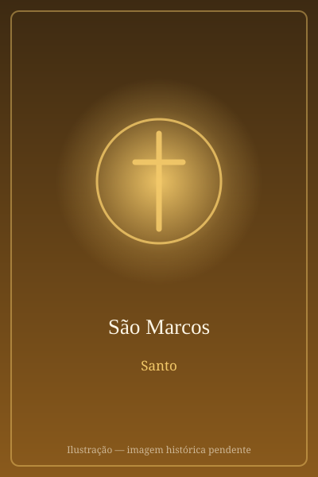

# São Marcos

> "Voz do que clama no deserto."

- **Nascimento:** Cirene ou Jerusalém
- **Morte:** 68 d.C., Alexandria, Egito
- **Canonização:** Pré-congregação
- **Festa Litúrgica:** 25 de abril

<TextToSpeech />

---

## Biografia

João Marcos era natural de Jerusalém, onde sua mãe, Maria, mantinha uma casa que servia de ponto de encontro dos primeiros cristãos — foi para lá que Pedro se dirigiu ao sair milagrosamente da prisão. Primo de Barnabé, acompanhou-o com Paulo na primeira viagem missionária, mas voltou atrás em Perge, o que provocou mais tarde a separação entre os dois apóstolos.

Reconciliado, tornou-se colaborador de Paulo em Roma e, sobretudo, discípulo e intérprete de Pedro, que o chama afetuosamente de "meu filho Marcos" na sua primeira carta. A tradição antiga, transmitida por Papias, afirma que seu Evangelho recolhe a pregação de Pedro em Roma.

Foi enviado ao Egito e fundou a Igreja de Alexandria, tornando-se seu primeiro bispo. Morreu mártir por volta do ano 68, arrastado por cordas pelas ruas da cidade.

## Vida Pessoal e Obra

O Evangelho de Marcos é o mais curto e provavelmente o mais antigo dos quatro, escrito num grego direto e vivo, cheio da palavra "imediatamente". Dirige-se a cristãos de origem pagã — por isso explica costumes judaicos — e concentra-se na pergunta sobre a identidade de Jesus, respondida pelo centurião ao pé da cruz: "verdadeiramente este homem era Filho de Deus".

## Milagres

A tradição alexandrina atribui a Marcos curas realizadas ao chegar ao Egito, entre elas a de um sapateiro chamado Ananias, ferido enquanto trabalhava — episódio que teria dado origem à primeira conversão da cidade. Depois de sua morte, o corpo foi disputado como relíquia, e o santuário de Alexandria foi, por séculos, centro de peregrinação e de relatos de graças.

## Curiosidades

1. **O leão alado:** seu símbolo entre os quatro viventes é o leão, porque o Evangelho começa com a voz que clama no deserto; o leão de São Marcos tornou-se o emblema de Veneza.
2. **A translação para Veneza:** em 828, mercadores venezianos levaram suas relíquias de Alexandria para Veneza — segundo a lenda, escondidas sob carne de porco para evitar a inspeção. Sobre elas ergueu-se a Basílica de São Marcos.
3. **O jovem da túnica:** muitos estudiosos veem uma assinatura discreta do autor no jovem que, na prisão de Jesus, foge deixando cair o lençol (Mc 14,51-52).
4. **Padroeiro:** de Veneza, do Egito, dos notários e dos vidraceiros.

## Cidades por onde passou

De Jerusalém partiu com Barnabé e Paulo por Chipre e pela Ásia Menor; esteve em Roma junto a Pedro e fundou a Igreja de Alexandria, onde morreu mártir.

<MiracleMap :items='[
  { lat: 32.825, lng: 21.8583, type: "nascimento", title: "Cirene", description: "Local de nascimento (Cirene ou Jerusalém)." },
  { lat: 31.2001, lng: 29.9187, type: "morte", title: "Alexandria", description: "Local de seu martírio e episcopado." },
  { lat: 45.4344, lng: 12.3394, type: "tumulo", title: "Basílica de São Marcos (Veneza)", description: "Onde repousam suas relíquias." }
]' />

## Impacto Hoje

A Igreja Copta Ortodoxa reconhece Marcos como seu fundador, e o Papa de Alexandria se apresenta como seu sucessor — o que faz dele uma figura central para milhões de cristãos do Egito e da Etiópia. Em Veneza, a basílica e a praça que levam seu nome são um dos conjuntos artísticos mais visitados do mundo, e o leão alado permanece o símbolo da cidade. Seu Evangelho, por ser o mais antigo, é a base de quase toda a pesquisa moderna sobre a formação dos textos evangélicos.
