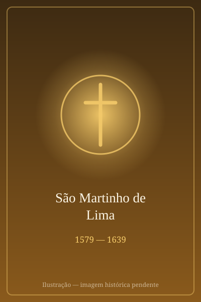

# São Martinho de Lima

> "A vassoura de Frei Martinho."

- **Nascimento:** 1579, Lima, Peru
- **Morte:** 1639, Lima, Peru
- **Canonização:** 1962, pelo Papa João XXIII
- **Festa Litúrgica:** 3 de novembro

<TextToSpeech />

---

## Biografia

Martinho de Porres nasceu em Lima, no Vice-Reino do Peru, em 1579, filho do fidalgo espanhol Juan de Porres e de Ana Velázquez, mulher negra liberta, do Panamá. Nasceu, portanto, mestiço e ilegítimo — o pai só o reconheceu anos depois —, e a certidão de batismo registrava apenas "filho de pai incógnito". Cresceu na pobreza com a mãe e a irmã.

Aos doze anos foi aprendiz de barbeiro-cirurgião, ofício que na época reunia corte de cabelo, sangrias, extração de dentes e cuidado de feridas — e que lhe deu a formação prática de enfermeiro que marcaria toda a sua vida. Aos quinze, pediu para entrar no convento dominicano do Santo Rosário de Lima. As leis coloniais impediam mestiços de se tornarem religiosos de pleno direito, e ele foi aceito como *donado*, servidor leigo encarregado das tarefas mais humildes: varrer, lavar, cuidar do lixo e da enfermaria.

Serviu assim durante nove anos, até que o prior, vencendo as resistências, o admitiu à profissão religiosa como irmão cooperador. Passou o resto da vida como enfermeiro do convento e da cidade, atendendo indistintamente frades, escravos, indígenas e espanhóis. Fundou um orfanato e uma escola para crianças pobres em Lima e sustentava diariamente centenas de necessitados. Morreu em 3 de novembro de 1639, aos sessenta anos.

## Vida Pessoal e Obra

Chamava a si mesmo de "pobre mulato" e "cão mestiço" e pedia repetidamente para ser vendido como escravo a fim de pagar as dívidas do convento. Era amigo de Santa Rosa de Lima e de São João Macias, com quem partilhava a mesma cidade e a mesma época. Dormia poucas horas, passava noites em oração e impunha-se jejuns severos.

## Milagres

- **Bilocação:** os depoimentos do processo de canonização afirmam que foi visto atendendo doentes na China, no Japão, na África e no México sem jamais ter deixado Lima.
- **Curas instantâneas:** numerosas testemunhas relataram curas obtidas com um copo d'água, um gesto ou uma oração — inclusive a de um frade com a perna gangrenada, marcada para amputação.
- **A refeição comum:** o episódio mais popular narra que fez um cão, um gato e um rato comerem juntos do mesmo prato, imagem da concórdia que buscava entre as pessoas.
- **Milagre da canonização:** a cura de Antônio Cabrera, um menino paraguaio de quatro anos com peritonite terminal, reconhecida em 1962.

## Curiosidades

1. **A vassoura:** é quase sempre representado com uma vassoura, símbolo do trabalho humilde que nunca abandonou mesmo depois de professo.
2. **Padroeiro da justiça social:** ao canonizá-lo em 1962 — em plena luta pelos direitos civis nos Estados Unidos —, João XXIII o apresentou como modelo de harmonia entre raças, e sua devoção se espalhou entre comunidades negras das Américas.
3. **Amigo dos animais:** mantinha no convento uma espécie de enfermaria para cães e gatos feridos, e a tradição lhe atribui um trato natural com os bichos.
4. **Padroeiro:** dos barbeiros e cabeleireiros, dos trabalhadores da saúde pública, da justiça social e da harmonia racial; é padroeiro do Peru junto com Santa Rosa.

## Cidades por onde passou

Nasceu, viveu e morreu em Lima, no Peru, onde permanece sepultado no convento dominicano do Santo Rosário.

<MiracleMap :items='[
  { lat: -12.0436, lng: -77.0315, type: "nascimento", title: "Convento de Santo Domingo (Lima)", description: "Local de nascimento (1579)." },
  { lat: -12.0436, lng: -77.0315, type: "morte", title: "Convento de Santo Domingo (Lima)", description: "Local da morte (1639)." },
  { lat: -12.0436, lng: -77.0315, type: "tumulo", title: "Convento de Santo Domingo (Lima)", description: "Onde viveu e está sepultado." }
]' />

## Impacto Hoje

São Martinho de Porres é um dos santos mais populares da América Latina e o primeiro santo negro das Américas — figura de referência para as pastorais afro-americanas e para a reflexão da Igreja sobre racismo. Sua imagem, com a vassoura e os animais aos pés, é uma das mais reproduzidas na devoção popular do continente. O convento de Lima recebe peregrinos o ano inteiro, e 3 de novembro é celebrado com festas em vários países.
