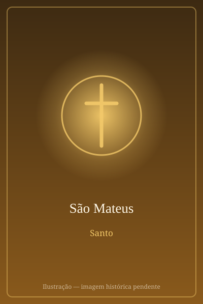

# São Mateus

> "Não vim chamar os justos, mas os pecadores."

- **Nascimento:** Século I, Galileia
- **Morte:** Século I, Etiópia ou Pérsia
- **Canonização:** Pré-congregação
- **Festa Litúrgica:** 21 de setembro

<TextToSpeech />

---

## Biografia

Mateus, também chamado Levi, filho de Alfeu, era publicano — cobrador de impostos para Roma — na alfândega de Cafarnaum. A profissão o tornava socialmente desprezado entre os judeus, tido como colaborador do ocupante e ritualmente impuro. Jesus passou por sua banca, disse apenas "segue-me", e ele deixou tudo e o seguiu.

Logo depois ofereceu um banquete em sua casa, com muitos publicanos e pecadores à mesa. Diante do escândalo dos fariseus, Jesus respondeu: "não são os sãos que precisam de médico, mas os doentes; não vim chamar os justos, e sim os pecadores" (Mt 9,12-13).

A tradição antiga, atestada por Papias e Eusébio, atribui-lhe o primeiro Evangelho, escrito para leitores de origem judaica e empenhado em mostrar que Jesus é o Messias anunciado pelos profetas. Depois de pregar na Judeia, as fontes o levam a terras distantes — a Etiópia, segundo a tradição mais difundida, ou a Pérsia. Morreu mártir, e uma tradição bastante antiga afirma que foi morto enquanto celebrava junto ao altar.

## Vida Pessoal e Obra

O Evangelho de Mateus é o mais "catequético" dos quatro: organiza o ensinamento de Jesus em cinco grandes discursos, começando pelo Sermão da Montanha com as Bem-aventuranças, e termina com o mandato missionário "ide e fazei discípulos de todas as nações". É também o único que traz a fórmula batismal trinitária e a passagem sobre o juízo final baseado nas obras de misericórdia.

## Milagres

Os relatos apócrifos atribuem-lhe curas, a expulsão de dragões venerados como divindades na Etiópia e a ressurreição do filho do rei local, episódio que teria levado a corte inteira à conversão. Na tradição da Igreja, porém, o "milagre" central de Mateus é o da própria vocação: a passagem instantânea da mesa dos impostos para o seguimento de Cristo.

## Curiosidades

1. **O homem alado:** entre os quatro viventes, é simbolizado por um homem ou anjo, porque seu Evangelho começa pela genealogia humana de Jesus.
2. **Caravaggio:** a *Vocação de São Mateus*, na igreja de San Luigi dei Francesi em Roma, é uma das obras mais célebres da pintura ocidental, e o Papa Francisco costumava citá-la como retrato de sua própria vocação.
3. **Salerno:** suas relíquias são veneradas na cripta da catedral de Salerno, na Itália, desde o século X.
4. **Padroeiro:** dos contadores, banqueiros, cobradores de impostos e profissionais de finanças.

## Cidades por onde passou

Trabalhava em Cafarnaum, na Galileia, e acompanhou Jesus pela Palestina; a tradição situa sua missão posterior na Judeia e depois em terras distantes, especialmente a Etiópia.

<MiracleMap :items='[
  { lat: 32.8808, lng: 35.575, type: "nascimento", title: "Cafarnaum", description: "Local de nascimento (Século I)." },
  { lat: 9.145, lng: 40.4897, type: "morte", title: "Etiópia", description: "Local da morte (Século I)." },
  { lat: 40.6782, lng: 14.7681, type: "tumulo", title: "Catedral de Salerno", description: "Local onde se encontram suas relíquias, na Itália." }
]' />

## Impacto Hoje

O Evangelho de Mateus é o mais lido na liturgia católica em um dos três anos do ciclo dominical, e textos como as Bem-aventuranças, o Pai-Nosso e o juízo final de Mateus 25 estão entre os fundamentos da ação social cristã. Sua vocação — a de alguém chamado a partir de uma profissão malvista — permanece como referência pastoral para o acolhimento de quem se sente à margem da comunidade.
