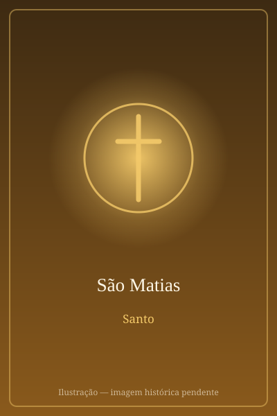

# São Matias

> "E a sorte caiu sobre Matias."

- **Nascimento:** Século I, Judeia
- **Morte:** c. 80 d.C., Jerusalém ou Cólquida
- **Canonização:** Pré-congregação
- **Festa Litúrgica:** 14 de maio

<TextToSpeech />

---

## Biografia

Matias não aparece nos Evangelhos pelo nome, mas os Atos dos Apóstolos deixam claro que estivera com Jesus desde o começo: quando a comunidade de Jerusalém decidiu completar o número dos Doze, Pedro estabeleceu o critério de escolher "um dos que estiveram conosco todo o tempo em que o Senhor Jesus viveu entre nós, começando pelo batismo de João até o dia em que foi elevado ao céu" (At 1,21-22).

Foram apresentados dois candidatos, José Barsabás e Matias. Depois da oração, a comunidade lançou sortes, e a escolha recaiu sobre Matias, que "foi contado entre os onze apóstolos" — completando o colégio apostólico antes de Pentecostes.

Sobre sua missão posterior, as fontes divergem. Uma tradição grega o leva à Etiópia e à Cólquida, junto ao Mar Negro, onde teria morrido mártir; outra, mais antiga e ligada a Clemente de Alexandria, situa sua pregação e sua morte em Jerusalém, por apedrejamento seguido de decapitação.

## Vida Pessoal e Missão

Matias é o apóstolo do qual menos se sabe, e é justamente essa discrição que a tradição espiritual sublinha: um discípulo que acompanhou Jesus em silêncio durante todo o ministério público e só foi chamado ao primeiro plano depois da Ascensão. Clemente de Alexandria cita uma frase que lhe é atribuída: é preciso "combater a carne e usá-la sem lhe ceder nada".

## Milagres

Os *Atos de André e Matias*, texto apócrifo bastante difundido no Oriente, narram sua libertação milagrosa de uma prisão entre um povo hostil, depois de ficar cego pela ação dos captores e recuperar a visão. A tradição associa ainda a suas relíquias, veneradas em Tréveris, uma longa série de curas registradas ao longo da Idade Média.

## Curiosidades

1. **Eleito por sorteio:** é o único apóstolo escolhido por sorteio, prática do Antigo Testamento para discernir a vontade de Deus — e o último ato desse tipo registrado na Bíblia, já que depois de Pentecostes as decisões passam a ser atribuídas ao Espírito Santo.
2. **Tréveris:** a Abadia de São Matias, em Tréveris, na Alemanha, é o único túmulo de apóstolo ao norte dos Alpes e recebe peregrinos desde a Idade Média.
3. **Mudança de data:** sua festa era celebrada em 24 de fevereiro; a reforma do calendário de 1969 a transferiu para 14 de maio, para não cair na Quaresma.
4. **Padroeiro:** dos alfaiates, dos carpinteiros e invocado contra o alcoolismo.

## Cidades por onde passou

Seguiu Jesus pela Galileia e pela Judeia desde o batismo no Jordão; foi eleito apóstolo em Jerusalém, e a tradição situa sua pregação entre a Judeia e as terras junto ao Mar Negro.

<MiracleMap :items='[
  { lat: 31.7683, lng: 35.2137, type: "nascimento", title: "Judeia", description: "Local de nascimento (Século I)." },
  { lat: 31.7683, lng: 35.2137, type: "morte", title: "Judeia", description: "Local da morte (c. 80 d.C.)." },
  { lat: 49.7558, lng: 6.6384, type: "tumulo", title: "Abadia de São Matias (Tréveris, Alemanha)", description: "Local onde se encontram suas relíquias." }
]' />

## Impacto Hoje

A eleição de Matias é o texto bíblico de referência sempre que a Igreja discute sucessão apostólica e o modo de escolher seus ministros — passagem citada em documentos sobre o episcopado e sobre o discernimento comunitário. Em Tréveris, a peregrinação ao seu túmulo continua ativa, e sua figura é lembrada como a do cristão fiel que serve longe dos holofotes.
