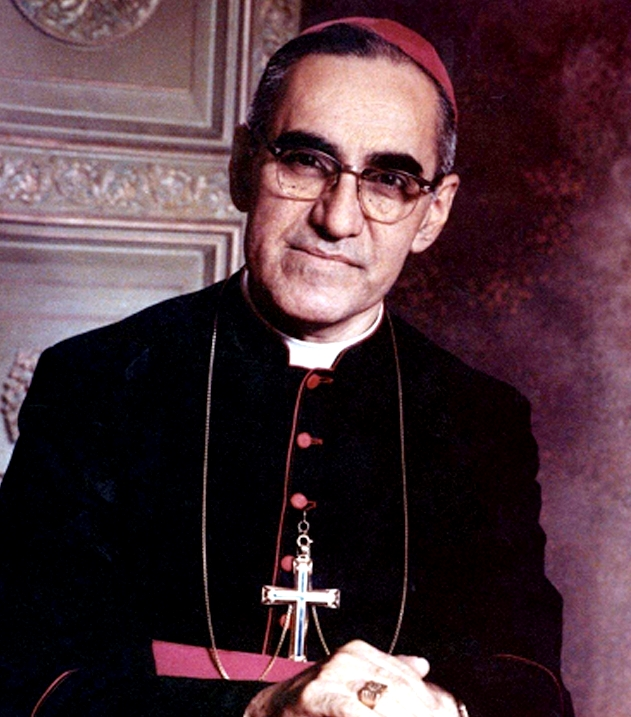

# São Oscar Romero

**"Se me matam, ressuscitarei no povo salvadorenho."**

- **Nascimento:** 15 de agosto de 1917, Ciudad Barrios (El Salvador)
- **Morte:** 24 de março de 1980, San Salvador (El Salvador)
- **Festa Litúrgica:** 24 de março
- **Canonização:** 14 de outubro de 2018, pelo Papa Francisco

<TextToSpeech />

---

## Biografia

Óscar Arnulfo Romero y Galdámez nasceu em Ciudad Barrios, uma pequena cidade nas montanhas de El Salvador, em uma família humilde. Aos 13 anos, sentiu o chamado ao sacerdócio e entrou para o seminário. Completou seus estudos em Roma e foi ordenado padre em 1942.

Durante muitos anos, Romero foi considerado um padre conservador, dedicado aos estudos e à pastoral tradicional. Em 1970, foi nomeado bispo auxiliar de San Salvador e, posteriormente, bispo de Santiago de María. Em 1977, foi escolhido como Arcebispo de San Salvador, em um momento de grande tensão política e social no país. Sua nomeação foi inicialmente bem recebida pela elite e pelo governo, que esperavam que ele mantivesse a Igreja afastada dos conflitos sociais.

No entanto, poucas semanas após sua posse, o assassinato de seu amigo, o padre jesuíta Rutilio Grande, que trabalhava com os camponeses pobres, provocou uma profunda transformação em Romero. Diante da brutalidade da repressão militar e dos esquadrões da morte, ele percebeu que não podia ficar em silêncio. Romero passou a denunciar as injustiças, a violência e a violação dos direitos humanos em suas homilias dominicais, que eram transmitidas pelo rádio e ouvidas por todo o país.

## Vida Pessoal e Obra

Romero tornou-se a "voz dos sem voz", defendendo os pobres e oprimidos. Ele pregava a reconciliação e a justiça, pedindo o fim da violência de ambos os lados do conflito civil. Sua coragem em enfrentar o poder opressor atraiu a ira do governo e dos grupos paramilitares, mas também o amor e a esperança do povo.

Apesar das constantes ameaças de morte, Romero recusou-se a abandonar seu rebanho e continuou a pregar o Evangelho da justiça e da paz. Ele viveu uma vida simples e austera, recusando privilégios e morando em um pequeno quarto no hospital da Divina Providência, onde cuidava de pacientes com câncer terminal.

## Milagres

Para sua beatificação, foi reconhecido o milagre da cura inexplicável de uma mulher grávida, Cecilia Maribel Flores de Rivas. Ela sofria de uma síndrome grave (síndrome HELLP) que colocava em risco sua vida e a do bebê. Após as orações de seu marido pedindo a intercessão de Romero, ela se recuperou completamente e deu à luz um bebê saudável.

A canonização ocorreu após a confirmação de outros milagres e da contínua devoção popular que se espalhou por todo o mundo, reconhecendo-o como um mártir da fé e da caridade.

## Curiosidades

1.  **Última Homilia:** Em sua última homilia dominical, um dia antes de sua morte, Romero fez um apelo direto aos soldados para que parassem a repressão: "Em nome de Deus e deste povo sofredor, cujos lamentos sobem até o céu cada dia mais tumultuosos, suplico-lhes, rogo-lhes, ordeno-lhes em nome de Deus: cessem a repressão!".
2.  **Mártir da Missa:** Ele foi assassinado com um tiro no coração enquanto celebrava a Santa Missa na capela do Hospital da Divina Providência, logo após a homilia, no momento do ofertório.
3.  **Santo das Américas:** É o primeiro santo nativo da América Central e é carinhosamente chamado de "San Romero de América".

## Cidades por onde passou

Nasceu em Ciudad Barrios, estudou em San Miguel e San Salvador, completou sua formação em Roma e exerceu seu ministério episcopal em Santiago de María e San Salvador.

<MiracleMap :items='[
  { lat: 13.7667, lng: -88.2667, title: "Ciudad Barrios, El Salvador", description: "Local de nascimento de Óscar Romero." },
  { lat: 13.4833, lng: -88.1833, title: "San Miguel, El Salvador", description: "Cidade onde estudou no seminário menor." },
  { lat: 41.9028, lng: 12.4964, title: "Roma, Itália", description: "Onde completou seus estudos de teologia e foi ordenado padre." },
  { lat: 13.6929, lng: -89.2182, title: "San Salvador, El Salvador", description: "Capital onde atuou como Arcebispo e foi martirizado." }
]' />

## Impacto Hoje

São Oscar Romero é um símbolo global de luta pelos direitos humanos e pela justiça social a partir da fé cristã. Sua vida e ensinamentos continuam a inspirar defensores da paz e da dignidade humana em todo o mundo. A ONU declarou o dia de sua morte, 24 de março, como o "Dia Internacional pelo Direito à Verdade sobre as Violações Graves dos Direitos Humanos e pela Dignidade das Vítimas". Ele nos lembra que a fé não pode ser separada da vida e do compromisso com os mais vulneráveis.
