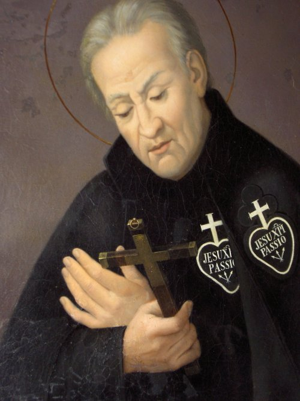

# São Paulo da Cruz

> "A oração é a chave de ouro que abre o céu."

**Nascimento:** 3 de Janeiro de 1694  
**Morte:** 18 de Outubro de 1775  
**Canonização:** 29 de Junho de 1867  
**Festa Litúrgica:** 19 de Outubro  

<TextToSpeech />

## Biografia

São Paulo da Cruz, batizado como Paolo Francesco Danei, nasceu em Ovada, na região de Piemonte, Itália. Segundo de 16 filhos de uma família nobre mas empobrecida, desde cedo demonstrou profunda piedade e inclinação para a oração contemplativa, especialmente voltada para a Paixão de Cristo.

Aos 19 anos, experimentou uma profunda conversão, decidindo dedicar sua vida inteiramente a Deus. Rejeitou uma herança substancial e um casamento vantajoso. Inspirado por visões místicas, sentiu o chamado para fundar uma congregação dedicada a promover a memória da Paixão de Jesus Cristo como a obra suprema do amor de Deus.

Em 1720, revestiu-se de um hábito negro de penitência e retirou-se por 40 dias em oração e jejum severo. Durante este período, escreveu a Regra da futura congregação, que mais tarde seria conhecida como a Congregação da Paixão de Jesus Cristo, ou Passionistas. Ele e seu irmão, João Batista, foram ordenados sacerdotes pelo Papa Bento XIII em 1727.

Os Passionistas combinam a vida contemplativa monástica com o trabalho apostólico ativo, pregando missões paroquiais centradas na Paixão de Cristo. Apesar das inúmeras dificuldades, falta de recursos e problemas de saúde, a congregação cresceu sob sua liderança. Paulo foi um dos mais famosos pregadores do seu tempo, cujas palavras e exemplo levavam muitos às lágrimas e conversões profundas. Faleceu em Roma, no mosteiro de São João e São Paulo, que havia recebido do Papa Clemente XIV.

## Milagres

A vida e o túmulo de São Paulo da Cruz são associados a inúmeros milagres, tanto durante sua vida terrena quanto após sua morte:

*   **Multiplicação de Alimentos:** Durante missões em épocas de fome, há relatos de que ele milagrosamente multiplicou alimentos para sustentar as multidões e os pobres que os procuravam.
*   **Curas Extraordinárias:** Numerosos testemunhos relatam curas de doenças terminais e crônicas mediante sua oração, imposição de mãos ou aplicação de relíquias e óleo abençoado.
*   **Dom da Profecia e Bilocação:** Foi creditado com o dom da profecia e houve vários relatos confiáveis de bilocação, sendo visto em dois lugares diferentes ao mesmo tempo.
*   **Milagres Post-Mortem:** Após sua morte, curas milagrosas fundamentaram seu processo de beatificação e canonização, confirmando sua santidade.

## Curiosidades

*   O hábito dos Passionistas, adotado por Paulo, é uma túnica negra com o emblema característico: um coração encimado por uma cruz branca e a inscrição "Jesu XPI Passio" (A Paixão de Jesus Cristo).
*   Seu irmão mais novo, João Batista, foi seu companheiro inseparável na fundação e obra missionária até o seu falecimento.
*   O Papa São João Paulo II o chamou de "um dos maiores místicos do século XVIII".

## Cidades por onde passou

São Paulo da Cruz desenvolveu sua missão pastoral principalmente na Itália, com destaque para:

*   **Ovada, Itália:** Sua cidade natal.
*   **Castellazzo Bormida, Itália:** Onde teve sua experiência mística inicial e escreveu a Regra.
*   **Monte Argentario, Itália:** Local da fundação do primeiro retiro (convento) passionista.
*   **Roma, Itália:** Cidade onde faleceu e onde está sepultado, na Basílica de São João e São Paulo.

## Impacto Hoje

Hoje, o legado de São Paulo da Cruz vive vibrantemente através da Congregação dos Passionistas, que conta com milhares de sacerdotes, irmãos e irmãs contemplativas em mais de 60 países. Seu carisma, centrado em meditar e anunciar o amor infinito de Deus revelado na Cruz de Cristo, continua a oferecer consolo, esperança e um profundo sentido de solidariedade aos que sofrem física e espiritualmente em todo o mundo. A congregação também lidera numerosos retiros, paróquias e santuários.

<MiracleMap :items='[
  { lat: 44.6397, lng: 8.6475, title: "Ovada, Itália", description: "Cidade natal de São Paulo da Cruz." },
  { lat: 44.8461, lng: 8.5833, title: "Castellazzo Bormida", description: "Local do seu retiro de quarenta dias onde escreveu a Regra." },
  { lat: 42.3917, lng: 11.1611, title: "Monte Argentario", description: "Fundação do primeiro retiro Passionista." },
  { lat: 41.8872, lng: 12.4925, title: "Roma", description: "Onde fundou a sede da Congregação e local do seu falecimento." }
]' />
