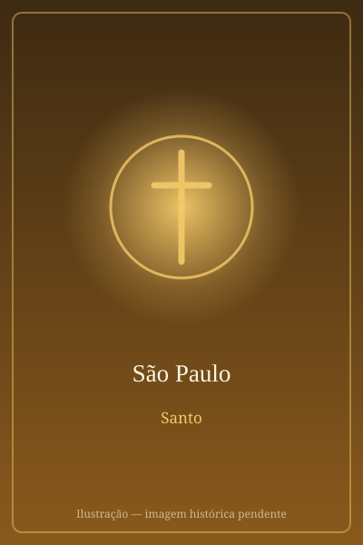

# São Paulo

> "Combati o bom combate, acabei a carreira, guardei a fé."

- **Nascimento:** c. 5 d.C., Tarso, Cilícia (Turquia)
- **Morte:** c. 67 d.C., Roma, Itália
- **Canonização:** Pré-congregação
- **Festa Litúrgica:** 29 de junho

<TextToSpeech />

---

## Biografia

Saulo nasceu em Tarso, na Cilícia (atual Turquia), numa família judia da tribo de Benjamim que possuía cidadania romana — privilégio raro e que marcaria toda a sua trajetória. Educado em Jerusalém aos pés do rabino Gamaliel, tornou-se fariseu rigoroso e perseguidor convicto dos primeiros cristãos: esteve presente, guardando as vestes dos executores, no apedrejamento de Santo Estêvão.

A caminho de Damasco, com cartas para prender os discípulos de Jesus, foi derrubado por uma luz do céu e ouviu: "Saulo, Saulo, por que me persegues?" (At 9,4). Ficou cego três dias e recuperou a visão pelas mãos de Ananias. A conversão transformou o perseguidor no maior missionário da Igreja primitiva.

Realizou três grandes viagens missionárias por Chipre, Ásia Menor, Macedônia e Grécia, fundando comunidades em Antioquia, Éfeso, Filipos, Tessalônica, Corinto e outras cidades. Defendeu no Concílio de Jerusalém que os gentios convertidos não precisavam observar a lei mosaica — decisão que abriu o cristianismo ao mundo. Preso em Jerusalém, apelou a César como cidadão romano e foi levado a Roma, onde permaneceu em prisão domiciliar. Foi decapitado nos arredores da cidade durante a perseguição de Nero.

## Vida Pessoal e Obra

Paulo era tecelão de tendas e fazia questão de sustentar-se com o próprio trabalho para não pesar sobre as comunidades. Treze cartas do Novo Testamento lhe são atribuídas, e nelas está a primeira grande elaboração teológica do cristianismo: a justificação pela fé, o corpo místico de Cristo, o hino à caridade da Primeira Carta aos Coríntios. Falava de um "espinho na carne" que o afligia e do qual pedia libertação, ouvindo em resposta: "basta-te a minha graça".

## Milagres

- **A ressurreição de Êutico:** em Trôade, um jovem adormeceu durante a longa pregação de Paulo e caiu do terceiro andar; dado como morto, foi abraçado pelo apóstolo e devolvido vivo à comunidade (At 20,7-12).
- **A víbora de Malta:** náufrago na ilha, foi mordido por uma serpente venenosa e nada sofreu, para espanto dos habitantes (At 28,3-6).
- **Curas em Éfeso:** os Atos relatam que lenços e aventais que haviam tocado Paulo eram levados aos doentes, que se curavam (At 19,11-12).
- **O paralítico de Listra:** curou um homem que nunca havia andado, e a multidão chegou a querer oferecer sacrifícios a ele e a Barnabé (At 14,8-18).

## Curiosidades

1. **Dois nomes:** "Saulo" era seu nome judaico e "Paulo" o romano; ambos eram seus desde o nascimento, e não houve troca de nome na conversão, como às vezes se supõe.
2. **A Basílica extramuros:** foi sepultado na via Ostiense, e sobre seu túmulo ergue-se a Basílica de São Paulo Fora dos Muros. Análises feitas em 2009 dataram os ossos do sarcófago entre os séculos I e II.
3. **Decapitado, não crucificado:** por ser cidadão romano, tinha direito a uma execução considerada menos infamante — daí a espada que aparece em suas imagens.
4. **Padroeiro:** dos escritores, dos jornalistas, da imprensa católica e dos missionários.

## Cidades por onde passou

Nasceu em Tarso, estudou em Jerusalém, converteu-se às portas de Damasco e percorreu o Mediterrâneo oriental em suas viagens missionárias, até morrer em Roma.

<MiracleMap :items='[
  { lat: 36.9177, lng: 34.8951, type: "nascimento", title: "Tarso, Cilícia (Turquia)", description: "Local de nascimento (c. 5 d.C.)." },
  { lat: 33.5138, lng: 36.2765, type: "vida", title: "Damasco", description: "Local da conversão de São Paulo." },
  { lat: 41.8336, lng: 12.4822, type: "morte", title: "Abadia das Três Fontes", description: "Local do martírio (decapitação) de São Paulo." },
  { lat: 41.9028, lng: 12.4964, type: "morte", title: "Roma, Itália", description: "Local da morte (c. 67 d.C.)." }
]' />

## Impacto Hoje

Paulo é, depois de Jesus, a figura mais determinante do cristianismo: suas cartas são lidas na liturgia do mundo inteiro e moldaram a teologia cristã de Agostinho a Lutero, de Tomás de Aquino aos autores contemporâneos. A festa de 25 de janeiro, Conversão de São Paulo, encerra a Semana de Oração pela Unidade dos Cristãos. Sua celebração conjunta com São Pedro, em 29 de junho, marca a data em que os arcebispos metropolitanos recebem o pálio das mãos do Papa.
