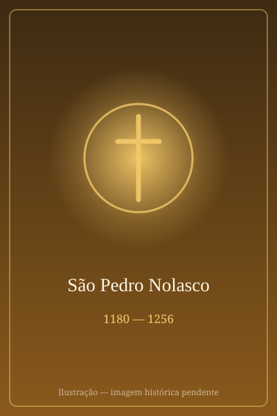

# São Pedro Nolasco

> "Para a libertação dos cativos, a nossa vida."

- **Nascimento:** 1180, Mas-des-Saintes-Puelles, França
- **Morte:** 6 de maio de 1256, Barcelona, Espanha
- **Canonização:** 30 de setembro de 1628, pelo Papa Urbano VIII
- **Festa Litúrgica:** 6 de maio

<TextToSpeech />

---

## Biografia

São Pedro Nolasco foi o fundador da Ordem de Nossa Senhora das Mercês, dedicada à redenção de cativos cristãos aprisionados durante as guerras com os mouros na Península Ibérica. Nascido na França em uma família nobre e rica, mudou-se ainda jovem para Barcelona, na Espanha. Sensibilizado pelo sofrimento dos cristãos feitos escravos por piratas e nos campos de batalha, decidiu usar sua herança para comprar a liberdade deles.

Em 1218, teve uma visão de Nossa Senhora, que o encorajou a fundar uma ordem religiosa dedicada à libertação dos cativos. Juntamente com São Raimundo de Peñafort e com o apoio do Rei Jaime I de Aragão, Nolasco estabeleceu a Ordem dos Mercedários. O traço distintivo dos mercedários era um quarto voto, no qual se comprometiam a oferecer a própria vida, se necessário, em troca da liberdade dos prisioneiros.

Durante a sua vida, São Pedro Nolasco resgatou milhares de cativos, viajando por terras hostis e arriscando sua vida em várias ocasiões. Ele foi preso e libertado, suportando sofrimentos indizíveis pela causa. Ele dedicou seus últimos anos à administração da Ordem e faleceu em paz em Barcelona.

## Milagres

A vida de São Pedro Nolasco está envolta em relatos de intervenções milagrosas, muitas relacionadas com sua missão de resgate:

- **Visão da Virgem:** O milagre fundacional da ordem foi a aparição simultânea de Nossa Senhora das Mercês a Pedro Nolasco, Raimundo de Peñafort e Jaime I, inspirando a fundação da Ordem dos Mercedários.
- **Milagre da Viagem:** Em uma ocasião, enquanto viajava de barco para o norte da África para resgatar cativos, diz-se que o vento parou. Nolasco orou e a viagem prosseguiu miraculosamente sem vento, levando-os em segurança ao destino.
- **A Corrente de Ouro:** Diz a tradição que, enquanto tentava resgatar cristãos e lhe faltava dinheiro, ele orou com fervor, e os mouros inexplicavelmente aceitaram o que ele tinha, com a graça divina operando no coração dos captores.

## Curiosidades

- A Ordem das Mercês foi originalmente uma ordem de cavalaria antes de se tornar uma ordem puramente religiosa mendicante.
- O hábito branco dos Mercedários exibe o brasão do rei de Aragão, um escudo com quatro listras vermelhas sobre um fundo de ouro.
- Os mercedários, além dos votos de castidade, pobreza e obediência, faziam um quarto voto de se entregar como reféns se necessário, para libertar um cristão em perigo de perder a fé.

## Cidades por onde passou

- **Mas-des-Saintes-Puelles, França:** Sua cidade natal.
- **Barcelona, Espanha:** Cidade onde fundou a Ordem das Mercês e o principal centro de suas operações.
- **Valência, Espanha:** Acompanhou o rei Jaime I na conquista da cidade.
- **Argel, Argélia:** (E outras cidades do Norte da África) Locais para onde viajou frequentemente para negociar a liberdade dos escravos.

## Impacto Hoje

O legado de São Pedro Nolasco perdura através da Ordem da Bem-Aventurada Virgem Maria das Mercês (Mercedários). Hoje, a Ordem adaptou sua missão inicial para atender às formas modernas de cativeiro e escravidão. Os frades mercedários trabalham na educação, pastoral paroquial e, significativamente, em ministérios prisionais, no combate ao tráfico humano, reabilitação de dependentes químicos e assistência a refugiados, continuando a levar a liberdade e a misericórdia onde há opressão.

<MiracleMap :items='[
  { lat: 43.3130, lng: 1.8780, title: "Nascimento", description: "Nasceu em Mas-des-Saintes-Puelles, França.", type: "nascimento" },
  { lat: 41.3851, lng: 2.1734, title: "Fundação da Ordem e Morte", description: "Fundou a Ordem das Mercês e faleceu em Barcelona, Espanha.", type: "morte" },
  { lat: 39.4699, lng: -0.3774, title: "Valência", description: "Atuou na região durante a reconquista.", type: "vida" },
  { lat: 36.7538, lng: 3.0588, title: "Argel", description: "Viajou para o Norte da África para resgatar cativos.", type: "vida" }
]' />
