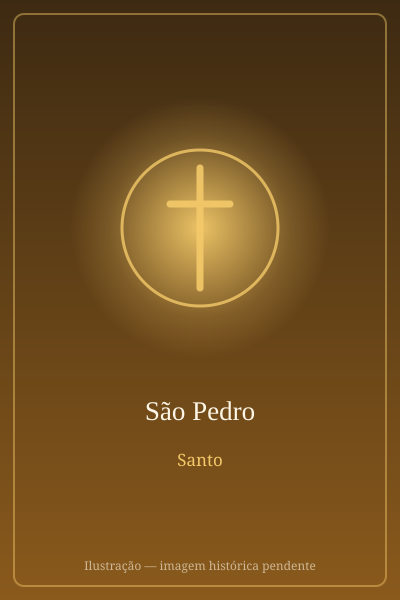

# São Pedro

> "Tu és Pedro, e sobre esta pedra edificarei a minha Igreja."

- **Nascimento:** Século I a.C., Betsaida, Galileia
- **Morte:** c. 64-67 d.C., Roma, Itália
- **Canonização:** Pré-congregação
- **Festa Litúrgica:** 29 de junho

<TextToSpeech />

---

## Biografia

Simão, filho de Jonas, era pescador em Cafarnaum, às margens do mar da Galileia, quando Jesus o chamou junto com seu irmão André. Casado e de temperamento impulsivo, foi o primeiro dos apóstolos a confessar abertamente que Jesus era "o Cristo, o Filho do Deus vivo" — e recebeu por isso o nome de Cefas, "Pedra": "tu és Pedro, e sobre esta pedra edificarei a minha Igreja" (Mt 16,18).

Esteve nos momentos decisivos da vida de Cristo: a Transfiguração no Tabor, a ressurreição da filha de Jairo, a agonia no Horto das Oliveiras. Também negou Jesus três vezes na noite da Paixão e chorou amargamente — episódio que a tradição cristã guarda não como vergonha, mas como retrato da fragilidade humana redimida pelo perdão. Depois da Ressurreição, junto ao lago, recebeu de Jesus a tríplice pergunta "tu me amas?" e o encargo de apascentar o rebanho.

Liderou a Igreja nascente em Jerusalém, presidiu a escolha de Matias, pregou no dia de Pentecostes e teve papel decisivo no chamado Concílio de Jerusalém, que abriu a Igreja aos não-judeus. Depois de passar por Antioquia, estabeleceu-se em Roma, onde foi martirizado durante a perseguição de Nero, por volta dos anos 64-67. A tradição afirma que pediu para ser crucificado de cabeça para baixo, por não se julgar digno de morrer como o seu Mestre.

## Vida Pessoal e Missão

Pedro era um homem simples, sem formação letrada, e é justamente essa simplicidade que os Evangelhos destacam. Tinha sogra — curada por Jesus em Cafarnaum — e deixou a rede de pesca para segui-lo. Sua pregação está na base do Evangelho de Marcos, escrito, segundo a tradição antiga, por seu discípulo e intérprete. Duas cartas do Novo Testamento levam seu nome.

Como primeiro Bispo de Roma, é reconhecido pela Igreja Católica como o primeiro Papa, e a sucessão apostólica dos pontífices romanos remonta a ele.

## Milagres

- **O coxo da Porta Formosa:** à porta do Templo de Jerusalém, disse ao paralítico de nascença: "Não tenho prata nem ouro, mas o que tenho te dou: em nome de Jesus Cristo Nazareno, levanta-te e anda" (At 3,6). O homem passou a andar e saltar diante de todos.
- **A sombra que curava:** os Atos dos Apóstolos registram que os doentes eram levados às ruas para que ao menos a sombra de Pedro os alcançasse ao passar (At 5,15).
- **Tabita, em Jope:** ressuscitou a discípula Tabita (Dorcas), conhecida pelas obras de caridade com as viúvas (At 9,36-42).
- **Libertação da prisão:** um anjo abriu as correntes e os portões da prisão de Herodes, e Pedro saiu sem que os guardas percebessem (At 12,1-11).

## Curiosidades

1. **Quo vadis?:** uma tradição antiga conta que, fugindo da perseguição em Roma, Pedro encontrou Cristo na estrada e perguntou "Quo vadis, Domine?" ("Para onde vais, Senhor?"). Ao ouvir "Vou a Roma para ser crucificado de novo", voltou e enfrentou o martírio.
2. **O túmulo sob a Basílica:** escavações realizadas no século XX sob o altar da Basílica de São Pedro encontraram uma necrópole romana e um conjunto de ossos venerado desde a Antiguidade como o sepulcro do apóstolo.
3. **As chaves:** é quase sempre representado com duas chaves, símbolo do poder de "atar e desatar" recebido de Cristo, e com um galo, lembrança da negação.
4. **Padroeiro:** dos pescadores, dos serralheiros e chaveiros, dos papas e da própria cidade de Roma, junto com São Paulo.

## Cidades por onde passou

De Betsaida e Cafarnaum, na Galileia, Pedro seguiu Jesus por toda a Palestina; pregou em Jerusalém, Jope e Cesareia, passou por Antioquia da Síria e terminou seus dias em Roma.

<MiracleMap :items='[
  { lat: 32.909, lng: 35.63, type: "nascimento", title: "Betsaida", description: "Cidade natal de Pedro." },
  { lat: 41.9028, lng: 12.4964, type: "morte", title: "Basílica de São Pedro", description: "Local da morte (c. 64-67 d.C.)." },
  { lat: 41.9022, lng: 12.4539, type: "tumulo", title: "Basílica de São Pedro", description: "Local do martírio e túmulo de São Pedro." }
]' />

## Impacto Hoje

A Basílica de São Pedro, no Vaticano, construída sobre o local tradicionalmente identificado como seu túmulo, é o coração visível do catolicismo e recebe milhões de peregrinos por ano. Cada novo Papa é apresentado ao mundo como sucessor de Pedro, e a expressão "Sé de Pedro" designa a autoridade do bispo de Roma. Sua festa, celebrada com São Paulo em 29 de junho, é solenidade em toda a Igreja e feriado na capital italiana. Para os fiéis, sua história — a do discípulo que negou e foi reconduzido — permanece como o retrato mais humano da misericórdia cristã.
