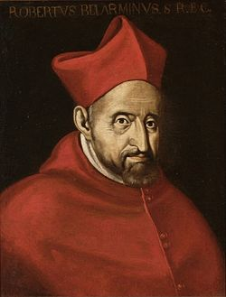

# São Roberto Belarmino

**"A paz é um bem tão grande que, mesmo que se deseje, não se pode desejar o bastante."**

**Nascimento:** 4 de outubro de 1542, Montepulciano, Itália 
**Morte:** 17 de setembro de 1621, Roma, Itália 
**Festa Litúrgica:** 17 de setembro 
**Canonização:** 29 de junho de 1930, pelo Papa Pio XI 

---

<TextToSpeech />

## Biografia

São Roberto Belarmino (Roberto Francesco Romolo Bellarmino) foi um jesuíta italiano, cardeal da Igreja Católica, e uma das figuras mais importantes da Contrarreforma. Nascido em uma família nobre, porém empobrecida, era sobrinho do Papa Marcelo II. Desde jovem, demonstrou grande inteligência e devoção, conhecendo Virgilio de cor e compondo poemas em latim e italiano.

Em 1560, entrou para a Companhia de Jesus (Jesuítas). Estudou em Pádua e Lovaina, onde se tornou o primeiro jesuíta a lecionar na universidade, focando na Suma Teológica de São Tomás de Aquino. Sua obra monumental, *Disputationes de controversiis christianae fidei* (Disputas sobre as controvérsias da fé cristã), foi a defesa mais completa da fé católica contra os argumentos protestantes da época.

Como teólogo e consultor papal, esteve envolvido em momentos cruciais da história da Igreja, incluindo a revisão da Vulgata e questões doutrinárias complexas. Foi nomeado Cardeal e depois Arcebispo de Cápua, onde se dedicou intensamente à reforma do clero e à catequese.

## Milagres

Embora seja mais conhecido por seu intelecto e defesa da fé, sua santidade foi confirmada por milagres reconhecidos pela Igreja para sua canonização. Sua intercessão é frequentemente invocada para a clareza na fé e no ensino da doutrina. Foi declarado Doutor da Igreja em 1931, um reconhecimento de sua contribuição excepcional para a teologia.

## Curiosidades

1.  **Caso Galileu:** Como Cardeal Inquisidor, Belarmino teve um papel central no caso de Galileu Galilei. Ele admoestou Galileu a não ensinar o heliocentrismo como verdade absoluta sem provas irrefutáveis, mantendo uma postura de cautela científica e teológica que é frequentemente mal compreendida.
2.  **Catecismo:** Escreveu um Catecismo ("Doutrina Cristã Breve") que foi traduzido para mais de 50 línguas e usado como padrão na Igreja por séculos.
3.  **Humildade:** Mesmo sendo Cardeal, vivia com extrema austeridade, doando seus bens aos pobres e vivendo como um simples religioso.

## Cidades por onde passou

*   **Montepulciano (Itália):** Cidade natal.
*   **Roma (Itália):** Onde estudou, lecionou no Colégio Romano e faleceu.
*   **Pádua (Itália):** Onde realizou estudos de teologia.
*   **Lovaina (Bélgica):** Onde foi ordenado sacerdote e lecionou na universidade.
*   **Cápua (Itália):** Onde serviu como Arcebispo.

## Impacto Hoje

São Roberto Belarmino continua sendo uma referência fundamental para a teologia católica. Suas obras sobre a relação entre fé e razão, e sobre a autoridade da Igreja, ainda são estudadas. Ele nos ensina a importância do estudo profundo da fé para defendê-la com caridade e inteligência. É o padroeiro dos catequistas, lembrando-nos da importância de transmitir a fé com clareza.

<MiracleMap />
