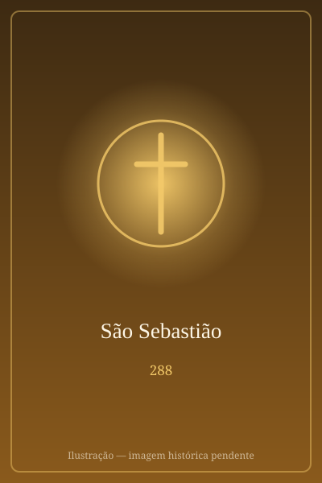

# São Sebastião

> "Soldado de Cristo."

- **Nascimento:** Narbona, França
- **Morte:** c. 288 d.C., Roma
- **Canonização:** Pré-congregação
- **Festa Litúrgica:** 20 de janeiro

<TextToSpeech />

---

## Biografia

Sebastião nasceu por volta de 256, em Narbona, na Gália, e cresceu em Milão. Alistou-se no exército romano e chegou à guarda pretoriana do imperador Diocleciano — segundo Santo Ambrósio, entrou na carreira militar não por ambição, mas para poder assistir e encorajar os cristãos presos sem levantar suspeitas.

Durante anos manteve a fé em segredo, visitando prisioneiros, sustentando os condenados e convertendo companheiros de armas e funcionários imperiais. A tradição registra a conversão do prefeito Cromácio e a de sua família, além do episódio em que fortaleceu os irmãos Marcos e Marceliano, que fraquejavam diante do martírio.

Denunciado, foi condenado a ser flechado no Campo de Marte. Os soldados o deixaram por morto, mas ele sobreviveu: a viúva Irene, ao recolher o corpo para sepultá-lo, percebeu que respirava e cuidou dele até a recuperação. Restabelecido, em vez de fugir, postou-se num degrau por onde passava Diocleciano e o repreendeu publicamente pela perseguição. Foi então açoitado até a morte, por volta de 288, e o corpo lançado na Cloaca Máxima.

## Vida Pessoal e Obra

Sebastião é o santo do duplo martírio — sobreviveu ao primeiro e voltou voluntariamente ao segundo —, e essa insistência é o traço que a tradição mais destaca. Seu culto é antiquíssimo: já em 354 a *Depositio Martyrum* registra sua sepultura na via Ápia, e a basílica de São Sebastião fora dos Muros é uma das sete igrejas da peregrinação romana.

## Milagres

- **A sobrevivência às flechas:** o episódio central de sua história, com a cura pelas mãos de Santa Irene, é tratado pela tradição como intervenção divina.
- **Protetor contra a peste:** em 680, uma epidemia que devastava Roma cessou depois que suas relíquias foram levadas em procissão até a igreja de São Pedro in Vincoli — episódio que fixou sua fama de protetor contra as pestes e explica sua enorme presença na arte da Idade Média e do Renascimento.
- **A defesa do Rio de Janeiro:** a tradição brasileira atribui à sua intercessão a vitória sobre os franceses e tamoios em 20 de janeiro de 1567, e mais tarde o fim de epidemias na cidade.

## Curiosidades

1. **As flechas:** embora as flechas não o tenham matado, tornaram-se seu atributo iconográfico, e sua figura amarrada à coluna é um dos temas mais pintados da história da arte, de Mantegna a El Greco.
2. **Padroeiro do Rio de Janeiro:** a cidade se chama oficialmente São Sebastião do Rio de Janeiro, e 20 de janeiro é feriado municipal, com procissão que reúne centenas de milhares de fiéis.
3. **Padroeiro dos atletas:** por sua condição de soldado e pela imagem de resistência física, é patrono dos atletas, dos arqueiros e dos soldados.
4. **Devoção popular:** no Brasil, é um dos santos mais populares, com festas e novenas em todas as regiões.

## Cidades por onde passou

Nasceu em Narbona, na Gália, cresceu em Milão e viveu em Roma, onde serviu na guarda pretoriana e onde foi martirizado.

<MiracleMap :items='[
  { lat: 43.1843, lng: 3.0039, type: "nascimento", title: "Narbona, França", description: "Local de nascimento (Narbona)." },
  { lat: 41.9028, lng: 12.4964, type: "morte", title: "Roma", description: "Local da morte (c. 288 d.C.)." },
  { lat: 41.8569, lng: 12.5192, type: "tumulo", title: "Catacumbas de São Sebastião", description: "Onde foi sepultado em Roma." }
]' />

## Impacto Hoje

Poucos santos têm presença tão forte na cultura visual e na devoção popular. No Brasil, é padroeiro do Rio de Janeiro e de dezenas de municípios, e sua festa mobiliza uma das maiores procissões urbanas do país. Na Itália e na Espanha, permanece como protetor invocado em tempos de epidemia — devoção que voltou a ser lembrada em anos recentes. Sua basílica na via Ápia, sobre as catacumbas que levam seu nome, continua a ser ponto obrigatório das peregrinações a Roma.
