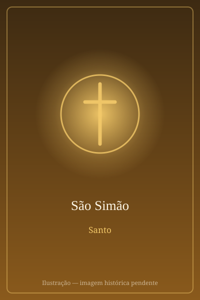

# São Simão

> "Zeloso pela lei do Senhor."

- **Nascimento:** Galileia
- **Morte:** Século I, Pérsia ou Edessa
- **Canonização:** Pré-congregação
- **Festa Litúrgica:** 28 de outubro

<TextToSpeech />

---

## Biografia

Simão é chamado "o Zelote" (ou "o Cananeu", do aramaico *qan'ana*, com o mesmo sentido) para distingui-lo de Simão Pedro. O apelido indica ou pertença ao movimento zelota — a corrente judaica que defendia a resistência armada à ocupação romana — ou, ao menos, um zelo ardente pela Lei. Se a primeira hipótese estiver certa, o grupo dos Doze reunia um zelota e um publicano, Mateus, cobrador de impostos para Roma: dois extremos opostos do espectro político de seu tempo, chamados a conviver.

Fora das listas apostólicas, os Evangelhos nada dizem sobre ele. As tradições posteriores situam sua pregação no Egito e na Mesopotâmia, e a tradição ocidental o associa a São Judas Tadeu na missão pela Pérsia, onde ambos teriam sido martirizados. Uma versão do martírio afirma que foi serrado ao meio; outra, que foi crucificado. Uma tradição oriental distinta o leva ao Cáucaso e à região de Edessa.

## Vida Pessoal e Missão

Simão é o retrato do discípulo cuja história a Escritura não conserva — e cuja identidade fica ligada a um apelido político. A tradição cristã lê nesse detalhe uma lição sobre a Igreja: o seguimento de Cristo reconcilia pessoas que a vida pública havia posto em campos opostos.

## Milagres

Os relatos apócrifos da *Paixão de Simão e Judas* narram que os dois apóstolos desmascararam os oráculos dos magos da corte persa, silenciaram ídolos e saíram ilesos de uma cova de feras — episódios que, segundo esses textos, precederam o martírio de ambos.

## Curiosidades

1. **A serra:** é representado com uma serra, instrumento do martírio segundo a tradição ocidental, e às vezes com um peixe, alusão à pesca apostólica.
2. **Celebrado com Judas Tadeu:** a Igreja latina celebra os dois no mesmo dia, 28 de outubro, por causa da tradição do martírio comum na Pérsia.
3. **Relíquias no Vaticano:** seus restos são venerados, com os de São Judas, num altar da Basílica de São Pedro.
4. **Padroeiro:** dos curtidores, serradores e lenhadores.

## Cidades por onde passou

Da Galileia acompanhou Jesus pela Palestina; a tradição situa sua missão posterior no Egito, na Mesopotâmia e na Pérsia, onde teria morrido mártir.

<MiracleMap :items='[
  { lat: 32.7467, lng: 35.3389, type: "nascimento", title: "Caná da Galileia", description: "Local de nascimento (Galileia)." },
  { lat: 37.1591, lng: 38.7969, type: "morte", title: "Edessa", description: "Local da morte (Século I)." },
  { lat: 41.9022, lng: 12.4539, type: "tumulo", title: "Basílica de São Pedro (Altar da Crucificação)", description: "Suas relíquias estão sob o altar junto com as de São Judas Tadeu." }
]' />

## Impacto Hoje

A convivência de Simão, o Zelote, com Mateus, o publicano, no mesmo grupo de discípulos é uma das imagens mais citadas em pregações e documentos sobre reconciliação e polarização política — um lembrete de que a comunidade cristã nasceu reunindo posições irreconciliáveis. Sua festa, partilhada com São Judas Tadeu, atrai grandes multidões em santuários da América Latina.
