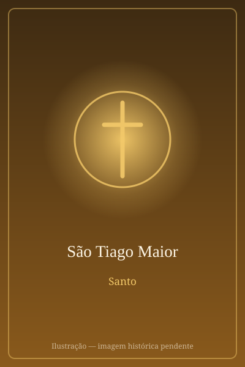

# São Tiago Maior

> "Podes beber o cálice que eu vou beber?"

- **Nascimento:** Betsaida, Galileia
- **Morte:** 44 d.C., Jerusalém
- **Canonização:** Pré-congregação
- **Festa Litúrgica:** 25 de julho

<TextToSpeech />

---

## Biografia

Tiago, filho de Zebedeu e de Salomé e irmão de João Evangelista, era pescador na Galileia quando Jesus o chamou. Recebeu com o irmão o apelido de *Boanerges*, "filhos do trovão", pelo temperamento ardente — chegaram a propor que fogo do céu descesse sobre uma aldeia samaritana que não os acolheu.

Formava com Pedro e João o grupo mais próximo de Jesus: os três presenciaram a ressurreição da filha de Jairo, a Transfiguração no monte Tabor e a agonia no Horto das Oliveiras. Sua mãe pediu a Jesus que os dois filhos se sentassem à sua direita e à sua esquerda no Reino, e ouviu como resposta a pergunta sobre o cálice que Cristo haveria de beber.

Foi o primeiro dos apóstolos a morrer mártir: por volta do ano 44, Herodes Agripa I mandou decapitá-lo em Jerusalém — o único martírio de apóstolo narrado dentro do Novo Testamento (At 12,2). Uma tradição hispânica muito antiga afirma que ele havia pregado na Península Ibérica e que seus restos foram levados de volta à Galiza, onde no século IX se identificou o sepulcro que deu origem a Santiago de Compostela.

## Vida Pessoal e Missão

Chamado "Maior" para distingui-lo de Tiago, filho de Alfeu, deixou a barca e as redes do pai imediatamente ao ser chamado. Os Evangelhos não lhe atribuem nenhum escrito, mas o colocam sempre no núcleo íntimo dos discípulos — o que fez dele, na memória cristã, a imagem do apóstolo que segue Cristo até o fim.

## Milagres

A tradição espanhola atribui a Tiago a aparição da Virgem do Pilar em Saragoça, quando, desanimado com a pregação, teria recebido a visita de Maria ainda em vida. A partir do século IX, o santuário de Compostela passou a registrar inúmeras curas de peregrinos, e a devoção medieval o invocava como protetor nos caminhos e nas batalhas.

## Curiosidades

1. **A vieira:** a concha de vieira, apanhada nas praias da Galiza, tornou-se o distintivo dos peregrinos e é hoje o símbolo do Caminho de Santiago, sinalizando as rotas por toda a Europa.
2. **Compostela:** o nome é geralmente ligado a *campus stellae*, "campo da estrela", pela luz que, segundo a lenda, revelou o sepulcro ao eremita Pelágio.
3. **Ano Santo Compostelano:** quando 25 de julho cai num domingo, abre-se a Porta Santa da catedral e o ano recebe indulgência plenária.
4. **Botafumeiro:** o gigantesco incensário da catedral, com cerca de 60 kg, é movido por oito tiraboleiros e atravessa o transepto em festas solenes.

## Cidades por onde passou

Nasceu na Galileia e acompanhou Jesus por toda a Palestina, morrendo mártir em Jerusalém. Sua devoção, porém, tem centro em Santiago de Compostela, na Galiza, onde suas relíquias são veneradas.

<MiracleMap :items='[
  { lat: 32.909, lng: 35.63, type: "nascimento", title: "Betsaida, Galileia", description: "Local de nascimento (Betsaida)." },
  { lat: 31.7683, lng: 35.2137, type: "morte", title: "Jerusalém", description: "Local do martírio." },
  { lat: 42.8805, lng: -8.5446, type: "tumulo", title: "Catedral de Santiago de Compostela", description: "Túmulo do Apóstolo Tiago." }
]' />

## Impacto Hoje

O Caminho de Santiago é a rota de peregrinação cristã mais percorrida do mundo, com centenas de milhares de caminhantes por ano vindos de todos os continentes — declarado Primeiro Itinerário Cultural Europeu e Patrimônio Mundial pela UNESCO. Santiago é padroeiro da Espanha, e 25 de julho é festa nacional na Galiza. Para muitos peregrinos, crentes ou não, o percurso continua sendo um dos grandes ritos de travessia da cultura europeia.
