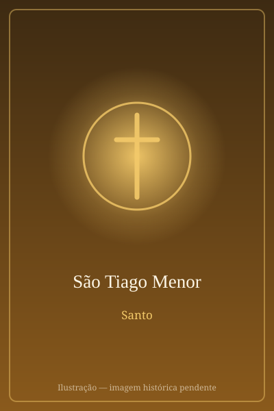

# São Tiago Menor

> "A fé sem obras é morta."

- **Nascimento:** Galileia
- **Morte:** c. 62 d.C., Jerusalém
- **Canonização:** Pré-congregação
- **Festa Litúrgica:** 3 de maio

<TextToSpeech />

---

## Biografia

Tiago, filho de Alfeu, é chamado "Menor" para distingui-lo de Tiago Maior — o adjetivo indica idade ou estatura, não importância. A tradição o identifica com "Tiago, o irmão do Senhor" mencionado por São Paulo, entendido como primo ou parente próximo de Jesus segundo o uso semita da palavra.

Depois de Pentecostes, tornou-se o primeiro bispo de Jerusalém e figura de referência para os cristãos de origem judaica. Presidiu com Pedro o Concílio de Jerusalém, por volta do ano 49, e foi sua intervenção que selou a decisão de não impor a circuncisão aos gentios convertidos. O historiador judeu Flávio Josefo registra sua morte, ocorrida por volta do ano 62, num intervalo entre dois governadores romanos.

Segundo Hegésipo, citado por Eusébio de Cesareia, foi levado ao pináculo do Templo e intimado a renegar Cristo diante da multidão; ao proclamar a fé, foi lançado do alto e, ainda vivo, morto a golpes de um bastão de pisoeiro.

## Vida Pessoal e Obra

Era conhecido como "o Justo" pela observância rigorosa da Lei e por sua vida de oração — a tradição diz que passava tanto tempo de joelhos no Templo que tinha os joelhos calejados. A ele é atribuída a Epístola de Tiago, um dos textos mais práticos do Novo Testamento, célebre pela afirmação de que "a fé sem obras é morta" (Tg 2,26).

## Milagres

Os relatos antigos ligam a Tiago menos prodígios espetaculares e mais a fama de intercessor: sua oração persistente no Templo era tida pelos próprios judeus de Jerusalém como proteção para a cidade. A tradição afirma ainda que Jesus ressuscitado lhe apareceu pessoalmente — aparição mencionada por São Paulo (1Cor 15,7) — e que suas relíquias, veneradas em Roma, foram associadas a curas.

## Curiosidades

1. **O bastão de pisoeiro:** é quase sempre representado com uma clava ou bastão de pisoeiro (a ferramenta usada para bater tecidos), instrumento de seu martírio.
2. **Relíquias em Roma:** seus restos são venerados junto aos de São Filipe na Basílica dos Santos Doze Apóstolos, e por isso a Igreja celebrava os dois no mesmo dia.
3. **A Liturgia de São Tiago:** uma das mais antigas anáforas cristãs, ainda usada pelas Igrejas siríaca e ortodoxa, leva seu nome como primeiro bispo de Jerusalém.
4. **Padroeiro:** dos chapeleiros, dos boticários e dos moribundos.

## Cidades por onde passou

Sua vida está ligada à Galileia, de onde vinha, e sobretudo a Jerusalém, onde presidiu a comunidade cristã e onde morreu mártir.

<MiracleMap :items='[
  { lat: 32.8, lng: 35.5, type: "nascimento", title: "Galileia", description: "Local de nascimento (Galileia)." },
  { lat: 31.7781, lng: 35.236, type: "morte", title: "Jerusalém", description: "Local do martírio e episcopado." },
  { lat: 41.8902, lng: 12.4848, type: "tumulo", title: "Basílica dos Santos Doze Apóstolos (Roma)", description: "Onde se encontram suas relíquias junto com as de São Filipe." }
]' />

## Impacto Hoje

A Carta de Tiago continua a ser um dos textos bíblicos mais citados quando se fala de justiça social, do cuidado com os pobres e da coerência entre fé e vida — sua advertência contra o salário retido dos trabalhadores é leitura frequente na Doutrina Social da Igreja. Também é dele o fundamento bíblico da Unção dos Enfermos (Tg 5,14-15). Sua festa é celebrada em 3 de maio, junto com São Filipe.
