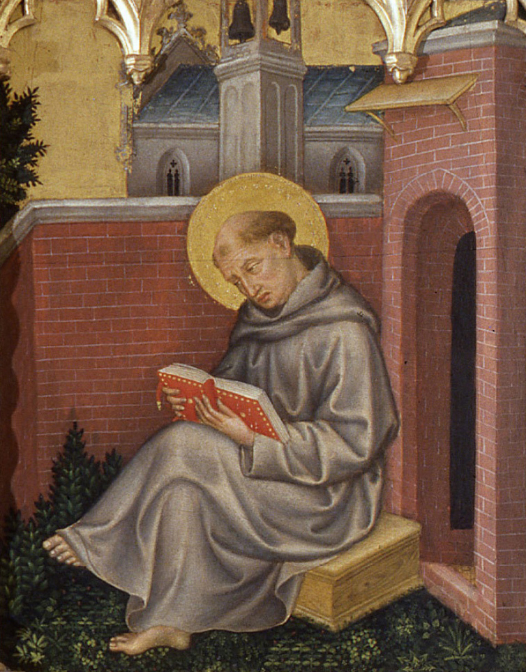

# São Tomás de Aquino

**"O Doutor Angélico"**

**Nascimento:** 1225, Roccasecca, Reino da Sicília (atual Itália)
**Morte:** 7 de março de 1274, Abadia de Fossanova, Itália
**Festa Litúrgica:** 28 de janeiro
**Canonização:** 18 de julho de 1323, pelo Papa João XXII

<TextToSpeech />

---

## Biografia

Tomás de Aquino nasceu em uma família nobre no castelo de Roccasecca. Seus pais esperavam que ele se tornasse abade de Monte Cassino, mas aos 19 anos decidiu juntar-se à recém-fundada Ordem dos Pregadores (Dominicanos), atraído por seu ideal de pobreza e estudo. Sua família tentou impedi-lo, mantendo-o prisioneiro em um castelo por mais de um ano, mas Tomás permaneceu firme em sua vocação.

Estudou em Paris e Colônia sob a orientação de Santo Alberto Magno, que, ao ouvir seus colegas zombarem do silêncio de Tomás chamando-o de "boi mudo", profetizou: "Vós o chamais de boi mudo, mas eu vos digo: quando este boi mugir, seus mugidos ecoarão por todo o mundo."

Tomás tornou-se um dos maiores teólogos e filósofos da Igreja, autor da monumental "Suma Teológica". Ele conseguiu harmonizar a filosofia aristotélica com a teologia cristã, demonstrando que a fé e a razão não se contradizem, mas se complementam.

## Vida Pessoal e Espiritualidade

Apesar de seu intelecto genial, Tomás era conhecido por sua humildade profunda e simplicidade. Era um homem de oração constante. Diz-se que, ao escrever sobre o Sacramento da Eucaristia, colocava a cabeça no tabernáculo para buscar inspiração. Seu amor por Cristo crucificado era o centro de sua vida.

No final de sua vida, após uma experiência mística durante a missa, parou de escrever, dizendo ao seu secretário Reginaldo: "Tudo o que escrevi me parece palha em comparação com o que vi e me foi revelado."

## Milagres

Durante sua vida e após sua morte, muitos milagres foram atribuídos a ele.
Um dos episódios mais célebres ocorreu em Nápoles, quando o sacristão o viu levitar diante de um ícone de Cristo crucificado. O Cristo falou com ele: "Escreveste bem de mim, Tomás. Que recompensa desejas por teu trabalho?" Ao que Tomás respondeu: "Nada além de Ti, Senhor" (*Non nisi te, Domine*).

## Curiosidades

1.  **Padroeiro:** É o padroeiro das escolas católicas, dos estudantes e dos teólogos.
2.  **O Boi Mudo:** Seu apelido de estudante, dado por ser grande, corpulento e silencioso, tornou-se irônico diante da vastidão de sua obra.
3.  **Corpus Christi:** A pedido do Papa Urbano IV, compôs os hinos litúrgicos para a Solenidade de Corpus Christi, incluindo o famoso *Tantum Ergo* e o *Panis Angelicus*.

## Cidades por onde passou

<MiracleMap :items='[
  { lat: 41.5428, lng: 13.6749, title: "Roccasecca, Itália", description: "Local de nascimento de São Tomás de Aquino." },
  { lat: 40.8518, lng: 14.2681, title: "Nápoles, Itália", description: "Cidade onde estudou e onde ocorreu o milagre do crucifixo." },
  { lat: 48.8566, lng: 2.3522, title: "Paris, França", description: "Onde estudou e lecionou na Universidade de Paris." },
  { lat: 50.9375, lng: 6.9603, title: "Colônia, Alemanha", description: "Estudou sob a orientação de Santo Alberto Magno." },
  { lat: 41.4394, lng: 13.1953, title: "Abadia de Fossanova, Itália", description: "Local de sua morte, a caminho do Concílio de Lyon." }
]' />

## Impacto Hoje

O pensamento de São Tomás de Aquino (Tomismo) continua sendo a base da teologia católica oficial. Sua clareza, rigor e capacidade de síntese fazem dele um modelo para todos os que buscam a verdade. Em um mundo muitas vezes confuso entre fé e ciência, o exemplo de São Tomás nos lembra que a verdade é uma só e vem de Deus.
