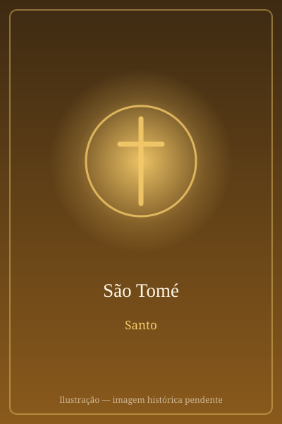

# São Tomé

> "Meu Senhor e meu Deus!"

- **Nascimento:** Galileia
- **Morte:** 72 d.C., Mylapore, Índia
- **Canonização:** Pré-congregação
- **Festa Litúrgica:** 3 de julho

<TextToSpeech />

---

## Biografia

Tomé, chamado *Dídimo* ("gêmeo"), era galileu e figura entre os Doze em todas as listas apostólicas. O Evangelho de João lhe dá relevo particular: quando Jesus decide voltar à Judeia, apesar do perigo, é Tomé quem diz aos companheiros "vamos também nós, para morrer com ele" (Jo 11,16); e é ele quem, na Última Ceia, pergunta "Senhor, não sabemos para onde vais; como podemos saber o caminho?", provocando a resposta "eu sou o caminho, a verdade e a vida".

Ficou conhecido sobretudo pelo episódio da Ressurreição: ausente na primeira aparição, recusou-se a crer sem ver e tocar as chagas. Oito dias depois, Jesus voltou e o convidou a pôr o dedo nas suas feridas. Tomé respondeu com a mais forte profissão de fé dos Evangelhos: "Meu Senhor e meu Deus!" — e ouviu: "Felizes os que creram sem terem visto".

A tradição, sustentada por fontes siríacas antigas e pelos *Atos de Tomé*, situa sua missão no Oriente: pregou entre os partos e chegou ao sul da Índia, à costa do Malabar. Foi martirizado por volta do ano 72 em Mylapore, próximo à atual Chennai, transpassado por uma lança.

## Vida Pessoal e Missão

Tomé é, na memória cristã, o apóstolo da fé que atravessa a dúvida — não o incrédulo, mas aquele que precisou tocar para crer e acabou formulando a confissão mais explícita da divindade de Cristo. As comunidades que se reclamam de sua pregação, os *Cristãos de São Tomé*, estão entre as mais antigas do mundo e mantêm liturgia de tradição siríaca.

## Milagres

- **O palácio no céu:** os *Atos de Tomé* narram que, encarregado por um rei indiano de construir um palácio, distribuiu o dinheiro aos pobres; quando o rei o prendeu, foi informado em sonho de que o apóstolo lhe havia construído um palácio no céu.
- **A cruz de sangue de Mylapore:** uma cruz de pedra encontrada no local do martírio, na chamada Colina de São Tomé, é venerada por relatos de exsudação de sangue registrados a partir do século XVI.
- **A fonte:** a tradição local atribui a Tomé a abertura de uma nascente na colina de Mylapore, ainda hoje procurada por peregrinos.

## Curiosidades

1. **"Ver para crer":** a expressão popular sobre o cético — o "São Tomé" que só acredita vendo — nasceu do episódio evangélico e entrou em praticamente todas as línguas europeias.
2. **Cristãos de São Tomé:** cerca de vários milhões de fiéis no estado indiano de Kerala se identificam como herdeiros de sua missão, divididos hoje entre diversas Igrejas siro-malabares e siro-malancares.
3. **Relíquias em Ortona:** parte de seus restos foi levada de Edessa a Quios e, em 1258, à cidade italiana de Ortona, onde repousam na catedral.
4. **Padroeiro:** dos arquitetos, engenheiros, agrimensores e da Índia.

## Cidades por onde passou

Da Galileia seguiu Jesus pela Palestina; a tradição o leva depois a Edessa, à Pérsia e ao sul da Índia, onde pregou e morreu, em Mylapore.

<MiracleMap :items='[
  { lat: 32.8, lng: 35.5, type: "nascimento", title: "Galileia", description: "Local de nascimento (Galileia)." },
  { lat: 13.033, lng: 80.2707, type: "morte", title: "Basílica de São Tomé (Chennai)", description: "Local da morte (72 d.C.)." },
  { lat: 13.0322, lng: 80.2707, type: "tumulo", title: "Basílica de São Tomé (Chennai)", description: "Túmulo do Apóstolo na Índia." }
]' />

## Impacto Hoje

A Índia guarda em Chennai a Basílica de São Tomé, uma das raras igrejas do mundo construídas sobre o túmulo de um apóstolo, e a comunidade cristã de Kerala é um dos exemplos mais antigos de cristianismo fora do mundo greco-romano. A cena do dedo nas chagas, imortalizada por Caravaggio, é uma das imagens mais reproduzidas da arte ocidental, e sua história continua a ser lida como consolo para quem atravessa períodos de dúvida.
